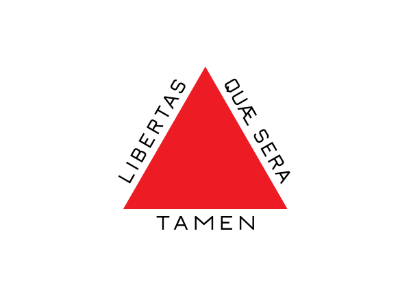

:::{#hero-heading}
**Desenvolvo tecnologia para o setor industrial | Projeto de Máquinas Elétricas, Geração de Energia &amp; Automação | ProfessorI develop technology for the industrial sector | Electrical Machine Design, Power Generation &amp; Automation | Professor**

Belo Horizonte, Minas Gerais, BrasilBelo Horizonte, Minas Gerais, Brazil  

Desenvolvo tecnologia para superar desafios industriais, atuando diretamente nos setores de geração renovável, cadeia do carbono, óleo e gás e automotivo. Com mais de 20 anos de vivência de mercado — aliados à experiência como Professor Universitário —, consolido uma bagagem no projeto de máquinas elétricas, eletrônica, instrumentação e software, criando arquiteturas completas para processos, acionamentos e automação.I develop technology to overcome industrial challenges, working directly in renewable generation, the carbon chain, oil &amp; gas, and automotive sectors. With over 20 years of market experience — combined with my work as a University Professor — I bring deep expertise in electrical machine design, electronics, instrumentation, and software, creating complete architectures for processes, drives, and automation.

Minha principal especialidade é o desenvolvimento de geradores e motores customizados (fluxo axial, alta rotação e motores in-wheel), integrando-os com eletrônica de potência, sistemas de controle e pilhas de comunicação industrial. Liderei projetos envolvendo geração eólica para redes rurais, microturbinas, máquinas móveis híbridas e powertrains especiais para ambientes severos.My main specialty is the development of custom generators and motors (axial flux, high-speed, and in-wheel motors), integrating them with power electronics, control systems, and industrial communication stacks. I have led projects involving wind generation for rural grids, microturbines, hybrid mobile machinery, and special powertrains for harsh environments.

Em paralelo, possuo ampla experiência prática em instrumentação de processos e sistemas térmicos: medição de gases de combustão em fornos de carbonização, gaseificação, produção de biochar e secadores industriais, integrando sensores, condicionamento de sinais, PLCs e sistemas embarcados.In parallel, I have extensive practical experience in process instrumentation and thermal systems: combustion gas measurement in carbonization furnaces, gasification, biochar production, and industrial dryers — integrating sensors, signal conditioning, PLCs, and embedded systems.

Normalmente sou chamado quando o problema é não trivial: ambientes ruidosos, redes elétricas fracas, condições térmicas severas, equipamentos legados ou metas energéticas ambiciosas. Resolvo o desafio desenvolvendo o seu sistema, validando-o por meio de modelos e protótipos, e então apoiando a implementação e o comissionamento.I am usually called in when the problem is non-trivial: noisy environments, weak electrical grids, severe thermal conditions, legacy equipment, or ambitious energy targets. I solve the challenge by developing your system, validating it through models and prototypes, and then supporting implementation and commissioning.

Se você busca alguém com visão sistêmica para o seu projeto — capaz de conectar desde a química do seu processo e o comportamento das suas máquinas até o código dos seus controladores — e transformar tudo isso em uma arquitetura robusta, é exatamente aí que eu gero mais valor.If you are looking for someone with a systems vision for your project — capable of connecting everything from your process chemistry and machine behavior to your controller code — and transforming all of that into a robust architecture, that is exactly where I generate the most value.

## Atuação ProfissionalProfessional Experience

<ul class="lang-pt">
  <li><strong>Líder Tecnológico (2024 - 2026)</strong>, NetZero <em>(Licença da universidade para atuação industrial)</em></li>
  <li><strong>Professor (2017 - Atual)</strong>, Universidade Federal de Minas Gerais (UFMG)</li>
  <li><strong>Professor (2015 - 2017)</strong>, Instituto Federal Minas Gerais (IFMG)</li>
  <li><strong>Sócio-Engenheiro (2013 - 2016)</strong>, Fahren</li>
  <li><strong>Sócio-Engenheiro (2011 - 2012)</strong>, STA Engenharia</li>
</ul>
<ul class="lang-en">
  <li><strong>Technology Leader (2024 - 2026)</strong>, NetZero <em>(University leave for industrial practice)</em></li>
  <li><strong>Professor (2017 - Present)</strong>, Federal University of Minas Gerais (UFMG)</li>
  <li><strong>Professor (2015 - 2017)</strong>, Federal Institute of Minas Gerais (IFMG)</li>
  <li><strong>Partner &amp; Engineer (2013 - 2016)</strong>, Fahren</li>
  <li><strong>Partner &amp; Engineer (2011 - 2012)</strong>, STA Engenharia</li>
</ul>

## FormaçãoEducation

<ul class="lang-pt">
  <li><strong>Doutorado em Engenharia Mecânica (2016)</strong>, Universidade Federal de Minas Gerais (UFMG)</li>
  <li><strong>Mestrado em Engenharia Elétrica (2011)</strong>, Universidade Federal de Minas Gerais (UFMG)</li>
  <li><strong>Graduação em Engenharia Elétrica (2009)</strong>, Universidade Federal de Minas Gerais (UFMG)</li>
</ul>
<ul class="lang-en">
  <li><strong>PhD in Mechanical Engineering (2016)</strong>, Federal University of Minas Gerais (UFMG)</li>
  <li><strong>MSc in Electrical Engineering (2011)</strong>, Federal University of Minas Gerais (UFMG)</li>
  <li><strong>BSc in Electrical Engineering (2009)</strong>, Federal University of Minas Gerais (UFMG)</li>
</ul>

:::

## TrajetóriaCareer Path

::: {style="float: right; width: 45%; margin-left: 2rem; margin-bottom: 1rem;"}

:::

A curiosidade por entender o funcionamento mecânico e elétrico do mundo começou cedo: minha infância foi marcada por desmontar equipamentos e improvisar pequenos geradores de forma empírica. Essa inquietação natural me levou à Engenharia Elétrica na UFMG, mas a teoria de sala de aula nunca foi o meu limite. Eu precisava sujar as mãos e construir.My curiosity to understand the mechanical and electrical workings of the world started early: my childhood was marked by dismantling equipment and improvising small generators empirically. This natural restlessness led me to Electrical Engineering at UFMG, but classroom theory was never my limit. I needed to get my hands dirty and build.

Em 2008, fui para a Alemanha imergir na fronteira do setor de energia eólica. Foi lá que projetei minhas primeiras placas eletrônicas e desenvolvi sistemas autônomos de aquisição de dados em campo. Voltei ao Brasil com um objetivo inflexível: criar tecnologia nacional de ponta. Essa urgência por tirar produtos do papel me impulsionou a empreender rapidamente, fundando empresas focadas em inovação industrial, como a STA e a Fahren.In 2008, I went to Germany to immerse myself at the frontier of the wind energy sector. It was there that I designed my first electronic boards and developed autonomous field data acquisition systems. I returned to Brazil with an unwavering goal: to create cutting-edge national technology. This urgency to take products from paper to reality drove me to rapidly start companies focused on industrial innovation, such as STA and Fahren.

Mas foi durante o meu Doutorado em Engenharia Mecânica que a minha assinatura profissional se cristalizou de vez: a visão híbrida. Para projetar um gerador acionado por uma microturbina a gás de altíssima rotação (com meta de operação em 100.000 rpm), precisei dominar o ecossistema completo. Eu não desenhei apenas a máquina elétrica; construí a balanceadora dinâmica do eixo, o sistema de controle térmico e de viscosidade do óleo, os conversores de potência e cheguei a conceber uma máquina CNC do zero para usinar minhas próprias peças e circuitos.But it was during my PhD in Mechanical Engineering that my professional signature truly crystallized: the hybrid vision. To design a generator driven by an ultra-high-speed gas microturbine (with a target operating speed of 100,000 rpm), I had to master the complete ecosystem. I didn't just design the electric machine; I built the dynamic shaft balancer, the thermal and oil viscosity control system, the power converters, and even designed a CNC machine from scratch to machine my own parts and circuits.

Foi na prática, lidando com os limites da física e da engenharia, que consolidei a premissa que guia o meu trabalho até hoje: a verdadeira inovação tecnológica exige domínio e controle de ponta a ponta.It was in practice, dealing with the limits of physics and engineering, that I consolidated the premise that guides my work to this day: true technological innovation demands end-to-end mastery and control.

---

## Um pouco de históriaA Bit of History

::: {style="float: left; width: 45%; margin-right: 2rem; margin-bottom: 1rem;"}

:::

A academia me atraiu pela capacidade de multiplicar inovação e resolver problemas estruturais. Como professor da UFMG, estive à frente de dezenas de desenvolvimentos aplicados, desde a eletrificação completa de máquinas pesadas (retroescavadeiras) até sistemas avançados de refrigeração por imersão para baterias e gerenciamento ativo de microrredes.Academia attracted me for its ability to multiply innovation and solve structural problems. As a UFMG professor, I led dozens of applied developments, from the complete electrification of heavy machinery (backhoe loaders) to advanced immersion cooling systems for batteries and active microgrid management.

Esse impacto técnico gerou forte validação internacional: em 2022, fui premiado e selecionado pelo Instituto Fraunhofer no programa *Call for Innovators*. Reconhecido como especialista em gás, realizei uma imersão de P&amp;D com tudo pago na Alemanha, estabelecendo conexões estratégicas com os maiores centros de pesquisa europeus.This technical impact generated strong international validation: in 2022, I was awarded and selected by the Fraunhofer Institute in the *Call for Innovators* program. Recognized as a gas specialist, I carried out an all-expenses-paid R&amp;D immersion in Germany, establishing strategic connections with the largest European research centers.

::: {style="float: right; width: 45%; margin-left: 2rem; margin-bottom: 1rem;"}

:::

Contudo, a minha raiz de "chão de fábrica" sempre falou mais alto. A necessidade de escalar sistemas com a urgência e a robustez que o mercado exige motivou um afastamento estratégico da universidade. Durante essa licença para atuação industrial, assumi a liderança tecnológica em uma planta de Biochar e IoT. Nesse desafio, projetei e implementei, em tempo recorde, toda a arquitetura da fábrica: desde a infraestrutura elétrica de baixa tensão e o Centro de Controle de Motores (CCM) até os hardwares customizados de comunicação redundante (CAN/Wi-Fi) e a integração de dados em nuvem.However, my "shop floor" roots always spoke louder. The need to scale systems with the urgency and robustness that the market demands motivated a strategic leave from the university. During this industrial leave, I took on technology leadership at a Biochar and IoT plant. In this challenge, I designed and implemented, in record time, the entire factory architecture: from the low-voltage electrical infrastructure and Motor Control Center (MCC) to custom redundant communication hardware (CAN/Wi-Fi) and cloud data integration.

Hoje, de volta à UFMG, materializo essa autonomia e visão sistêmica com a fundação do **SPHIN (Smart Power &amp; Industries)**. Mais do que um grupo de pesquisa, o SPHIN é um hub de inovação e um laboratório de excelência concebido com identidade e cultura de engenharia próprias. O objetivo é direto: romper definitivamente a barreira entre a bancada acadêmica e o mercado, entregando arquiteturas prontas, maduras e comercializáveis para a indústria de alta performance.Today, back at UFMG, I materialize this autonomy and systems vision with the founding of **SPHIN (Smart Power &amp; Industries)**. More than a research group, SPHIN is an innovation hub and a laboratory of excellence conceived with its own engineering identity and culture. The goal is straightforward: to definitively break the barrier between the academic bench and the market, delivering ready, mature, and marketable architectures for high-performance industry.

---

## Linha do tempoTimeline

::: {.timeline}

**2008** — Experiência internacional na Alemanha (µ-Sen), atuando no monitoramento de turbinas eólicas.**2008** — International experience in Germany (µ-Sen), working on wind turbine monitoring.

**2011** — Início da jornada empreendedora focada em instrumentação de gases e eletrônica customizada (STA Engenharia).**2011** — Beginning of the entrepreneurial journey focused on gas instrumentation and custom electronics (STA Engenharia).

**2013** — Desenvolvimento e construção integral de uma microturbina a gás de alta rotação (Fahren / Doutorado).**2013** — Complete development and construction of a high-speed gas microturbine (Fahren / PhD).

**2017** — Posse como Professor na UFMG, liderando projetos de eletrificação pesada off-road e microrredes.**2017** — Appointment as Professor at UFMG, leading heavy off-road electrification and microgrid projects.

**2024** — Atuação como Líder Tecnológico industrial (construção completa de arquitetura full-stack para chão de fábrica em IoT/Biochar).**2024** — Industrial Technology Leader (complete full-stack architecture for shop floor IoT/Biochar).

**2026** — Retorno à UFMG e fundação do **SPHIN**, unindo pesquisa profunda, desenvolvimento de motores e independência comercial.**2026** — Return to UFMG and founding of **SPHIN**, combining deep research, motor development, and commercial independence.

:::

---

## Currículo completoFull CV

Para uma visão detalhada da formação, publicações, consultorias e experiência profissional, acesse o meu [Lattes](http://lattes.cnpq.br/8637504941507702).For a detailed overview of education, publications, consulting, and professional experience, visit my [Lattes](http://lattes.cnpq.br/8637504941507702).
