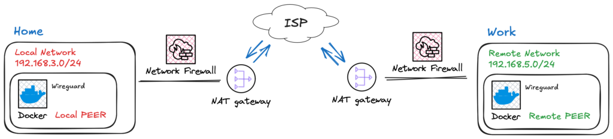
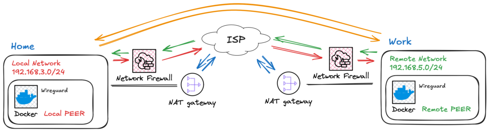
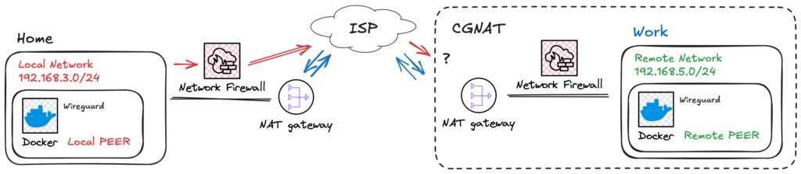
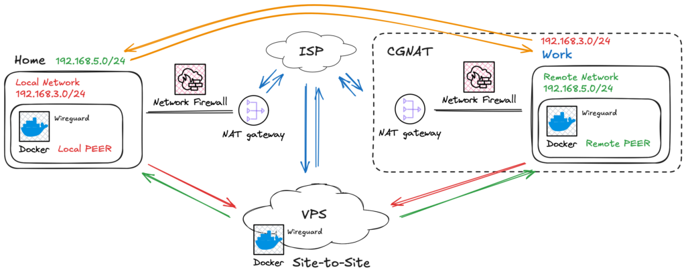

## Introduction

I remember using my first VPN back in 2004. It was a standard feature, and using PPTP was really straightforward: define a user and password, and that was it! You could enjoy the capability of uniting networks. Unfortunately, it was a protocol with weak security policies.

Around that time, OpenVPN was emerging. It was a great open-source alternative with certificate authentication and robust encryption. However, back then, we needed to manually tweak ("bit bang") every piece of configuration.

VPNs have been my main tool since then. They allowed me to access high-end computers at the university to run long simulation trials. During the pandemic, VPNs became a household term. Everyone wanted access here and there to gain some freedom and work remotely.

Fast forward to today, and WireGuard has emerged. It is lightweight, simple, and direct. It is open-source and built into the Linux Kernel. It is much easier to configure—native, even. I feel like I've returned to the simplicity of the PPTP era.

## The Problem: CGNAT and IPv6

The number of connected devices has exploded, forcing ISPs to evolve from IPv4 to IPv6 or drop regular NAT in favor of CGNAT (Carrier-Grade NAT) to withstand the load. Because of this, VPNs are not always end-to-end anymore. Firewall rules also contribute to complicating things a bit more.

Even though I'm not a dedicated network expert, I faced this problem and discovered that a site-to-site connection could solve all these issues once and for all.

Based on this demand, new services like Tailscale arrived. Sure, they are good and easy—just a few clicks solve it. But is that the endgame? If you look at OpenVPN, they created an entire market based on old players that are not able to migrate (yet) to solutions like WireGuard. Soon enough, managed solutions might change their pricing or terms. Thus, I decided to build my own Site-to-Site tutorial using standard tools.

## The Architecture

## Hands-on

### The VPN ideia



  
Fig. 1 - Ilustration of two netwroks geographically isolated and accesing the Internet.

To simplify, think of a VPN as a tunnel that connects two networks. Ideally, the VPN connects these networks as illustrated in Fig. 2.



  
Fig. 2 - Ilustration of two netwroks connected usign a VPN tunnel.

The VPN is thus responsible to connect those networks, as illustrated in Fig. 2.

However, typically, a port forwarding rule must be set, firewall rules must be adjusted, and opening incoming connections makes your network vulnerable to exploitation of unpatched services, brute-force attacks, and DoS. On top of these manageable problems come the ISP restrictions and CGNAT configurations, as shown in Fig. 3.



  
Fig. 3 - Ilustration of a network with CGNAT that can\`t route incoming traffic using IPv4.

The Solution: Site-to-Site with a Middleman Think of site-to-site as a bridge. However, in our case, this connection has doors that can only be opened from the inside. Once the peer requests to connect, an outbound connection is opened, and we can use this path to make our way back—like fish swimming up a river.

For this to work, we need a "doorman"—something in between responsible for receiving the request and giving network directions. In Fig. 4, I've illustrated this with a VPS, but any hosted service that can accept inbound connections serves the purpose.



  
Fig. 4 - Ilustration of a site-to-site network connection.

This architecture allows peers to have dynamic IPs and requires no complex administration interfaces on the local networks.

### Configuration: The VPS (Server)

In order to make everything work, we are going to use docker. Why, you ask? Well, there is a life before docker, flatpak, snap and others. There is also today. It's just better!

#### VPS

To make everything work, we are going to use Docker. Why? Well, there was life before Docker, Flatpak, and Snap, but today, Docker is simply better for reproducibility.

First, you need a server. In this tutorial, I will call it a VPS. It will hold the main configurations and allow peer connections. Since WireGuard config parameters are often handled via environmental variables, I've created a simple script to facilitate peer creation.

1. Generate the Environment File Create a file named `generate_env.sh`:

```bash
#!/bin/bash
# 1. Your Peer Database (Keep names readable here!)
# Syntax: ["READABLE_NAME"]="SITE_TO_SITE_SUBNET"
# If it is a simple client (like a phone), leave the subnet empty.
declare -A PEERS_DB
PEERS_DB["android"]=""
PEERS_DB["work"]="192.168.2.0/24"
PEERS_DB["home"]="192.168.3.0/24"

# 2. Global Configurations
OUTPUT_FILE="default.env"

echo "# File automatically generated at $(date)" > $OUTPUT_FILE
echo "# WARNING: Peer names sanitized (hyphens removed) for compatibility." >> $OUTPUT_FILE
echo "" >> $OUTPUT_FILE
echo "TIMEZONE=America/Sao_Paulo" >> $OUTPUT_FILE
echo "SERVERURL=mydomain-or-ip.com.br" >> $OUTPUT_FILE # CHANGE THIS
echo "PUID=1000" >> $OUTPUT_FILE
echo "PGID=1000" >> $OUTPUT_FILE
echo "SERVERPORT=51820" >> $OUTPUT_FILE
echo "PEERDNS=auto" >> $OUTPUT_FILE
echo "ALLOWEDIPS=0.0.0.0/0" >> $OUTPUT_FILE
echo "INTERNAL_SUBNET=10.22.22.0" >> $OUTPUT_FILE
echo "PERSISTENTKEEPALIVE_PEERS=all" >> $OUTPUT_FILE
echo "" >> $OUTPUT_FILE

# 3. Generation and Sanitization Logic
PEER_LIST=""
echo "# Routing Rules and Peers" >> $OUTPUT_FILE

for PEER in "${!PEERS_DB[@]}"; do
    # Remove special chars for safety
    SAFE_PEER=$(echo "$PEER" | sed 's/[^a-zA-Z0-9]//g')
    PEER_LIST+="$SAFE_PEER,"
    SUBNET="${PEERS_DB[$PEER]}"

    if [ ! -z "$SUBNET" ]; then
        echo "SERVER_ALLOWEDIPS_PEER_$SAFE_PEER=$SUBNET" >> $OUTPUT_FILE
    fi
done

PEER_LIST=${PEER_LIST%,}
echo "PEERS=$PEER_LIST" >> $OUTPUT_FILE

echo "File $OUTPUT_FILE generated successfully!"
```

Running it will give a `default.env` file as output.

```bash
$ ./generate_env.sh
```

```bash
# Arquivo gerado automaticamente em Sat Dec 20 01:39:31 UTC 2025
# ATENCAO: Os nomes dos peers foram sanitizados (hifens removidos) para compatibilidade.

TIMEZONE=America/Sao_Paulo
SERVERURL=mydomain-or-ip.com.br
PUID=1000
PGID=1000
SERVERPORT=51820
PEERDNS=auto
ALLOWEDIPS=0.0.0.0/0
INTERNAL_SUBNET=10.22.22.0
PERSISTENTKEEPALIVE_PEERS=all

# Regras de Roteamento e Peers
SERVER_ALLOWEDIPS_PEER_work=192.168.3.0/24
SERVER_ALLOWEDIPS_PEER_home=192.168.2.0/24
PEERS=android,work,home
```

Run it:

```bash
$ ./generate_env.sh
```

This will output a default.env file. Notice that I added my phone ("android") to this new overlay network, but since I don't need my networks accessing my phone, I left the subnet blank.

2. The Docker Compose In the same folder, create your `docker-compose.yml`:

```yml
services:
  wireguard:
    image: linuxserver/wireguard
    container_name: wireguard-server
    cap_add:
      - NET_ADMIN
      - SYS_MODULE
    env_file:
      - default.env
    volumes:
      - ./config:/config
      - /usr/src:/usr/src # location of kernel headers
      - /lib/modules:/lib/modules
    ports:
      - 51820:51820/udp
    sysctls:
      - net.ipv4.conf.all.src_valid_mark=1
      - net.ipv4.ip_forward=1
      - net.ipv6.conf.all.disable_ipv6=1
      - net.ipv6.conf.default.disable_ipv6=1
    restart: unless-stopped
    networks:
      default:
        ipv4_address: 172.70.0.2

networks:
  default:
    driver: bridge
    ipam:
      config:
        - subnet: 172.70.0.0/24
          gateway: 172.70.0.1
```

Now, bring it up:

```bash
$ docker compose up -d
```

```bash
$ docker compose up -d
```

A `config` folder will be created containing the peer files. Before we proceed, we need a few tweaks.

#### KeepAlive and Routing

1. Persistent KeepAlive Since the peers are behind NAT/CGNAT, the connection might drop if idle. WireGuard has a `PersistentKeepalive` flag. You can add this manually to the `.conf` files (usually `PersistentKeepalive = 15`), or use a script to inject it into all configs automatically if your container image doesn't handle it perfectly for all peers.

3. Routing Traffic (PostUp/PreDown) This is the most critical part for Site-to-Site. The traffic needs to be routed correctly. Inside the generated `.conf` files for your "Work" or "Home" peers, you need to ensure the routing rules exist.

```bash
[Interface]
# Masquerade traffic leaving the VPN interface and add route to remote subnet
PostUp = iptables -t nat -A POSTROUTING -o eth+ -j MASQUERADE && ip route add 192.168.2.0/24 via 172.70.0.1
PreDown = iptables -t nat -D POSTROUTING -o eth+ -j MASQUERADE && ip route del 192.168.2.0/24 via 172.70.0.1
Address = 10.222.222.3
PrivateKey = <super_secret_hash>
ListenPort = 51820
DNS = 10.222.222.1

[Peer]
PersistentKeepalive = 15
PublicKey = <super_secret_hash>
PresharedKey = <super_secret_hash>
Endpoint = mydomain-or-ip.com.br:51820
AllowedIPs = 0.0.0.0/0
```

> Pro Tip: Full Tunnel vs. Split Tunnel By default, the configuration `AllowedIPs = 0.0.0.0/0` routes all your device's internet traffic through the VPS. If you want to access only the remote network while keeping your local internet speed for everything else (Split Tunnel), change this line in your client config to list only the specific subnets.
> 
> Example: `AllowedIPs = 10.22.22.0/24, 192.168.3.0/24`

#### Bringing the Peer Alive (Client Side)

Now that you have the configs, you need a device running 24/7 on your local network (like a Raspberry Pi or an HTPC).

I simply create another Docker container for the client. Rename the generated `peer_*.conf` file to `wg0.conf`, place it inside a `config` folder, and run:

```yml
services:
  wireguard:
    image: linuxserver/wireguard
    container_name: wireguard-client
    cap_add:
      - NET_ADMIN
      - SYS_MODULE
    environment:
      - PUID=1000
      - PGID=1000
      - TZ=America/Sao_Paulo
    volumes:
      - ./config:/config
      - /usr/src:/usr/src # location of kernel headers
      - /lib/modules:/lib/modules
    logging:
      options:
        max-size: "100m"
        max-file: "3"
    sysctls:
      - net.ipv4.conf.all.src_valid_mark=1
    restart: unless-stopped
    networks:
      default:
        ipv4_address: 172.70.0.2   # <-- Update

networks:
  default:
    driver: bridge
    ipam:
      config:
        - subnet: 172.70.0.0/24
          gateway: 172.70.0.1
```

Once connected, services like Home Assistant, Frigate, and others become accessible across the site-to-site connection as if you were on the same local network.

## Conclusion

At first glance, networking can be scary—believe me, I was there. But after some time, things start to make sense. This setup bypasses CGNAT and complex firewall rules using standard, open-source tools. I hope this guide helps you reclaim control over your networks!

## Source Code & Scripts

To make this setup easier, I’ve organized all the scripts mentioned in this guide (environment generation, route injection, and client packaging) into a public repository.

You can clone it and start your own VPN gateway in minutes:

[Get the Source Code on GitHub](https://github.com/thalesmaoa/docker-wireguard-site-to-site)


<!--Include social share buttons-->

