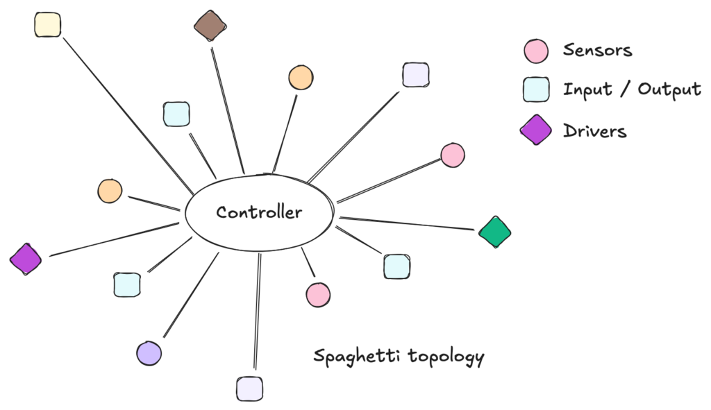
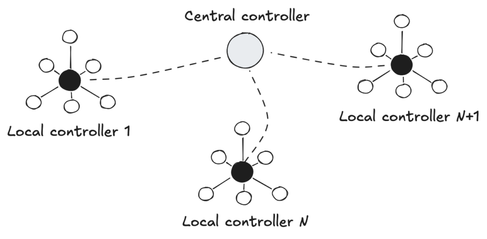
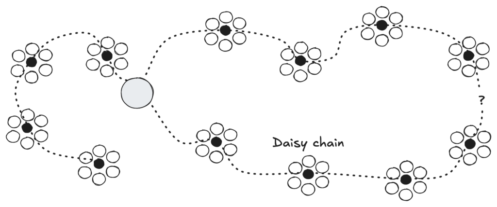
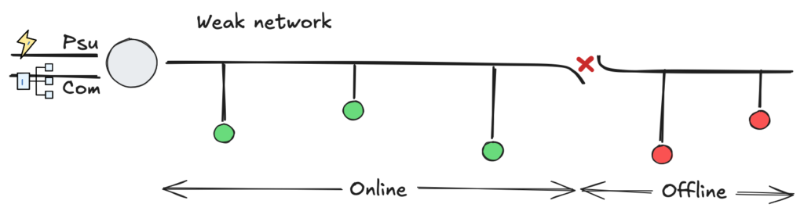
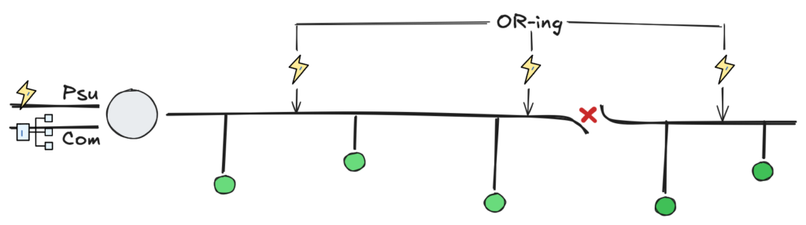
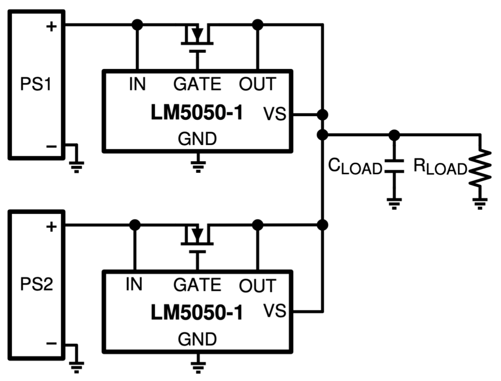
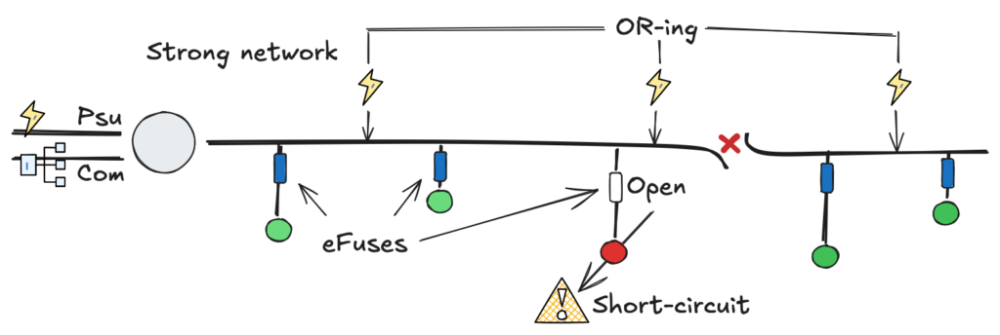
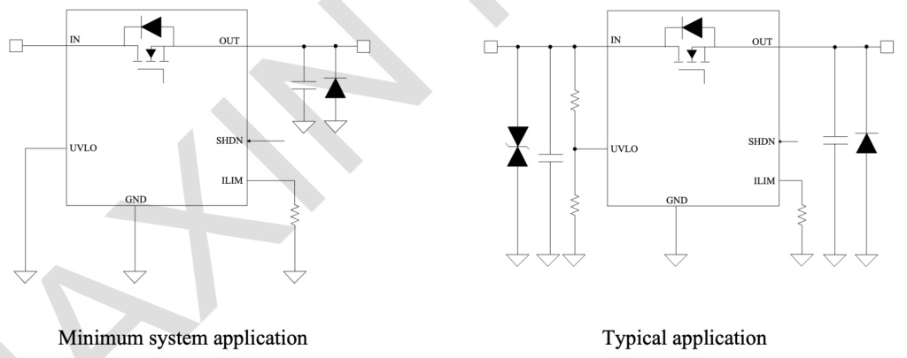

## **Introduction**

Whether in automotive design, aerospace, or industrial environments, engineers face a common challenge: efficiently interconnecting hundreds of sensors, actuators, and controllers.

The most primitive strategy is the Centralized Topology (Star Topology). Here, a central controller receives every signal and makes decisions based on a monolithic algorithm.

Fig. 1 - Diagram of a Centralized Star Topology with heavy cabling.

While simple in concept, centralization becomes a nightmare as complexity grows. In the automotive industry, if every dashboard instrument were wired directly to a central ECU, the wiring harness would be so heavy and complex that maintenance would be impossible. In the industrial sector, this was known as the "Spaghetti Era": massive cable trays routing thousands of individual wires to a central Marshalling Cabinet. The result? Excessive CAPEX, complex troubleshooting, and rigid infrastructure.

To solve this, Decentralized Topologies emerged. By distributing intelligence closer to the process, we reduce cabling and improve modularity. These architectures typically fall into three categories: Star, Ring, and the focus of our discussion, the Bus (or Daisy Chain) topology.

Fig. 2 - Diagram of Decentralized Topologies.

Physically, in a confined space like a car, a dense harness is manageable. However, in a geographically distributed industrial plant, insisting on centralized wiring is a relic of the 1980s. It wastes copper, time, and money.

## **The Daisy Chain in Industrial Environments**

The Daisy Chain (or Line Topology) is arguably the most elegant solution for covering distances. A single cable carries both communication and power, hopping from one node to the next. This topology drove the success of technologies like RS-485 (Modbus), CAN (DeviceNet), Profibus (Siemens), and EtherCAT.

Fig. 3 - Standard Daisy Chain Topology.

However, in a market flooded with options, the choice isn't purely technical—it's strategic. In 90% of cases, engineers lock themselves into a single vendor ecosystem, such as Siemens (Profinet) or Rockwell Automation/Allen-Bradley (EtherNet/IP). While reputable, this creates "Vendor Lock-in." Any future adaptation requires proprietary hardware, often leading to obsolescence management nightmares.

For this reason, major players are moving towards interoperability. My Golden Rule for new projects is simple: Stay Open, Stay Solid.

Protocols like EtherNet/IP, Modbus, EtherCAT, and CANOpen sustain this rule. Among these, CANOpen shines for its balance of robustness, low cost, and ease of implementation in embedded systems.

But, to use an idiom, it's not all sunshine and rainbows. The classic Daisy Chain has a fatal flaw: Single Point of Failure. If a cable breaks or a device fails at the beginning of the chain, every downstream device loses communication and power.

Fig. 4 - Illustration of the effect of cable disconnection.

## **Distributed Power Architecture**

This "interruption problem" was solved decades ago in high-availability sectors like Telecom and Data Centers using the concept of Distributed Power Architecture (DPA). Instead of relying on a single massive power supply, they use redundant, parallel modules sharing the load.

Why aren't we doing this for industrial control power? We should be.

The concept is to move away from a "single point of failure" PSU towards a robust 24V DC Shared Bus. Instead of segregating "AC Control / PSU / Loads," we leverage the DC bus to create redundancy. Imagine replacing 220VAC contactors with 24VDC components: solenoids, valve islands, sensors, PLCs, and even high-power actuators.

The Advantages of a Redundant DC Architecture:

1. Safety (SELV): According to IEC 60364-4-41, circuits under 60V DC (Ripple-Free) are considered SELV (Safety Extra Low Voltage). This significantly simplifies maintenance procedures and safety requirements compared to working with AC mains voltage.

3. Redundancy (N+1): Multiple PSUs on the bus ensure that if one fails, others pick up the slack without system downtime.

5. Cable Efficiency: Distributing power injection points along the chain reduces voltage drop (IR Drop) issues common in long cables.

However, simply tying PSUs together is dangerous. Without proper isolation, a short circuit in one PSU's output stage could drag down the entire bus or damage the other units. To do this safely, we need Active OR-ing.

## **The Solution: Active OR-ing**

Fig. 5 - Daisy Chain with Multiple Redundant PSUs.

Paralleling DC power supplies is significantly easier than synchronizing AC generators. It operates similarly to a "battery pack" logic. To do this safely, we use an OR-ing circuit.

While simple diodes could be used, they introduce voltage drops (heat). My recommendation is to use an Active OR-ing Controller, such as the Texas Instruments LM5050-1.

Fig. 6 - LM5050-1 Typical Application Diagram.

This IC controls an external MOSFET to behave like an "ideal diode" with near-zero voltage drop. It automatically disconnects a faulty power supply from the bus, preventing the bus voltage from back-feeding into a shorted PSU. It effectively creates an N+1 redundant power bus where power flows seamlessly even if a source dies.

Note: For complete reverse polarity protection at the input, a "Back-to-Back" MOSFET topology is recommended, but OR-ing handles the critical bus redundancy.

## **The Protection: Smart eFuses**

Fig. 7 - Daisy Chain with Multiple Redundant PSUs and eFuses.

Now that we have a robust power bus, how do we protect the individual loads? Standard glass fuses or Polyfuses in 24V systems are unreliable, slow, and hard to diagnose remotely.

The modern solution is the eFuse (Electronic Fuse). These are intelligent ICs that manage load protection. They are programmable, incredibly fast (<10µs response), and, most importantly, resettable. If a short occurs, the eFuse isolates only that specific load, leaving the rest of the Daisy Chain unaffected. Once the fault is cleared, the system can be reset remotely or automatically.

My component of choice for this architecture is the Maxic MX26631S (or the TI TPS2663x family).

Fig. 8 - MX26631S Typical Application Diagram.

Why the MX26631S?

- 40V Rated: Plenty of headroom for 24V industrial transients.

- High Current: Supports up to 3.5A, covering the majority of sensors and standard actuators for this Proof of Concept.

- Inrush Control: Soft-start capability prevents voltage dips on the bus when turning on capacitive loads.

## **Conclusion**

It no longer makes sense to ignore the benefits of DC-based industrial networks. We don't need over-complicated systems to start benefiting from available technology.

By combining the simplicity of the Daisy Chain topology with the resilience of Active OR-ing and the precision of eFuses, we transform a simple cable into a smart, redundant power and data backbone. I will continue to advocate for this approach: reducing CAPEX, simplifying maintenance, and ensuring that a single loose wire doesn't shut down the entire factory.

<!--Include social share buttons-->

