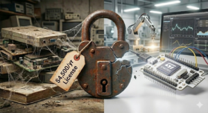
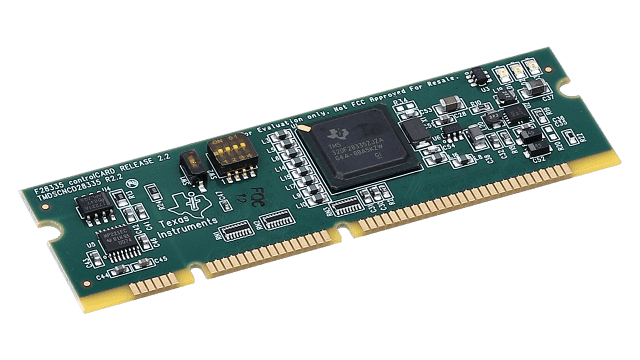
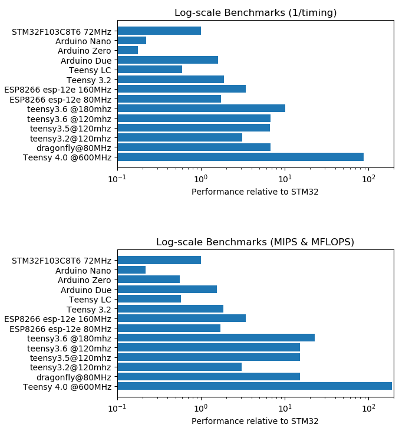
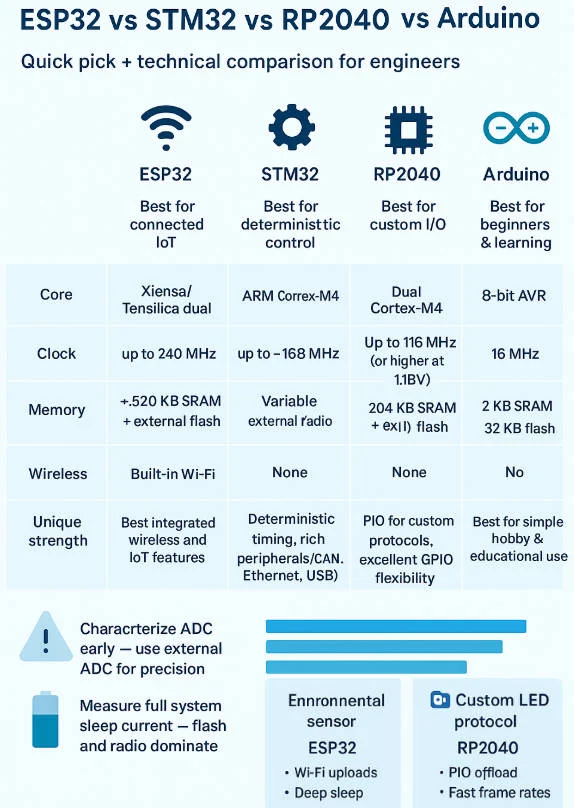

<figure style="text-align: center;">

<figcaption>

Fig. 1 - Image generated by AI.

</figcaption>

</figure>

Recently, a friend asked me: "Do you use MATLAB Coder too?"

I answered quickly: "Of course not."

My answer created an awkward silence, which he eventually broke by saying: "At my company, everyone still uses it, but it bothers me, and I can't explain why."

My reply was straightforward: "It bothers you because you are a good engineer."

I pushed further: "I bet you guys are still using the Texas Instruments C2000 series, right?"

His confirmation came with an automatic defense. Unfortunately, a large part of the engineering market is still conservative, afraid of change, and repeats processes simply because "it has always been done this way." We are in 2025, and this mindset is expensive.

## **The Invisible Knowledge Barrier**

I remember the first time I encountered digital control. Programming embedded systems in C seemed much harder than theoretical programming classes. Peripherals, timers, memory allocation... I remember thinking: _"I'll need to study a lot, and there won't be enough time to learn it all during undergrad."_

This is the classic **illusion of the knowledge barrier**. When we don't master a subject, we imagine the learning curve is insurmountable. I was inexperienced and junior.

At the same time, I interned at a university lab where several students shared the same fears. The magic solution they found? _"You already know MATLAB and Simulink, why learn C/C++? Use MATLAB Coder! It converts your simulation automatically."_

Long story short: I spent the next three weeks learning how to "tweak" my simulation in Simulink just to make the code generator work. By the end, I had a strange feeling of having worked hard but evolved little. The code worked, but I remained a hostage to the tool.

## **The C2000 Saga and the Cost of "Tradition"**

Still in my naivety, I asked colleagues which controller I should use. The answer was unanimous: **Texas Instruments C2000 Series (TMS320F28335).**

<figure>

<figcaption>

Fig. 2 - Texas Instruments C2000 Series (TMS320F28335).

</figcaption>

</figure>

When, thirsty for information, I timidly asked, "Why not a PIC?" (at the time so famous that Motorola didn't even worry about the 8-bit market), the answer came recited from the datasheet. The final argument? _"It was the processor the professor used in his PhD."_

I was convinced I knew everything. After all, I knew how to use MATLAB.

After graduating, I received my first consulting demand: develop a simple embedded instrumentation system. _"Easy,"_ I thought. _"I just need to pull what I've already done out of the drawer."_ I went to draft the budget for the client:

- **Annual MATLAB + Coder License:** ~USD 4,500.00 / year.

- **TI TMS320F28335 Dev Board:** ~USD 100.00.

- **Development Hours:** Mobilization costs only (since the code "already existed").

Obviously, the client would never accept that recurring initial cost. National Instruments, for instance, already offered complete solutions cheaper than just the software license I was proposing.

I tried a workaround: I called friends to use their licenses for the preliminary design. Upon trying to open my simulation, MATLAB blocked me—incompatible version. I wasted 4 hours, skipping lunch, waiting for MATLAB and Code Composer Studio to reinstall. I took a deep breath and had a moment of sanity: **"It is impossible that this is more efficient than learning to program the hardware for real."**

## **The Breakthrough: The Arduino Effect and Hardware Choice**

Around that time, the Arduino project appeared. Open-source, Atmega328p, costing less than USD 20.00, with a vibrant community. Why not?

Here is where most engineers stumble: **Choosing the hardware.**

The question is simple, but the answer requires competence: **You need to** _design_**.**

I already had the requirements and the math. That "cheap" processor would solve it. I consulted colleagues and heard: _"But the Texas DSP is better, it has feature X, Y, Z..."_

True. It is an incredible machine. I would be stupid not to use the Ferrari, right? **Wrong.**

Let's use an analogy: You have a Ferrari and an Economy Hatchback. Do you use the Ferrari to buy bread at the corner bakery every day?

It made no technical or economic sense. I refused the advice, wrote the code in C, and delivered the project. Client satisfied, zero license costs. I adopted the Atmega as my standard solution for years.

## **Real Engineering: The Open-Loop Inverter**

<figure>

<figcaption>

Fig. 3 - Log-scale performance comparison. Source: [Arduino](https://forum.arduino.cc/t/benchmark-stm32-vs-atmega328-nano-vs-sam3x8e-due-vs-mk20dx256-teensy-3-2/414630/26)

</figcaption>

</figure>

Demands increased. I needed to develop a sinusoidal modulator to magnetize a ferromagnetic core. I accepted the challenge: I implemented a 3-level converter (H-bridge) in open loop, manually manipulating registers on the Atmega328p. This was in 2014, during my PhD. Believe it or not, 12 years later, it still works. No licensing, no complicated installations—just editing a few lines of code.

I was fully aware of the hardware limitations. The Atmega physically couldn't handle the math for closed-loop control. However, solving this was trivial. The next step was obvious: upgrade to a 32-bit MCU with a better clock. It wasn't a lack of tools that stopped the Arduino; it was just physics. And fixing it was just a matter of choosing the right chip.

_(I share the repository for this project at the end of this post for those interested)._

## **Conclusion: The Message for 202**6

In the last 12 years, the market has shifted. **STMicroelectronics** and **Espressif Systems** have democratized access to high-end hardware.

I no longer see technical sense in keeping complex projects on 8-bits, but I also see no financial sense in maintaining expensive licenses to generate inefficient code. The **ESP32 (S and C Series)** and **STM32 (F and G Series)** families offer absurd processing power for a fraction of the cost.

While Espressif dominates IoT communication, STM offers industrial robustness. Today, the best designers—myself included—adopt hybrid solutions. We use the best of both worlds to create real-time systems (HW Timers/RTOS) with IIoT connectivity, without paying a "toll" to simulation software vendors.

<figure style="text-align: center;">

<figcaption>

Fig. 4 - Quick board comparison. Source: [Bettlink](https://www.bettlink.com/blog/esp32-vs-stm32-vs-rp2040-vs-arduino-guide)

</figcaption>

</figure>

Code generators (whether from MATLAB, PLECS, or PSIM) are excellent tools for academic rapid prototyping. But if your company bases its final product on these tools simply because the engineering team "learned it that way in college" and is afraid to code, you are not innovating. You are paying an **incompetence tax**.

**It is time to take the training wheels off.**

[Get the Source Code on GitHub](https://github.com/thalesmaoa/avr-3level-spwm)

<!--Include social share buttons-->

