For an electrical machine designer, Finite Element Analysis (FEA) is an indispensable tool. Although a draft project usually begins with a base analytical design, high-performance machines demand flux path optimization, geometry tweaks, and deep material probing.

One of the best ways to achieve this is by creating a parametric drawing and coordinating it using a scripting language. For this, FreeCAD is my go-to choice. Its native Python API allows for complete automation and control over the design variables.

However, before diving into scripting, it is crucial to understand how to structure your first design properly. This post will guide you through that process. While the geometry may seem extremely simple, a few specific tricks will save you hours of rework and frustration.

We are starting with a standard 2D EI transformer core, inspired by the classic [FEMM tutorials](https://www.femm.info/wiki/ACForceExample). Please note that I am using the latest FreeCAD version (v1.1) for this guide.

## Parameters

This step is not mandatory, and you can play with constraints for the parametric design as you wish. However, establishing parameters is a fundamental habit for me. I will draw an E-core with a center length of 70mm and lateral legs of 35mm. In total, the height is 140mm, and the coils are fully fitted within a 35mm window.

1. Create a new document.

3. Switch to the **Spreadsheet** workbench.

5. Create a **New Spreadsheet**. You can rename it (by pressing `F2`) as you like. Mine is named `vars`.

<figure>

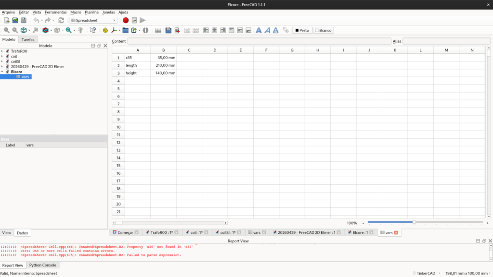

<figcaption>

Fig. 1 - Creating a new spreadsheet to host our parametric variables.

</figcaption>

</figure>

After filling out the spreadsheet, you should add aliases to the cells. This creates a global variable that is easy to access during the drawing phase. Just right-click on the value cell » **Properties** » **Alias** tab, and type the variable name.

## The Sketch

1. Switch to the **Part Design** (or **Sketcher**) workbench.

3. Create a **New Sketch**.

5. Select any plane you prefer. You will likely see a window similar to the one below.

<figure>

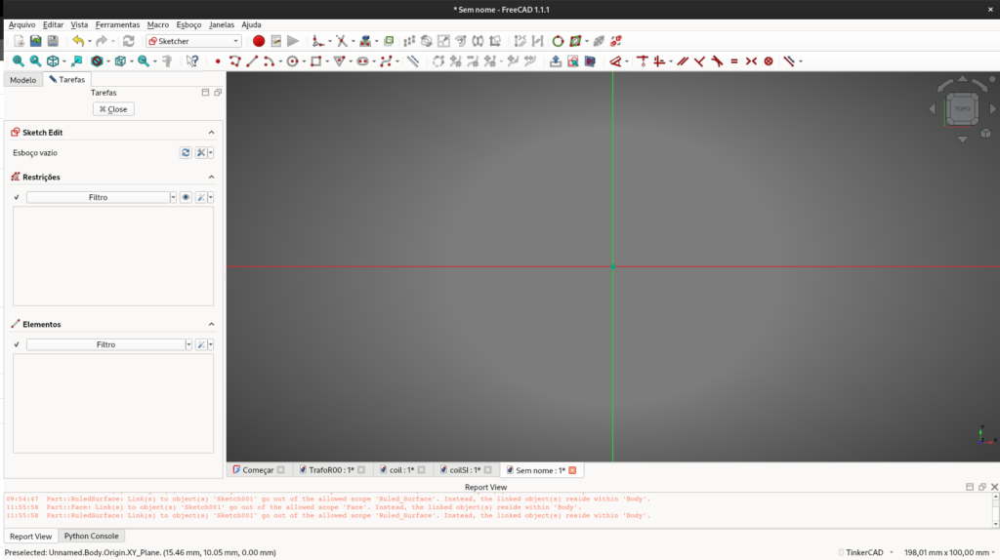

<figcaption>

Fig. 3 - Selecting the sketch plane. For 2D FEM, the XY-plane is usually the standard choice.

</figcaption>

</figure>

After that, draw the model, apply the geometric constraints, and link your spreadsheet variables by clicking the small `f(x)` icon in the dimension input boxes or just type `=`.

<figure>

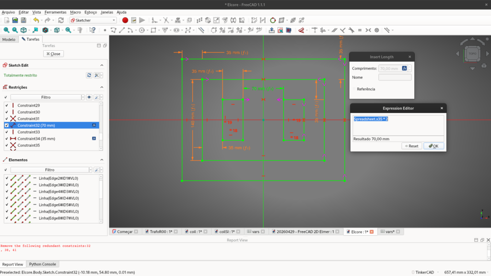

<figcaption>

Fig. 3 - The completed EI core geometry. Note the green lines indicating the sketch is fully constrained and tied to the variables.

</figcaption>

</figure>

## Generating the Faces (Surface)

With the 2D geometry ready, it's time to route it to Gmsh. Inside FreeCAD's FEM workbench, meshing works reliably on solid bodies or faces, not directly on 2D wireframe sketches. Therefore, we must convert our sketch into 2D faces.

<figure>

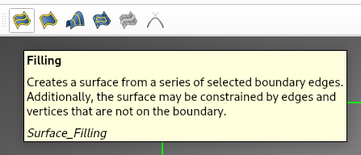

<figcaption>

Fig. 4 - Using the Filling tool in the Surface workbench to create the 2D domains for each part.

</figcaption>

</figure>

- Select your sketch and use tools to generate flat faces. You will need distinct faces for the Air, the Core, and the Coils.

<figure>

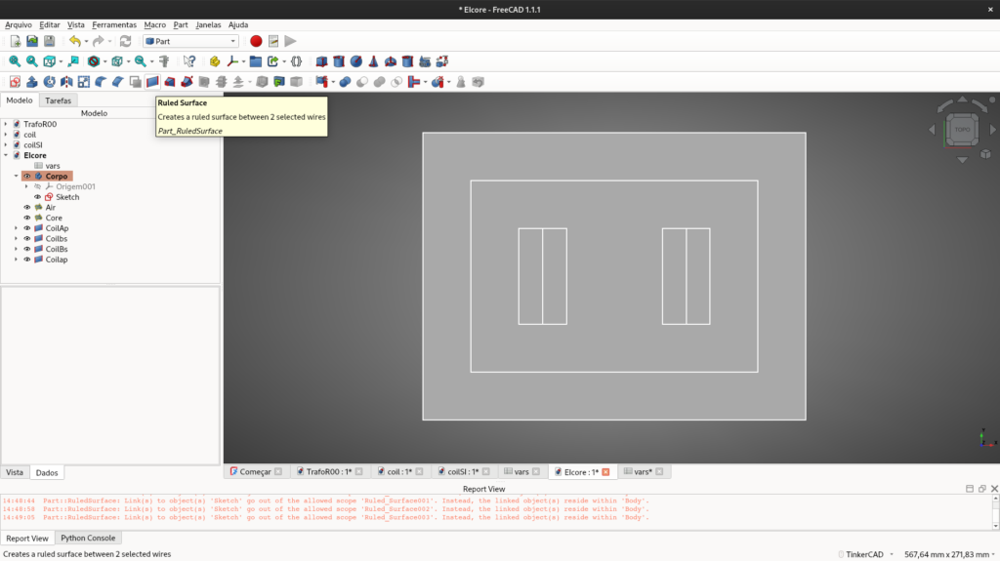

<figcaption>

Fig. 5 - Generating the primary surfaces using the Ruled Surface tool. Note that the domains for air, core, and coils are currently overlapping.

</figcaption>

</figure>

- If you end up with overlapping faces, they must be broken into their own specific, non-overlapping domains.

<figure>

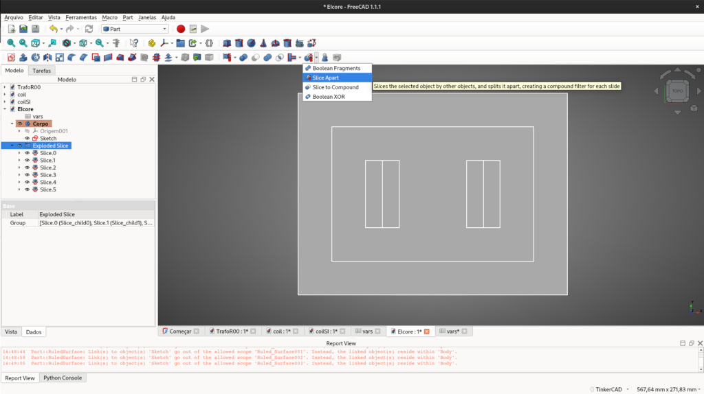

<figcaption>

Fig. 6 - Crucial step: Using 'Slice Apart' to ensure that overlapping surfaces (like coils inside the air window) are properly divided.

</figcaption>

</figure>

- This part can be tricky: using the **Part** workbench, you must select the surfaces (from the outermost to the innermost) and use the **Slice Apart** (or Boolean Fragments) tool.

Once properly sliced, use the **Connect** tool to ensure all adjacent faces share the same boundary edges.

<figure>

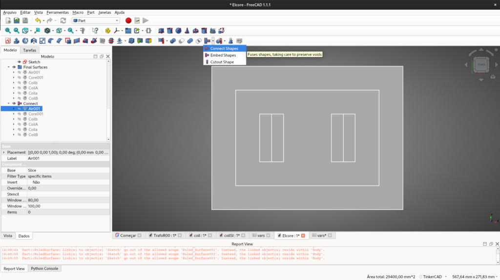

<figcaption>

Fig. 7 - The 'Connect' tool ensures that adjacent faces share the same nodes, which is vital for a continuous mesh.

</figcaption>

</figure>

## Meshing with Gmsh

Now it's time to mesh the model.

1. Switch to the **FEM** workbench.

3. Select your `Connect` (or `Fragment`) group in the tree view and click **FEM mesh from shape by Gmsh**.

<figure>

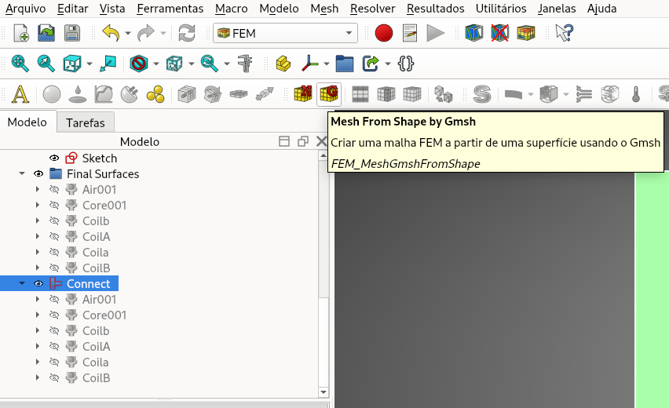

<figcaption>

Fig. 8 - Initializing the FEM Mesh object using the Gmsh engine from the Part Design body.

</figcaption>

</figure>

In the configuration panel, you can choose the element dimension as _From Shape_ or _2D_, select _2nd order elements_, and define the maximum and minimum mesh sizes based on your design requirements.

<figure>

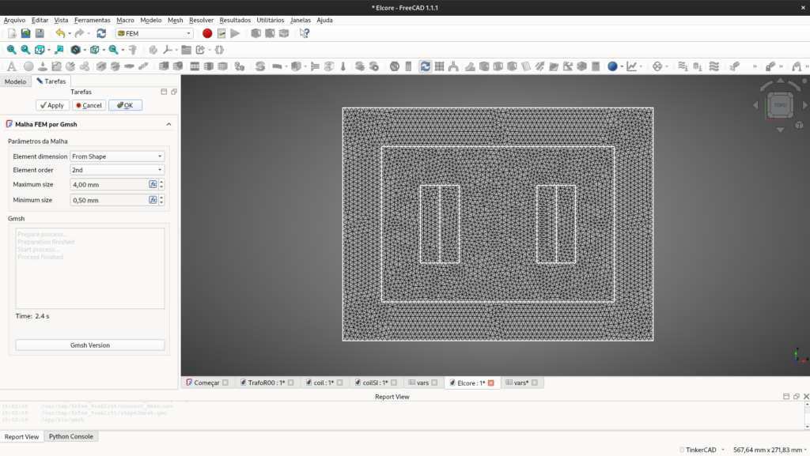

<figcaption>

Fig. 9 - Adjusting the min/max element size and choosing 2nd-order elements for better numerical accuracy.

</figcaption>

</figure>

If you need to improve the mesh density in specific areas, use the **Mesh Refinement** tool, select the target surface, and adjust as needed. To apply the changes, double-click the Gmsh object in the tree and hit apply to re-mesh.

<figure>

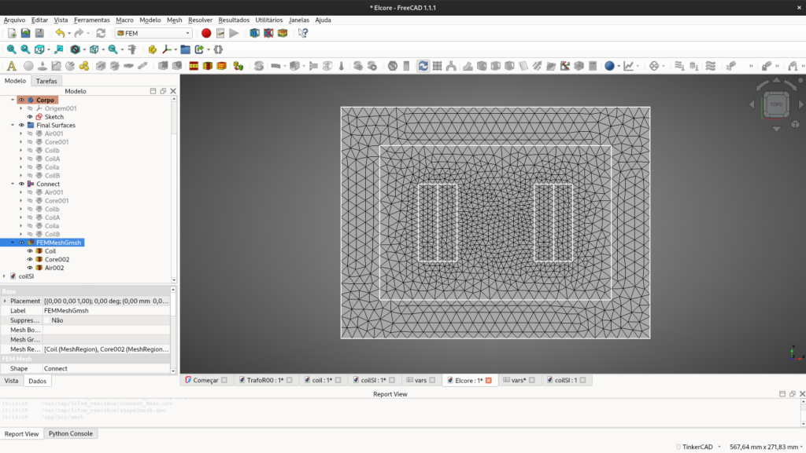

<figcaption>

Fig. 10 - Applying local mesh refinement in areas where we expect high magnetic flux density gradients.

</figcaption>

</figure>

### Materials and Boundaries (The Mesh Groups Trick)

FreeCAD’s visual material tools do not export properly to Elmer when generating `.unv` files. Instead, materials and boundaries are treated as **Physical Groups**.

To define them:

1. Click on **FEM mesh region** (Mesh Group).

3. Select the specific surface (e.g., the steel core) and assign a Label name (e.g., `Core`). The exact same logic applies to the boundaries (edges), which will later be defined as Magnetic Potentials inside Elmer.  
    _Crucial Tip:_ Always ensure you are selecting the edges/faces of your final _Connect/Face_ object, not the original _Sketch_!

<figure>

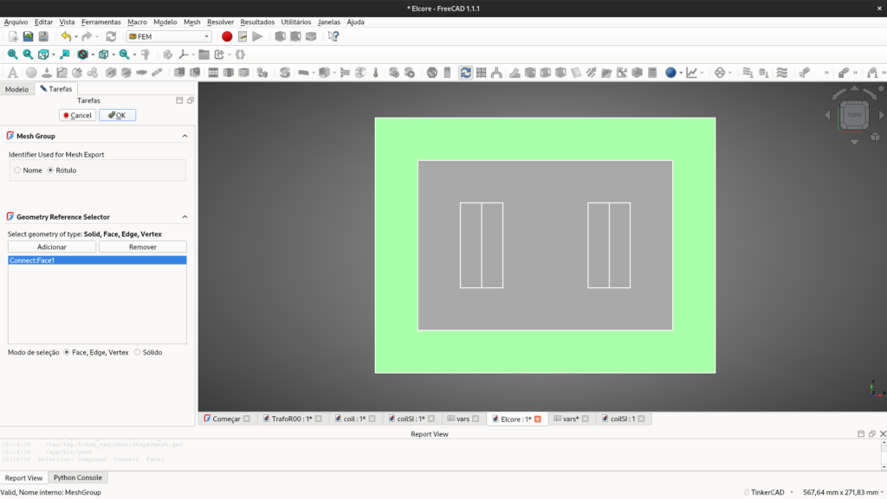

<figcaption>

Fig. 11 - Creating Mesh Groups.

</figcaption>

</figure>

The final result is presented bellow.

<figure>

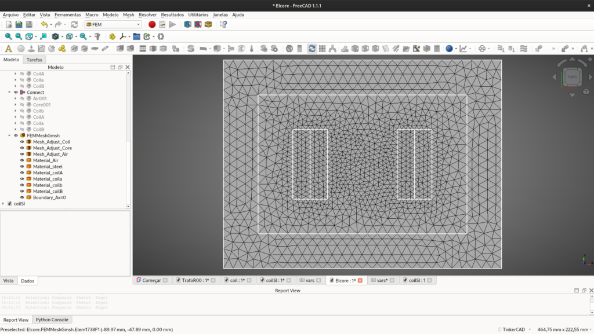

<figcaption>

Fig. 12 - The complete FEM model in FreeCAD. Observe the tree view with mesh refinements and Mesh Groups (Physical Groups) properly assigned, ensuring a structured entity definition for the export.

</figcaption>

</figure>

## Exporting to Elmer

The model must now be exported for Elmer to understand. Select your Gmsh mesh object in the tree, go to **File » Export...**, and save it as an I-DEAS Universal (`.unv`) file.

Open ElmerGUI, go to **File » Open**, select your `.unv` file, and check the final imported mesh. You should see your named physical groups translated perfectly into _Body Properties_ and _Boundary Properties_.

<figure>

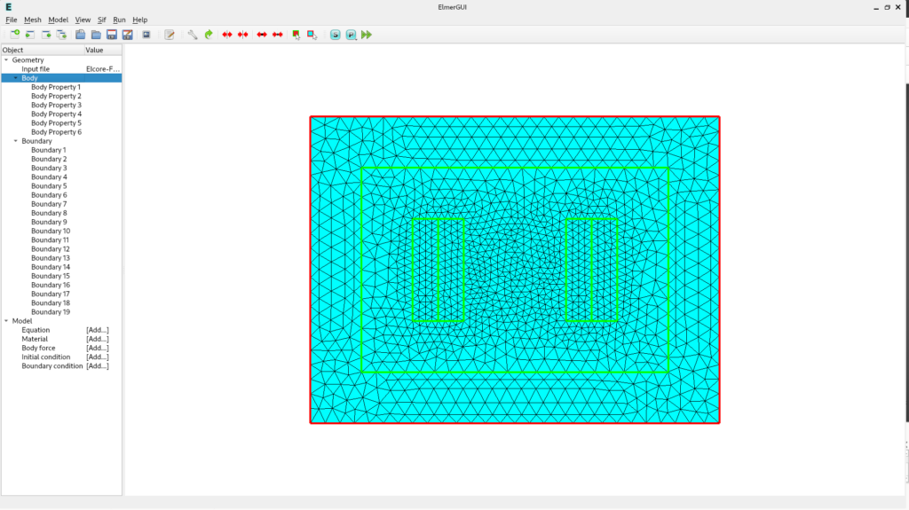

<figcaption>

Fig. 12 - Import check: The .unv file is successfully parsed by Elmer, showing all bodies and boundaries ready for physics assignment.

</figcaption>

</figure>

Now it's time to assign the electromagnetic equations, materials, and start the Elmer simulation— [but that is a topic for the next post](../20260501%20-%20Designing%202D%20transformer%20core%20steady%20state%20simulation%20elmerfem%20part2/).

<!--Include social share buttons-->

