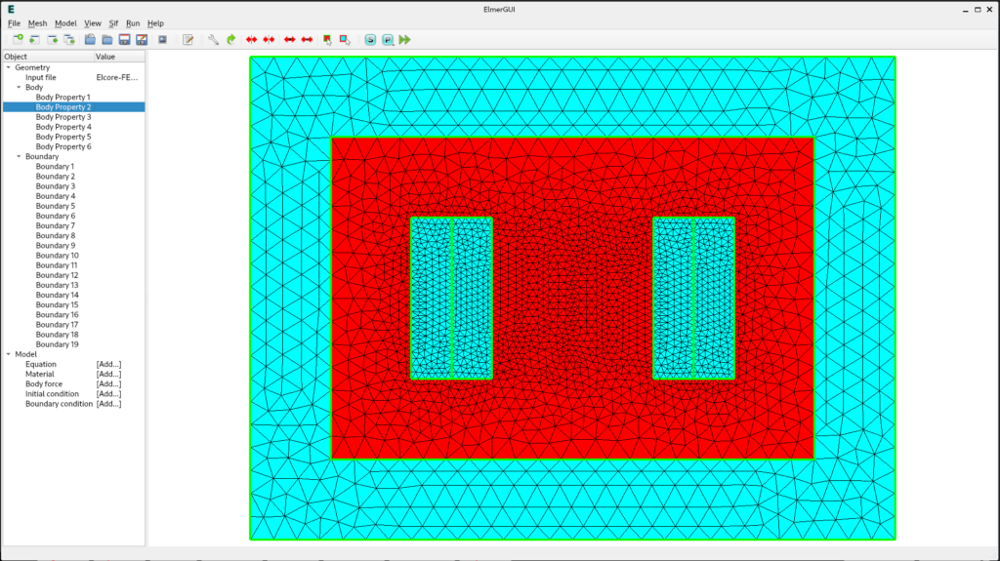
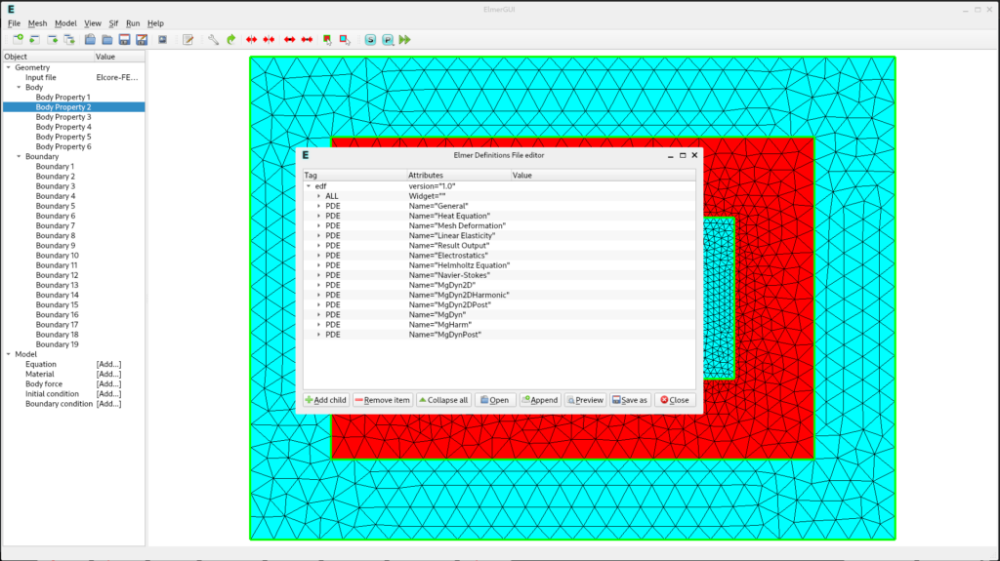
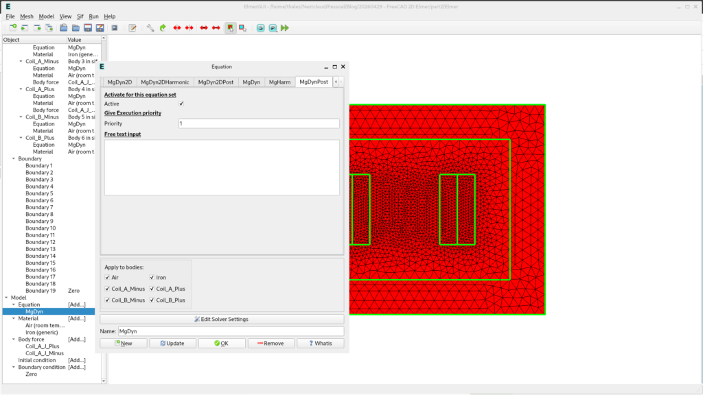
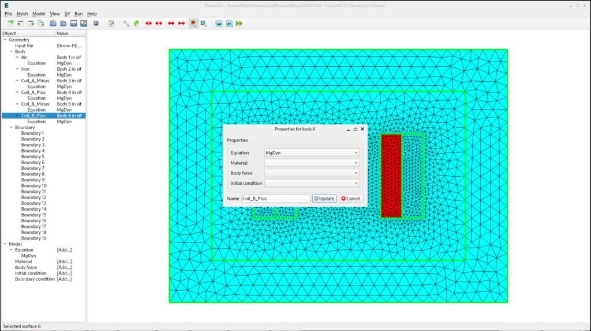
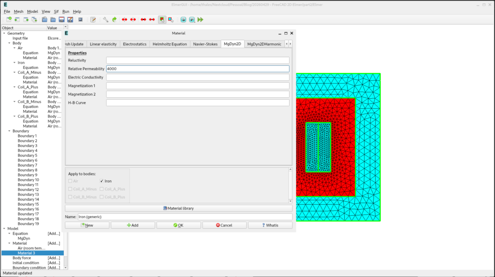
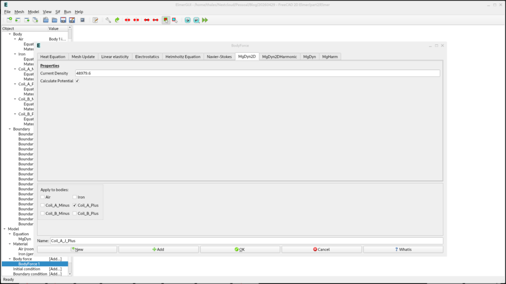
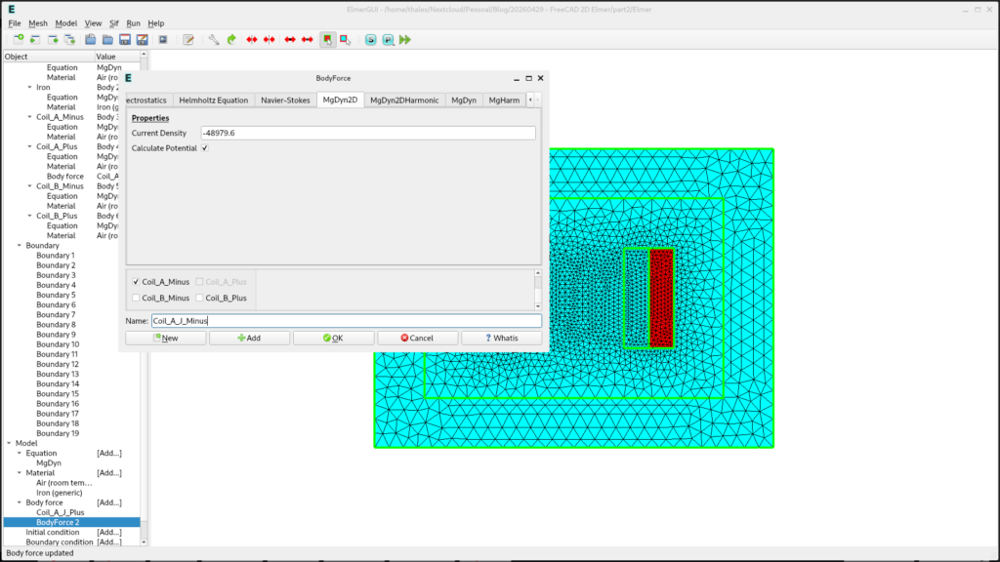
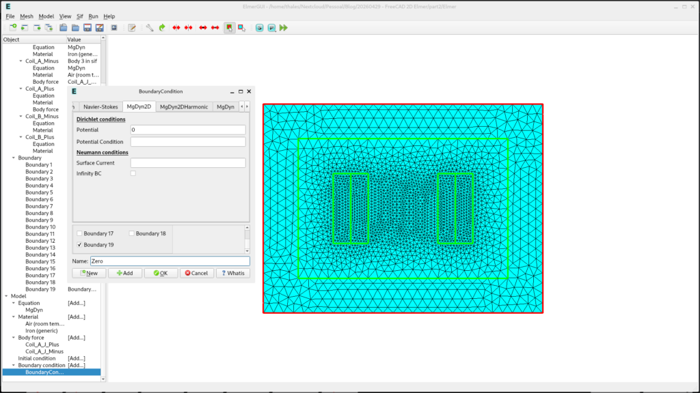
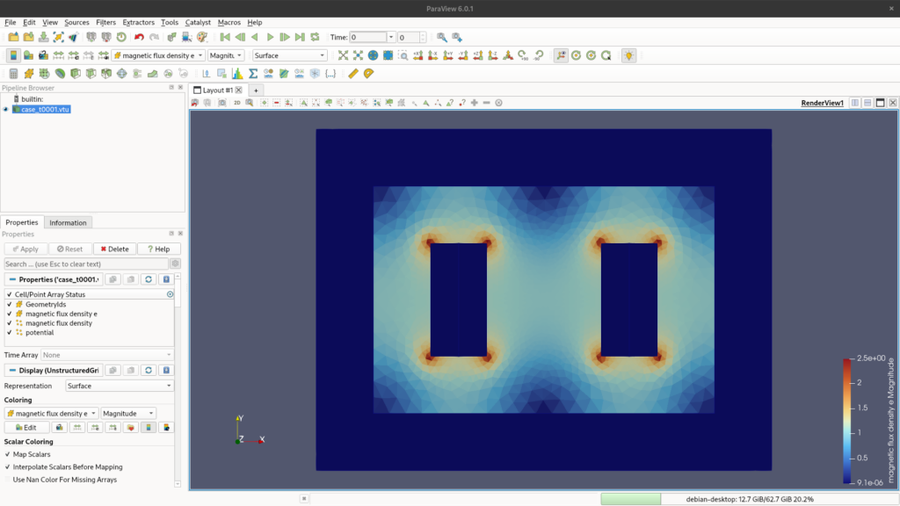

In this second part of our series, we transition from geometry preparation in FreeCAD to the simulation environment of **ElmerFEM**. If you missed [Part 1, you can catch up via the link](../20260429%20-%20Designing%20a%202D%20transformer%20core%20freecad%20to%20elmerfem%20integration%20part1/).

**ElmerGUI** streamlines the workflow by managing the Solver Input File (`.sif`) directly through its interface. In this stage, we will compute the static magnetic flux generated by the transformer's primary winding and later apply a load to the secondary winding to validate our Finite Element Method (FEM) results against analytical calculations.

## Understanding ElmerGUI

Before we start, it is important to understand that ElmerGUI is a great tool for those starting with Elmer. However, you will soon find that the core configuration eventually leads back to the `.sif` file, which we will learn to edit in this post.

### First Steps: Importing and Scaling

The first task is to import the mesh we generated previously. Go to **File >> Open** and select your `.unv` file.

<figure>

<figcaption>

Fig. 1 - The ElmerGUI interface showing the successfully imported transformer mesh, including the core and surrounding air domain.

</figcaption>

</figure>

For the model to work correctly, we need two specific solvers that aren't active by default in the UI:

1. Go to **File >> Definitions**.

3. Click the **Append** button.

5. Navigate to the `edf-extra` folder and select `magnetodynamics2d.xml` and `magnetodynamics.xml`.

<figure>

<figcaption>

Fig. 2 - Appending the Magnetodynamics definitions to enable magnetic field simulation capabilities.

</figcaption>

</figure>

> **Important Note on Units:** If you modeled your geometry in millimeters or inches, you must add a **Coordinate Scaling** factor. Go to **Model >> Setup** and set the scale to `0.001` (to convert mm to meters), as Elmer operates in SI units.

### Setting Up the Equation

We must inform Elmer what physics it needs to solve.

1. In the left sidebar, under **Model**, click **Equation >> Add**.

3. In the **MgDyn2D** tab, activate the solver and apply it to all bodies.

5. Set the **Priority** to **2** (higher numbers indicate higher priority).

<figure>

<figcaption>

Fig. 3 - Configuring the 2D Magnetodynamics equation and assigning execution priority 1.

</figcaption>

</figure>

1. Now look for **MgDynPost** (used for post-processing results). Activate it and set its **Priority** to **1**.

3. Name this set "MgDyn" before clicking OK.

<figure>

<figcaption>

Fig. 4 - Configuring the 2D Magnetodynamics equation and assigning execution priority 1.

</figcaption>

</figure>

### Materials and Body Identification

Before assigning materials, it is best practice to rename your bodies for better organization. Double-click the numbered bodies in the left menu to rename them (e.g., Core, Coil\_A, Air).

<figure>

<figcaption>

Fig. 5 - Renaming the mesh bodies to simplify the assignment of materials and forces.

</figcaption>

</figure>

Now, apply the materials via **Model >> Material >> Add**:

- **Air and Coils:** Choose "Air" from the Material library and apply it to the Air and Coil bodies.

- **Core (Iron):** Select "Iron". In the **MgDyn2D** tab, set the **Relative Permeability** to **4000**.Now we can go to Material and click in \[Add..\]. Click in the Material library. Chose Air and Apply to bodies Air and Coils. Follow the same process, but now, select the Iron material.

<figure>

<figcaption>

Fig. 6 - Defining the magnetic properties for the transformer core material.

</figcaption>

</figure>

### Body Force: Adding the Current Source

We must add the current source for the primary winding. In ElmerGUI, we enter the total surface current density (J). If we consider a total current of 60\\ A.e, the surface current density is calculated as:

$$J = \frac{N \cdot I}{A} = \frac{60~\text{A.e}}{70~\text{mm} \times 17.5~\text{mm}} = 48\,979.6~\text{A/m}^2$$

1. Go to **Model >> Body Force >> Add**.

3. In the **MgDyn2D** tab, check **Calculate Potential** and enter the calculated value above.

5. Create a second Body Force for the opposite coil using a **negative** value to represent the return path of the current.

<figure>

<figcaption>

Fig. 7 - Applying the calculated surface current density as a Body Force to the coils. Positive.

</figcaption>

</figure>

Create a new Body force, but now you should choose the opposite coil and put a negative surface current value.

<figure>

<figcaption>

Fig. 8 - Applying the calculated surface current density as a Body Force to the coils. Negative.

</figcaption>

</figure>

### Boundary Conditions

Finally, we define the simulation boundary.

1. Go to **Model >> Boundary Condition >> Add**.

3. Select the **outer boundary** of the air domain.

5. Set the **Dirichlet Potential** to **0**. This ensures the magnetic flux is contained within our simulation space.

<figure>

<figcaption>

Fig. 9 - Setting the Dirichlet boundary condition to zero at the outer edges of the model.

</figcaption>

</figure>

### The Sif File and Running the Simulation

We are now ready for the first simulation run.

1. Click on **Sif** in the upper bar menu and select **Generate**.

3. Click **Sif** again and select **Edit**. You will be able to read every modification we've made in text format.

5. After checking the settings, click the **Run** icon to start the solver.

### Paraview Results

If everything went fine, the solver will finish, and you will be able to view the results in **Paraview**. We will discuss the visualization of flux lines and density [in our next topic](../20260504%20-%20Designing%202D%20transformer%20core%20post%20processing%20with%20paraview%20part3/)!

<figure>

<figcaption>

Fig. 10 - Paraview post-processing.

</figcaption>

</figure>

<!--Include social share buttons-->

