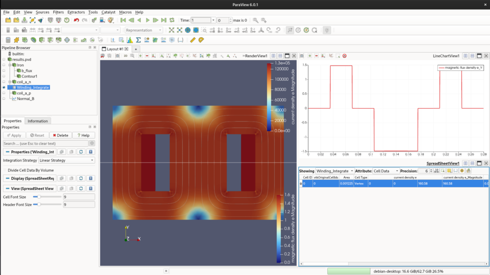
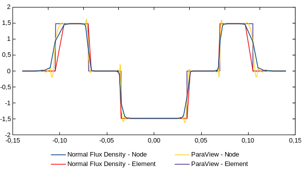

[In our last series](../20260429%20-%20Designing%20a%202D%20transformer%20core%20freecad%20to%20elmerfem%20integration%20part1/), we covered the step-by-step of how to model a simple EI core and simulate it using ElmerFEM. Due to the limitations of the ElmerGUI, we soon enough face some limitations.

In this post, we will follow some basics of the `.sif` file and, later, we will compare it with the ElmerGUI generated one.

Before we start, let's consider that you already generated your `.unv` file and you are ready for a new model design. Our first suggestion was to open ElmerGUI and do everything from there. Now, we follow a different approach. Let's try to do it using your preferable text editor. I will use VSCodium for that.

## ElmerGrid

The first thing we need to do is convert the `.unv` file to Elmer format. To perform that, we use ElmerGrid.

```bash
$ ElmerGrid 8 2 EIcore-FEMMeshGmsh.unv -autoclean
```

It will generate a lot of files as follows:

```bash
$ tree
.
├── EIcore-FEMMeshGmsh
│   ├── entities.sif
│   ├── mesh.boundary
│   ├── mesh.elements
│   ├── mesh.header
│   ├── mesh.names
│   └── mesh.nodes
└── EIcore-FEMMeshGmsh.unv
```

If you look inside the `.sif` file, you will notice that now it uses the same name that you created in FreeCAD. That one will help us a lot.

```yml
!------ Skeleton for body section -----
Body 1
    Name = Air
End

Body 2
  Name = Iron_Faces
End

Body 3
  Name = coil_a_minus_Faces
End
.
.
```

Now, we fill out the rest.

## Sif Editing

Let's break the sif editing into different parts. The first one is the variables.

### MATC

MATC is a library for the numerical evaluation of mathematical expressions. Here I first define the important variables for my simulation. It must appear as the very first thing in the .sif file.

```yml
$ N = 217
$ I = 0.74
$ NI = N*I
$ A_coil = 0.035 * 0.07 
$ J = N * I / A_coil
```

### Headers, Simulation and Constants

For headers and simulation, just use the default of ElmerGUI. Don't forget to add Coordinate Scaling if you need it.

```yml
Header
  CHECK KEYWORDS Warn
  Mesh DB "." "."
  Include Path ""
  Results Directory ""
End

Simulation
  Max Output Level = 5
  Coordinate System = Cartesian
  Coordinate Mapping(3) = 1 2 3
  Simulation Type = Steady state
  Steady State Max Iterations = 1
  Output Intervals(1) = 1
  ! Solver Input File = case.sif
  Coordinate Scaling = Real 0.001
End

Constants
  Gravity(4) = 0 -1 0 9.82
  Stefan Boltzmann = 5.670374419e-08
  Permittivity of Vacuum = 8.85418781e-12
  Permeability of Vacuum = 1.25663706e-6
  Boltzmann Constant = 1.380649e-23
  Unit Charge = 1.6021766e-19
End
```

### Equation

Now we follow the order of Bodies, Solvers, Equation, Materials, Body Force and Boundary Condition.

We will skip the Bodies for now and go directly to Equation.

```yml
Equation 1
  Name = "MgDyn2D"
  Active Solvers(3) = 1 2 3 ! <-- Here you define the number of solvers and the execution order.
End
```

The solvers must be defined before the equation definition.

#### Solver 1

Those are default exported from ElmerGUI.

```yml
Solver 1
  Equation = MgDyn2D
  Variable = Potential
  Procedure = "MagnetoDynamics2D" "MagnetoDynamics2D"
  Exec Solver = Always
  Optimize Bandwidth = True
  Steady State Convergence Tolerance = 1.0e-5
  Nonlinear System Convergence Tolerance = 1.0e-7
  Nonlinear System Max Iterations = 20
  Nonlinear System Newton After Iterations = 3
  Nonlinear System Newton After Tolerance = 1.0e-3
  Nonlinear System Relaxation Factor = 1
  Linear System Solver = Iterative
  Linear System Iterative Method = BiCGStab
  Linear System Max Iterations = 500
  Linear System Convergence Tolerance = 1.0e-10
  BiCGstabl polynomial degree = 2
  Linear System Preconditioning = ILU0
  Linear System Abort Not Converged = False
  Linear System Residual Output = 10
End
```

#### Solver 2

Those are also default, exported from ElmerGUI.

```yml
Solver 2
  Equation = MgDynPost
  Procedure = "MagnetoDynamics" "MagnetoDynamicsCalcFields"
  Target Variable = Potential
  Exec Solver = Always
  Steady State Convergence Tolerance = 1.0e-5
  Linear System Solver = Iterative
  Linear System Iterative Method = BiCGStab
  Linear System Max Iterations = 500
  Linear System Convergence Tolerance = 1.0e-10
  Linear System Preconditioning = ILU0
  Calculate Magnetic Field Strength = Logical True
  Calculate Magnetic Flux Density = Logical True
  Calculate Current Density = Logical True
End
```

#### Solver 3

For solver 3, we just add more post-processing features. We use `Vtu Part Collection`. This will create separate results improving Paraview post-processing.

```yml
Solver 3
  Exec Solver = After saving
  Equation = "ResultOutput"
  Procedure = "ResultOutputSolve" "ResultOutputSolver"
  Output File Name = "results"
  Vtu Format = Logical True
  Vtu Part Collection = Logical True
  Vtu Multiblock = Logical True
End
```

### Materials

We add Air and Iron materials, however, we add non-linearity with an H-B Curve.

```yml
Material 1
  Name = "Air (room temperature)"
  Heat Conductivity = 0.0257
  Relative Permeability = 1.00000037
  Viscosity = 1.983e-5
  Heat expansion Coefficient = 3.43e-3
  Density = 1.205
  Relative Permittivity = 1.00059
  Sound speed = 343.0
  Heat Capacity = 1005.0
End

Material 2
  Name = "Iron (generic)"
  Sound speed = 5000.0
  ! Relative Permeability = 4000
  H-B Curve = Variable "dummy"
    Real Cubic
      Include "hb_iron.txt"
    End

  Poisson ratio = 0.29
  Density = 7870.0
  Heat Capacity = 449.0
  Heat Conductivity = 80.2
  Youngs modulus = 193.053e9
  Electric Conductivity = 10.30e6
  Heat expansion Coefficient = 11.8e-6
End
```

Please, notice that now I have included a `.txt` file with the H-B curve data. The correct path to the file must be addressed.

```yml
0 0
0.05 19.96533
0.1 29.906288
0.15 36.398771
0.2 41.371669
0.25 45.590262
0.3 49.424859
0.35 53.08228
0.4 56.692664
0.45 60.347374
0.5 64.117637
0.55 68.064755
0.6 72.246371
0.65 76.720886
0.7 81.551123
0.75 86.807959
0.8 92.574503
0.85 98.95152
0.9 106.065047
0.95 114.077777
1 123.206911
1.05 133.753385
1.1 146.151738
1.15 161.058668
1.2 179.516634
1.25 203.267945
1.3 235.379748
1.35 281.524948
1.4 352.648412
1.45 470.426179
1.5 677.451541
1.55 1051.068036
1.6 1703.275165
1.65 2726.517959
1.7 4137.981052
1.75 5832.619704
1.8 7939.55294
1.85 10565.294335
1.9 13843.912965
1.95 17970.359698
2 23423.776432
2.05 32234.32596
2.1 51366.778967
2.15 84577.843501
2.2 121162.493322
2.25 160127.812767
2.3 202470.282245
```

### Body force

Now we add current to the windings. We added the `-distribute` flag as presented in the [source code](https://github.com/ElmerCSC/elmerfem/blob/68e7613a4ea08101eaeb6a1f46d16be2f7d5ffbe/fem/src/ModelDescription.F90#L2303).

```yml
Body Force 1
  Name = "Circuit_A"
  Current Density = -distribute $ NI
  ! Current Density = $ J
End

Body Force 2
  Name = "Circuit_a"
  Current Density = -distribute $ -NI
  ! Current Density = $ -J
End

Body Force 3
  Name = "Circuit_b"
  Current Density = Real 0.0 ! $ NI
End

Body Force 4
  Name = "Circuit_B"
  Current Density = Real 0.0 ! $ -NI
End
```

### Zero boundary

Lastly, we add the `zero` boundary condition.

```yml
Boundary Condition 1
  Target Boundaries(1) = 19 
  Name = "Zero"
  Potential = Real 0.0
End
```

### Bodies

Now, just add equation, material and body forces to the target bodies.

```yml
Body 1
  Name = Air
  Equation = 1
  Material = 1
End

Body 2
  Name = Iron_Faces
  Equation = 1
  Material = 2
End

Body 3
  Name = coil_a_minus_Faces
  Equation = 1
  Material = 1
  Body Force = 1
End

Body 4
  Name = coil_a_plus_Faces
  Equation = 1
  Material = 1
  Body Force = 2
End

Body 5
  Name = coil_b_minus_Faces
  Equation = 1
  Material = 1
  Body Force = 3
End

Body 6
  Name = coil_b_plus_Faces
  Equation = 1
  Material = 1
  Body Force = 4
End
```

The complete `.sif` file is presented bellow.

```yml
$ N = 217
$ I = 0.74
$ NI = N*I
$ A_coil = 0.035 * 0.07 
$ J = N * I / A_coil

Header
  CHECK KEYWORDS Warn
  Mesh DB "." "."
  Include Path ""
  Results Directory ""
End

Simulation
  Max Output Level = 5
  Coordinate System = Cartesian
  Coordinate Mapping(3) = 1 2 3
  Simulation Type = Steady state
  Steady State Max Iterations = 1
  Output Intervals(1) = 1
  ! Solver Input File = case.sif
  Coordinate Scaling = Real 0.001
End

Constants
  Gravity(4) = 0 -1 0 9.82
  Stefan Boltzmann = 5.670374419e-08
  Permittivity of Vacuum = 8.85418781e-12
  Permeability of Vacuum = 1.25663706e-6
  Boltzmann Constant = 1.380649e-23
  Unit Charge = 1.6021766e-19
End

!------ Skeleton for body section -----
Body 1
  Name = Air
  Equation = 1
  Material = 1
End

Body 2
  Name = Iron_Faces
  Equation = 1
  Material = 2
End

Body 3
  Name = coil_a_minus_Faces
  Equation = 1
  Material = 1
  Body Force = 1
End

Body 4
  Name = coil_a_plus_Faces
  Equation = 1
  Material = 1
  Body Force = 2
End

Body 5
  Name = coil_b_minus_Faces
  Equation = 1
  Material = 1
  Body Force = 3
End

Body 6
  Name = coil_b_plus_Faces
  Equation = 1
  Material = 1
  Body Force = 4
End

Solver 1
  Equation = MgDyn2D
  Variable = Potential
  Procedure = "MagnetoDynamics2D" "MagnetoDynamics2D"
  Exec Solver = Always
  Optimize Bandwidth = True
  Steady State Convergence Tolerance = 1.0e-5
  Nonlinear System Convergence Tolerance = 1.0e-7
  Nonlinear System Max Iterations = 20
  Nonlinear System Newton After Iterations = 3
  Nonlinear System Newton After Tolerance = 1.0e-3
  Nonlinear System Relaxation Factor = 1
  Linear System Solver = Iterative
  Linear System Iterative Method = BiCGStab
  Linear System Max Iterations = 500
  Linear System Convergence Tolerance = 1.0e-10
  BiCGstabl polynomial degree = 2
  Linear System Preconditioning = ILU0
  Linear System Abort Not Converged = False
  Linear System Residual Output = 10
End

Solver 2
  Equation = MgDynPost
  Procedure = "MagnetoDynamics" "MagnetoDynamicsCalcFields"
  Target Variable = Potential
  Exec Solver = Always
  Steady State Convergence Tolerance = 1.0e-5
  Linear System Solver = Iterative
  Linear System Iterative Method = BiCGStab
  Linear System Max Iterations = 500
  Linear System Convergence Tolerance = 1.0e-10
  Linear System Preconditioning = ILU0
  Calculate Magnetic Field Strength = Logical True
  Calculate Magnetic Flux Density = Logical True
  Calculate Current Density = Logical True
End

Solver 3
  Exec Solver = After saving
  Equation = "ResultOutput"
  Procedure = "ResultOutputSolve" "ResultOutputSolver"
  Output File Name = "results"
  Vtu Format = Logical True
  Vtu Part Collection = Logical True
  Vtu Multiblock = Logical True
End

Equation 1
  Name = "MgDyn2D"
  Active Solvers(3) = 1 2 3
End

Material 1
  Name = "Air (room temperature)"
  Heat Conductivity = 0.0257
  Relative Permeability = 1.00000037
  Viscosity = 1.983e-5
  Heat expansion Coefficient = 3.43e-3
  Density = 1.205
  Relative Permittivity = 1.00059
  Sound speed = 343.0
  Heat Capacity = 1005.0
End

Material 2
  Name = "Iron (generic)"
  Sound speed = 5000.0
  ! Relative Permeability = 4000
  H-B Curve = Variable "dummy"
    Real Cubic
      Include "bh_iron.txt"
    End

  Poisson ratio = 0.29
  Density = 7870.0
  Heat Capacity = 449.0
  Heat Conductivity = 80.2
  Youngs modulus = 193.053e9
  Electric Conductivity = 10.30e6
  Heat expansion Coefficient = 11.8e-6
End

Body Force 1
  Name = "Circuit_A"
  Current Density = -distribute $ NI
  ! Current Density = $ J
End

Body Force 2
  Name = "Circuit_a"
  Current Density = -distribute $ -NI
  ! Current Density = $ -J
End

Body Force 3
  Name = "Circuit_b"
  Current Density = Real 0.0 ! $ NI
End

Body Force 4
  Name = "Circuit_B"
  Current Density = Real 0.0 ! $ -NI
End

Boundary Condition 1
  Target Boundaries(1) = 19
  Name = zerobound_Edges
  Name = "Zero"
  Potential = Real 0.0
End
```

## Simulation

Now we run the simulation.

```bash
$ ElmerSolver my_first_sif_file.sif 
```

## Paraview

Now, inside paraview, you will notice a `.vtu` file. It has now different blocks that can be evaluated in paraview. It will be easier for post-processing. For now, let's just see the expected result.

The total magnetic length is 420mm.

$$H = \frac{N \cdot I}{l_m} = \frac{160.6}{0.385} = 417.17~\text{A/m}$$

Lookig the HB curve, that gives us aroung 1.43T.

<figure>



<figcaption>

Fig. 1 - Elmer post-processing using ParaView.

</figcaption>

</figure>

The surface current integral shows 160.58 A.e and 1.48 T of normal flux density.

## Post-processing

One last thing before we close this post, we can also perform post-processing natively using Elmer. Sometimes it is better to evaluate outside ParaView. For us, it is better just to compare both results. We are going to add plot over line flux, calculate the coil's Area, and the Potential integral (Flux Linkage). With current and flux, we get inductance.

To achieve this, we need to add two internal solvers to our `.sif` file: `SaveLine` and `SaveScalars`.

### Plot Over Line (SaveLine)

We add a 4th solver to extract data across a specific gap line:

```yml
Solver 4
  Equation = SaveLine
  Procedure = "SaveData" "SaveLine"
  Filename = "linha_fluxo.dat"
  File Append = Logical False
  Polyline Coordinates(2,2) = Real -0.14 0.0  0.14 0.0 
End
```



### Area and Flux Linkage (SaveScalars)

Instead of trying to integrate the current directly (which yields zero in a steady-state 2D model due to zero conductivity), we integrate the geometric Volume (Area in 2D) and the Magnetic Vector Potential ($A\_z$) over the coil surface:

```yml
Solver 5
  Equation = "SaveScalars"
  Procedure = "SaveData" "SaveScalars"
  Filename = "integrais_bobina.dat"
  File Append = Logical False

  ! 1. Area validation
  Variable 1 = Coordinate 1
  Operator 1 = volume

  ! 2. Potential Integral for Flux Linkage
  Variable 2 = Potential
  Operator 2 = int

  ! Apply exactly to the bodies marked with this tag
  Mask Name 1 = "Integrar Corrente"
  Mask Name 2 = "Integrar Corrente"
End
```

Don't forget to update your equation to include the new solvers (`Active Solvers(5) = 1 2 3 4 5`) and to add the mask `Integrar Corrente = Logical True` to the Body blocks representing your coils.The results are exported directly to standard text files (.dat), which are extremely friendly for pipelines using Python or Julia. With the integrated Potential (IAI\_A) and the known coil Area (AcoilA\_{coil}), the Inductance (LL) is easily calculated by:

$$L = \frac{N}{I \cdot A_{coil}} \iint A_z \, dA$$

I've improved some parts. You can check the result [here](https://github.com/thalesmaoa/Elmer-Examples/tree/main/Electrical_Machines/Static/Transformers/2D_Simulations/EICore).

[Get the Source Code o](https://github.com/thalesmaoa/Elmer-Examples/tree/main/Electrical_Machines/Static/Transformers/2D_Simulations/EICore)[n GitHub](https://github.com/thalesmaoa/avr-3level-spwm)


<!--Include social share buttons-->

