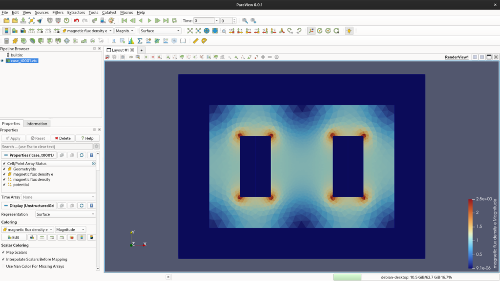
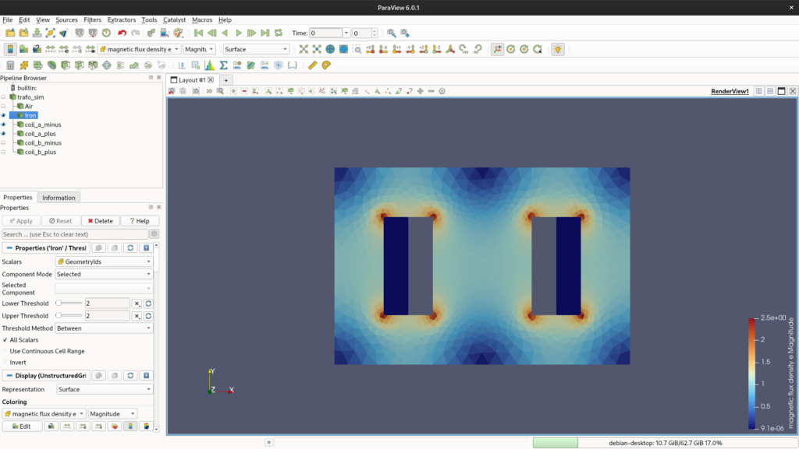
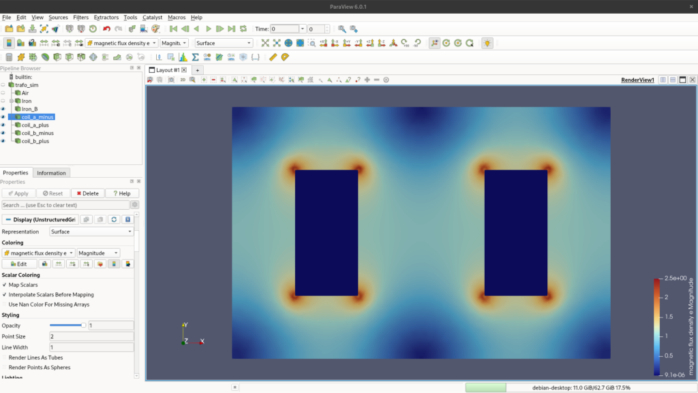
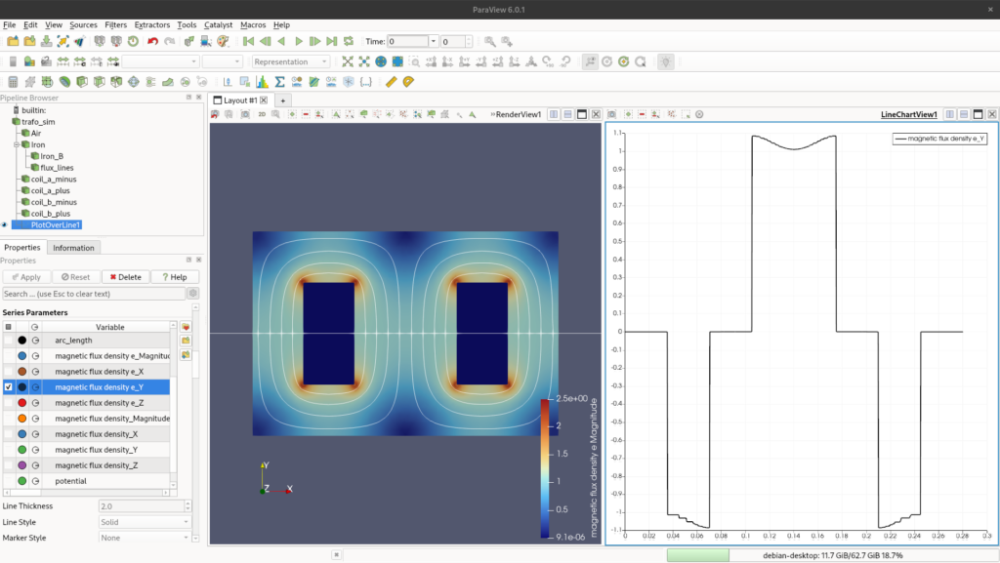

We have arrived at the final part of this design series! Throughout this process, we followed some straightforward steps using exclusively Graphical User Interfaces (GUI) to perform a steady-state simulation. If you missed them, you can check out [Part 1](../20260429%20-%20Designing%20a%202D%20transformer%20core%20freecad%20to%20elmerfem%20integration%20part1/) and [Part 2](../20260501%20-%20Designing%202D%20transformer%20core%20steady%20state%20simulation%20elmerfem%20part2/) of this series.

I will eventually address a more robust workflow for advanced analysis and tools. For now, however, it is essential for newcomers to understand these fundamental first steps.

## ParaView

The first thing we need to do is open our `.vtu` result file.

1. Load the file. In the _Pipeline Browser_ (the menu on the left), ParaView will show the file with a green box next to it, indicating it hasn't been applied yet.

3. Below that, in the _Properties_ panel, you will see the configuration options. This is where we adjust our results.

5. Click the **Apply** button, and the geometry will appear in the Render View.

7. Now, in the top toolbar (or the Properties window), change the visualization representation from _Solid Color_ to **magnetic flux density e**.

<figure>

<figcaption>

Fig. 1 - Initial ParaView setup showing the loaded `.vtu` file in the Pipeline Browser and the magnetic flux density distribution in the Render View.

</figcaption>

</figure>

You will notice that the magnetic flux is displayed in the form of elements (triangles) or nodes. The triangle view often looks a bit sharper because the data is self-contained within the boundaries of each element. The node view, on the other hand, averages the values of adjacent elements. If you play around with it, you will notice a blurring effect across the entire geometry.

### Isolating Components: Breaking the Bodies

To visualize our results better, we need to separate the different materials. We will do this using the _Threshold_ filter.

1. Click on your `case_t0001.vtu` file in the Pipeline Browser (feel free to rename it to something meaningful).

3. Go to the top menu: **Filters** > **Search...** and type **Threshold**. Hit Enter.

5. We will now reference the body numbers we set up in Elmer (e.g., `1` for Air, `2` for Iron, etc.).

7. In the Threshold _Properties_ panel, find the **Scalars** dropdown menu and select **GeometryIds**.

9. Set both the **Lower Threshold** and **Upper Threshold** to `1`, then click **Apply**.

You will notice that only the air body is now visible. Rename this threshold in the Pipeline Browser to "Air". Repeat this exact process for the other parts (Iron, Coils).

_⚠️ **Important note:** In ParaView, filters are applied to the currently selected item in the pipeline. Make sure you select the original `.vtu` file (the parent element) before adding a new Threshold, otherwise, you will try to apply a Threshold to an existing Threshold!_

<figure>

<figcaption>

Fig. 2 - Applying the Threshold filter to isolate specific components (e.g., the Air domain) by filtering their respective `GeometryIds`.

</figcaption>

</figure>

### Smoothing the Data: Cell Data to Point Data

Now that we can see the individual bodies, we can improve their visual representation.

Select the "Iron" body in the pipeline and apply the filter **Cell Data to Point Data** (using the Search menu). This filter will interpolate the constant values within the elements to the nodes, resulting in a much smoother and more professional-looking color gradient.

From here, you can change the color map (the legend) and axis limits. For now, I will just leave the default options.

<figure>

<figcaption>

Fig. 3 - Visualization of the surface magnetic flux.

</figcaption>

</figure>

### Drawing Flux Lines: The Contour Filter

A classic way to evaluate electromagnetic machines is by looking at the flux lines. We can achieve this using the Contour filter.

1. Select the smoothed "Iron" body in the pipeline.

3. Search for and apply the **Contour** filter.

5. In the Properties panel, change the Contour By field to **potential** (which represents the magnetic vector potential).

7. Look for the _Isosurfaces_ section. Clear the default value, click on **Add a range of values**, choose the number of samples you want (e.g., 15 or 20), and generate them. Click **Apply**.

<figure>

<figcaption>

Fig. 4 -Visualization of the magnetic flux lines across the iron core, generated by applying the Contour filter to the magnetic vector potential.

</figcaption>

</figure>

### Extracting Data: Plot Over Line

The last post-processing technique we will cover is extracting the normal flux density over a specific line. This is crucial for evaluating core saturation.

1. Select the parent "Iron" body in the pipeline.

3. Search for and apply the **Plot Over Line** filter.

5. In the Properties panel, define the coordinates (`Point 1` and `Point 2` representing `<x, y, z>`) to draw a line across the section of the core you want to analyze. Click **Apply**.

7. A new line chart window will open. In the _Series Parameters_ (Display properties), make sure you check only the variable of interest, such as **magnetic flux density e\_Y** (if your line is horizontal).

<figure>

<figcaption>

Fig. 5 - Evaluating the core's saturation by extracting and plotting the magnetic flux density (`e_Y`) across a defined cross-section using the Plot Over Line filter.

</figcaption>

</figure>

## Conclusion

There are far more powerful tools and filters inside ParaView, but these are the most relevant ones for a basic post-processing evaluation of our 2D model.

Now, we need to step back into Elmer and start playing serious, but that will be [the topic for another discussion](../20260504%20-%20Designing%202D%20transformer%20core%20mastering%20sif%20file/)!

<!--Include social share buttons-->

