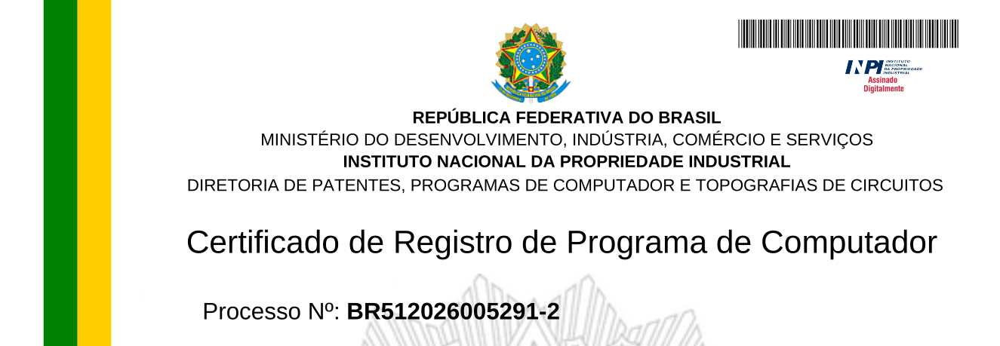

<figure style="text-align: center;">

<figcaption>

Fig. 1 — Certificado de Registro de Programa de Computador — INPI.Fig. 1 — Computer Program Registration Certificate — INPI.

</figcaption>

</figure>

É com satisfação que anuncio o registro de software junto ao **INPI** (Instituto Nacional da Propriedade Industrial) no âmbito do **Projeto SIMOI**, em parceria com a **Petrobras**.I am pleased to announce the software registration with **INPI** (Brazilian National Institute of Industrial Property) under the **SIMOI Project**, in partnership with **Petrobras**.

O software, intitulado **"Software para Monitoramento e Previsão da Degradação de Falha de Isolamento em Motores de Indução Trifásicos Equipados com Sensor de Corrente de Alta Sensibilidade"**, recebeu o certificado de registro sob o processo **BR512026005291-2**, expedido em 14 de julho de 2026.The software, titled **"Software for Monitoring and Predicting Insulation Failure Degradation in Three-Phase Induction Motors Equipped with High-Sensitivity Current Sensor"**, received the registration certificate under process **BR512026005291-2**, issued on July 14, 2026.

Este trabalho contou com a excelente coordenação do [Prof. Sidelmo Magalhães Silva](https://somos.ufmg.br/professor/sidelmo-magalhaes-silva) e com uma equipe multidisciplinar de pesquisadores da UFMG e da Petrobras, unindo esforços em prol da inovação na área de monitoramento de máquinas elétricas.This work was carried out under the excellent coordination of [Prof. Sidelmo Magalhães Silva](https://somos.ufmg.br/professor/sidelmo-magalhaes-silva) and with a multidisciplinary team of researchers from UFMG and Petrobras, joining efforts to drive innovation in the field of electrical machine monitoring.

<!--Include social share buttons-->


