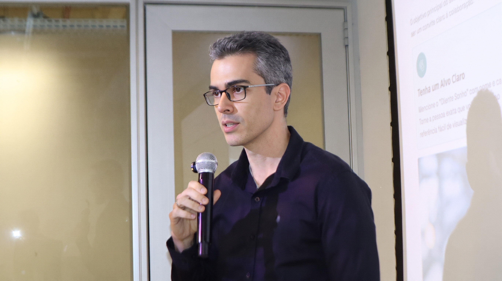

<figure style="text-align: center;">

{width=70%}

<figcaption>

Fig. 1 — Evento BuyCoffee.Fig. 1 — BuyCoffee event.

</figcaption>

</figure>

Bom dia, pessoal! ☀️☕Good morning, everyone! ☀️☕

Na última quarta-feira, dia 15 de julho, tive o prazer de participar de mais uma edição do **BuyCoffee** — um evento que já virou referência em networking de qualidade aqui em Belo Horizonte.Last Wednesday, July 15th, I had the pleasure of attending another edition of **BuyCoffee** — an event that has become a benchmark for quality networking here in Belo Horizonte, Brazil.

Foi uma manhã especial, com muito networking, conexões estratégicas, boas conversas e aquele café mineiro para deixar tudo ainda melhor. ☕🚀It was a special morning, filled with networking, strategic connections, great conversations, and that authentic *café mineiro* to make everything even better. ☕🚀

Na oportunidade, apresentei meus trabalhos como pesquisador e desenvolvedor de tecnologia. Tive conversas enriquecedoras com profissionais de diferentes áreas — do empreendedorismo à indústria — e pude compartilhar um pouco da minha jornada unindo pesquisa acadêmica, sistemas embarcados e desenvolvimento de soluções open-source.During the event, I presented my work as a researcher and technology developer. I had enriching conversations with professionals from diverse fields — from entrepreneurship to industry — and had the chance to share a bit of my journey bridging academic research, embedded systems, and open-source development.

É sempre revigorante encontrar pessoas que enxergam a tecnologia como motor de transformação real. Saí do evento com a cabeça fervendo de ideias e o coração cheio de boas conexões.It's always refreshing to meet people who see technology as an engine for real transformation. I left the event with my mind buzzing with ideas and my heart full of great connections.

Se você esteve por lá e não nos falamos, me manda uma mensagem! E se ainda não conhece o BuyCoffee, fica de olho na próxima edição — vale muito a pena.If you were there and we didn't get a chance to talk, send me a message! And if you haven't been to BuyCoffee yet, keep an eye out for the next edition — it's absolutely worth it.

Nos vemos na próxima ☕🚀See you at the next one ☕🚀

<!--Include social share buttons-->

