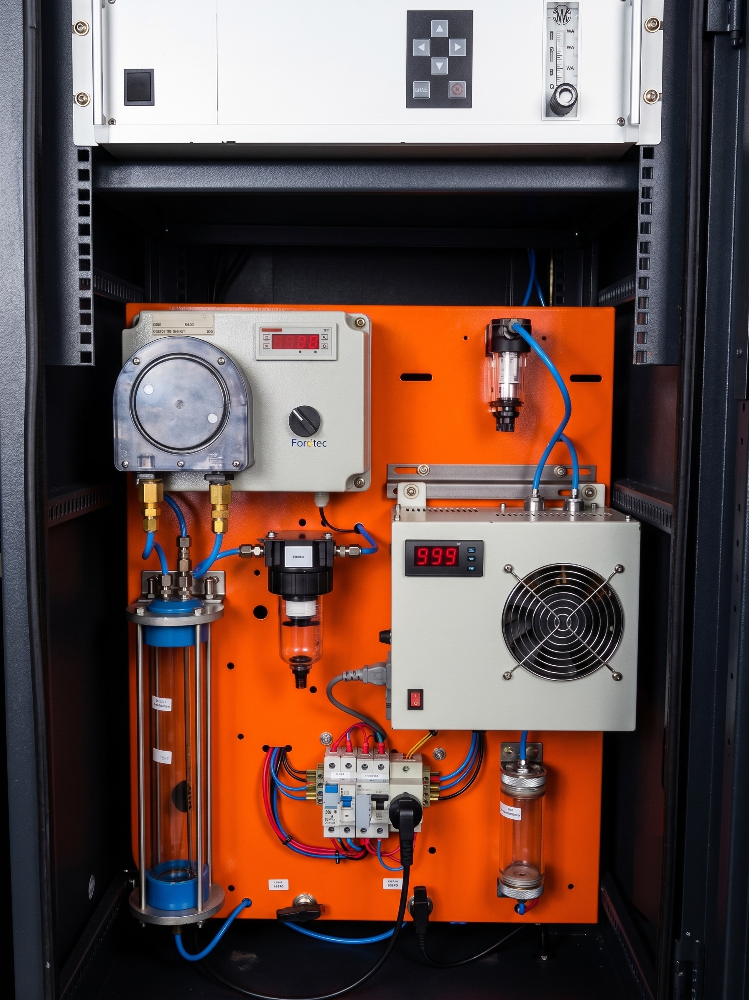

**Parceiro Industrial:** ArcelorMittal Bioflorestas  
**Escopo:** Engenharia Reversa, Instrumentação Analítica e Ciência de Dados Aplicada  

{width=60%}

## O Desafio

A produção de carvão vegetal (biomassa) para a indústria siderúrgica envolve processos termoquímicos complexos de carbonização. Para que empresas de grande porte, como a **ArcelorMittal Bioflorestas**, possam certificar suas operações e atuar ativamente no mercado internacional de créditos de carbono, é exigida uma precisão absoluta na medição das emissões de gases de efeito estufa (GEE) durante o processo.

O grande obstáculo prático é que os analisadores de gás comerciais de alta precisão operam frequentemente como "caixas-pretas". Seus hardwares e softwares proprietários entregam dados pré-processados e engessados, o que inviabiliza a customização algorítmica necessária para a realização de cálculos estequiométricos e auditorias rigorosas exigidas pelos órgãos certificadores de carbono. 

## Engenharia Reversa e Ciência de Dados

Para contornar as restrições comerciais dos equipamentos de prateleira e garantir total controle sobre os dados das emissões, o projeto exigiu uma abordagem híbrida de instrumentação avançada e modelagem matemática. 

A solução desenvolvida passou pelas seguintes etapas críticas de engenharia:

* **Engenharia Reversa de Analisadores:** Atuei diretamente na desmontagem lógica e física dos analisadores de gás comerciais. O objetivo foi mapear e interceptar os sinais analógicos e digitais "crus" (*raw data*) diretamente nas saídas dos sensores óticos e químicos, antes que fossem filtrados pelo software proprietário do fabricante.
* **Sistema de Aquisição e Condicionamento:** Projetei a arquitetura de coleta de dados capaz de operar no ambiente hostil do chão de fábrica (altas temperaturas e particulados). Isso garantiu que as leituras de concentração de gases (como $CO$, $CO_2$, $CH_4$ e $O_2$) fossem extraídas em tempo real e com alta fidelidade.
* **Balanço Químico e Modelagem:** Na camada de software, utilizei técnicas de Ciência de Dados para modelar a termodinâmica dos fornos. Desenvolvi algoritmos que cruzavam os dados crus dos sensores com as variáveis de entrada de biomassa, realizando o balanço químico estequiométrico e de massa contínuo da combustão.

{width=85%}

## Impacto

Este desenvolvimento rompeu a limitação dos instrumentos comerciais, transformando equipamentos padrão em ferramentas de auditoria de precisão científica. A modelagem algorítmica do balanço de massa forneceu à ArcelorMittal Bioflorestas a transparência e a rastreabilidade exatas dos gases emitidos e evitados no processo de carbonização. 

Como resultado direto, o sistema viabilizou a comprovação auditável das métricas de sustentabilidade da planta, fornecendo o lastro técnico necessário para a conversão das reduções de emissões em ativos financeiros no mercado global de créditos de carbono.

{height=60px}

{height=60px}

<!--Include social share buttons-->

