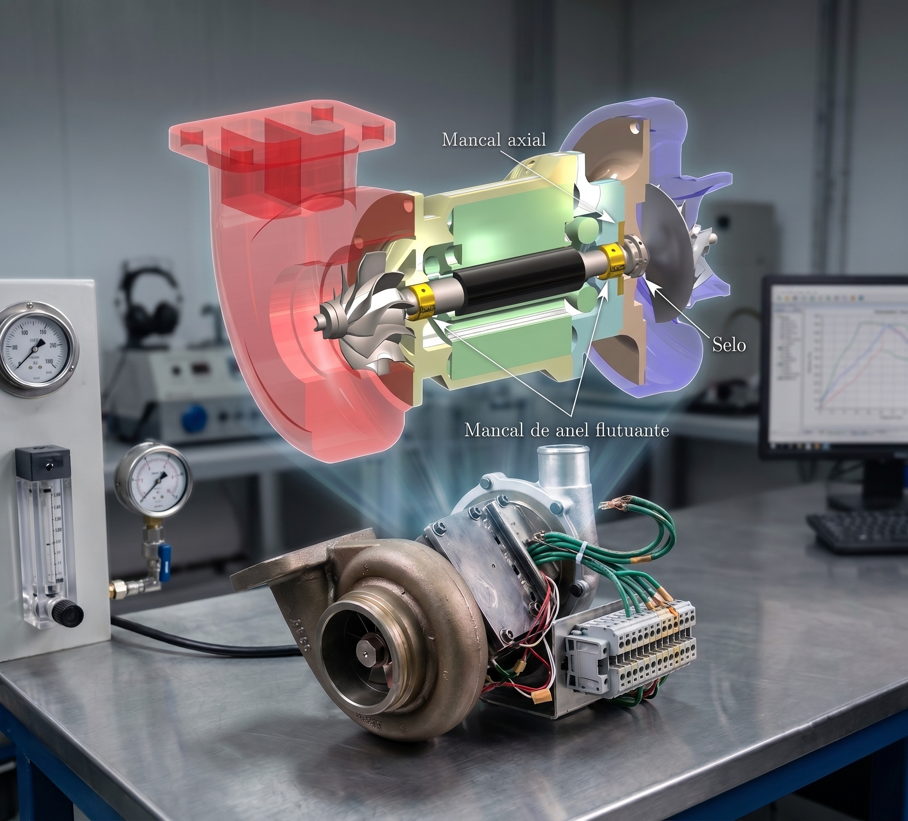
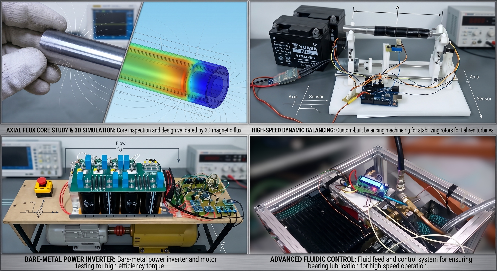

**Empresa / Contexto:** Fahren (Startup Empreendedora) & Doutorado (UFMG)
**Escopo:** Pesquisa & Desenvolvimento (P&D) / Design Eletromecânico e Automação**Company / Context:** Fahren (Entrepreneurial Startup) & Doctorate (UFMG)
**Scope:** Research & Development (R&D) / Electromechanical Design and Automation

{width=70%}

## O DesafioThe Challenge

A geração de energia distribuída por meio de microturbinas a gás representa o estado da arte em densidade de potência e eficiência termoelétrica. O grande obstáculo tecnológico, no entanto, é a altíssima velocidade do rotor.Distributed power generation using gas microturbines represents the state of the art in power density and thermoelectric efficiency. The major technological obstacle, however, is the extremely high rotational speed of the rotor.

O desafio deste projeto, que foi o núcleo de desenvolvimento da minha startup **Fahren** e tema central do meu Doutorado, foi conceber e construir um sistema de geração baseado em uma microturbina a gás com meta de operação na faixa de 100.000 rpm. Operar máquinas elétricas nessa velocidade exige a quebra de paradigmas convencionais da engenharia, forçando o domínio rigoroso e simultâneo de vibrações mecânicas, lubrificação termofluidodinâmica e eletrônica de potência de alta frequência.The challenge of this project, which was the core development of my startup **Fahren** and the central theme of my Doctorate, was to design and build a generation system based on a gas microturbine targeting operation in the 100,000 rpm range. Operating electrical machines at such speeds requires breaking conventional engineering paradigms, demanding rigorous and simultaneous mastery of mechanical vibrations, thermofluidodynamic lubrication, and high-frequency power electronics.

## Engenharia Híbrida e Desenvolvimento de FerramentasHybrid Engineering and Tool Development

Como tratava-se de um desenvolvimento autônomo e de fronteira tecnológica, não existiam ferramentas de prateleira para testar e operar a máquina. A inovação real exigiu que eu projetasse e construísse todo o ecossistema periférico do zero:As this was an autonomous development at the technological frontier, no off-the-shelf tools existed to test and operate the machine. True innovation required designing and building the entire peripheral ecosystem from scratch:

{width=80%}

* **Mecânica de Alta Rotação e Balanceamento:** Realizei os cálculos complexos de frequência natural, vibração e dimensionamento de mancais a óleo (*journal bearings*). Para viabilizar a estabilidade do eixo, projetei e construí uma balanceadora dinâmica proprietária.**High-Speed Mechanics and Balancing:** I performed complex calculations of natural frequency, vibration, and sizing of journal bearings. To enable rotor stability, I designed and built a proprietary dynamic balancing machine.
* **Sistemas Térmicos e de Fluidos:** Desenvolvi integralmente o sistema de alimentação de óleo da turbina. Criei um controlador inteligente que gerenciava a bomba, ajustando não apenas a pressão, mas controlando ativamente a temperatura para variar e estabilizar a viscosidade do fluido de lubrificação em tempo real.**Thermal and Fluid Systems:** I fully developed the turbine oil supply system. I created an intelligent controller that managed the pump, adjusting not only pressure but actively controlling temperature to vary and stabilize lubrication fluid viscosity in real time.
* **Eletrônica de Potência e Testes Eletromagnéticos:** Para medir as perdas no aço elétrico do núcleo do gerador (Teste de Epstein), escovei bits em um microcontrolador de 8 bits para desenvolver um inversor monofásico capaz de modular diferentes amplitudes, frequências harmônicas e de chaveamento. Também construí retificadores e bancadas *back-to-back* com motores de indução e síncronos para ensaiar o sistema com carga.**Power Electronics and Electromagnetic Testing:** To measure electrical steel losses in the generator core (Epstein Test), I bit-banged an 8-bit microcontroller to develop a single-phase inverter capable of modulating different amplitudes, harmonic frequencies, and switching frequencies. I also built rectifiers and back-to-back test benches with induction and synchronous motors to test the system under load.
* **Fabricação Própria (CNC):** Para garantir velocidade na prototipagem e independência, construí minha própria máquina CNC, utilizada para usinar peças customizadas em alumínio e fabricar todas as placas de circuito impresso da eletrônica de controle.**In-House Manufacturing (CNC):** To ensure rapid prototyping and independence, I built my own CNC machine, used to machine custom aluminum parts and manufacture all printed circuit boards for the control electronics.

## Impacto e Validação ComercialImpact and Commercial Validation

O projeto provou a capacidade de centralizar o ciclo completo de inovação *hard-tech*. A microturbina operou com sucesso e estabilidade na faixa de 73.000 rpm, atingindo o status de produto tangível e funcional.The project proved the ability to centralize the complete hard-tech innovation cycle. The microturbine operated successfully and stably in the 73,000 rpm range, reaching the status of a tangible and functional product.

A excelência e a robustez técnica do desenvolvimento atraíram o mercado, resultando em aportes de investidores anjo e na vitória em um edital de inovação do SENAI no valor de meio milhão de reais, chancelando a viabilidade industrial da arquitetura concebida.The technical excellence and robustness of the development attracted market interest, resulting in angel investor funding and winning a SENAI innovation grant worth half a million reais, endorsing the industrial viability of the designed architecture.

<!-- {height=60px} -->

{height=60px}

<!--Include social share buttons-->

