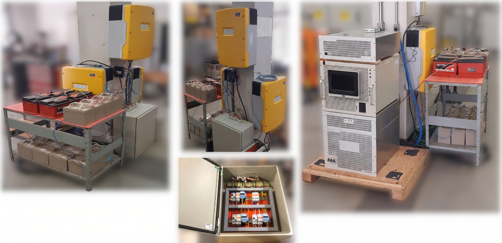
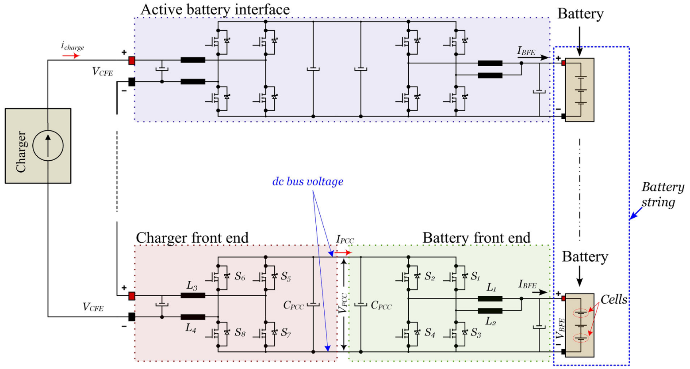
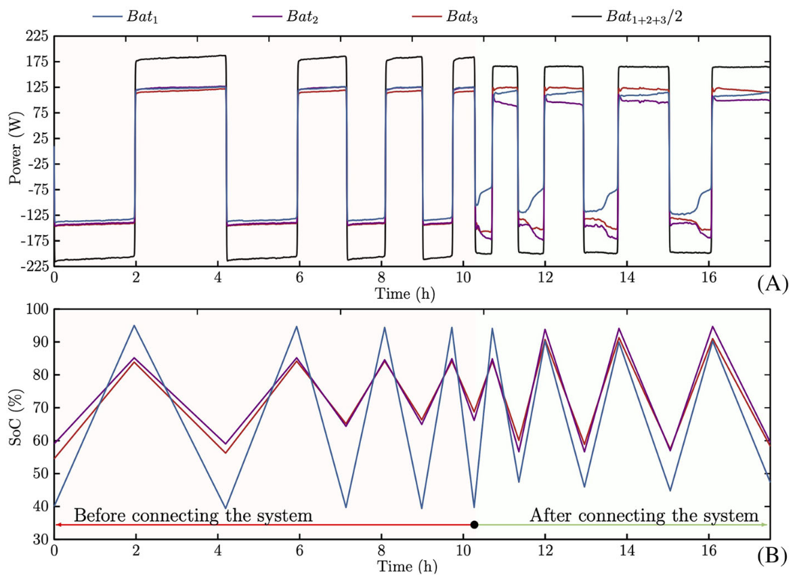

**Parceiro Industrial:** Petrobras
**Escopo:** Pesquisa & Desenvolvimento (P&D) / Eletrônica de Potência e Armazenamento**Industrial Partner:** Petrobras
**Scope:** Research & Development (R&D) / Power Electronics and Energy Storage

## O DesafioThe Challenge

Em sistemas de armazenamento de energia de grande porte, as baterias não envelhecem de forma homogênea. Com o tempo, algumas células ou bancos degradam mais rápido que os demais. Em sistemas de gerenciamento de baterias (BMS) tradicionais, a supervisão é passiva: o banco mais fraco acaba limitando a capacidade, a corrente e o desempenho de toda a planta.In large-scale energy storage systems, batteries do not age uniformly. Over time, some cells or banks degrade faster than others. In traditional Battery Management Systems (BMS), supervision is passive: the weakest bank ends up limiting the capacity, current, and performance of the entire plant.

O desafio deste projeto de pesquisa, desenvolvido em parceria com a **Petrobras**, foi criar uma arquitetura inovadora capaz de superar as restrições do BMS convencional, permitindo que baterias com diferentes níveis de saúde (SoH - *State of Health*) e degradação operassem de forma otimizada dentro de uma mesma microrrede.The challenge of this research project, developed in partnership with **Petrobras**, was to create an innovative architecture capable of overcoming the limitations of conventional BMS, enabling batteries with different State of Health (SoH) and degradation levels to operate optimally within the same microgrid.

## Desenvolvimento Tecnológico e AtuaçãoTechnological Development and Contributions

Para solucionar esse problema, a equipe de pesquisa abandonou a abordagem passiva e propôs um sistema avançado de **equalização ativa de carga**. Trata-se de um esforço multidisciplinar que envolveu desde a modelagem eletroquímica profunda das células até a arquitetura de potência macro da planta.To solve this problem, the research team moved beyond the passive approach and proposed an advanced **active charge equalization** system. This was a multidisciplinary effort spanning from deep electrochemical cell modeling to the plant's macro power architecture.

Dentro deste grande escopo de desenvolvimento, minha atuação direta esteve focada em duas frentes estruturais do projeto:Within this broad development scope, my direct contributions focused on two structural fronts of the project:

* **Coordenação do Sistema DC/DC:** Liderei os esforços de especificação e desenvolvimento da arquitetura eletrônica que embarca um conversor DC/DC individual na frente de cada banco de bateria. Fui responsável por orientar a topologia e as simulações dessa eletrônica dedicada, que ajusta dinamicamente a potência extraída ou injetada em cada módulo. Isso permite que o sistema compense ativamente os bancos mais degradados, equalizando a carga sem sacrificar o desempenho da planta.**DC/DC System Coordination:** I led the specification and development efforts for the electronic architecture that places an individual DC/DC converter in front of each battery bank. I was responsible for guiding the topology and simulations of this dedicated electronics, which dynamically adjusts the power drawn from or injected into each module. This allows the system to actively compensate for the more degraded banks, equalizing the load without sacrificing plant performance.
* **Concepção e Especificação da Microrrede:** Garanti a integração do armazenamento com o ecossistema elétrico. Fiquei a cargo de dimensionar a infraestrutura da microrrede como um todo, o que incluiu o cálculo e a especificação dos inversores principais, a definição do arranjo e número de baterias da microrrede, e a estratégia de acoplamento direto com as usinas de geração fotovoltaica presentes no escopo do desenvolvimento.**Microgrid Design and Specification:** I ensured the integration of storage with the electrical ecosystem. I was responsible for sizing the microgrid infrastructure as a whole, which included calculating and specifying the main inverters, defining the arrangement and number of batteries in the microgrid, and the direct coupling strategy with the photovoltaic generation plants within the development scope.
* **Modelagem Eletroquímica (Trabalho de Equipe):** Em conjunto com os demais pesquisadores, mergulhamos no estudo da química das baterias de lítio e na modelagem de Estado de Carga (SoC), garantindo que as simulações computacionais guiassem o controle eletrônico com máxima precisão.**Electrochemical Modeling (Team Effort):** Together with fellow researchers, we delved into lithium battery chemistry and State of Charge (SoC) modeling, ensuring that computational simulations guided the electronic control with maximum precision.

## ImpactoImpact

A arquitetura desenvolvida pela nossa equipe transforma a maneira como grandes plantas industriais gerenciam seus ativos de armazenamento. Ao substituir a limitação passiva por um controle de potência eletrônico ativo e descentralizado, o projeto provou ser capaz de prolongar substancialmente a vida útil dos ativos. Isso não apenas propõe uma redução drástica nos custos de reposição prematura, como aumenta a resiliência de microrredes industriais conectadas a fontes de energia renovável.The architecture developed by our team transforms the way large industrial plants manage their storage assets. By replacing passive limitation with active and decentralized electronic power control, the project proved capable of substantially extending asset lifespan. This not only offers a drastic reduction in premature replacement costs but also increases the resilience of industrial microgrids connected to renewable energy sources.

{height=60px}

{height=60px}

<!--Include social share buttons-->

