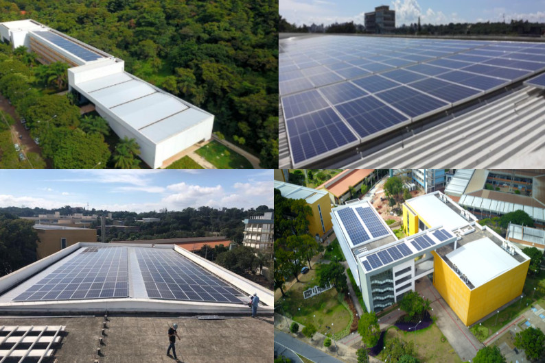
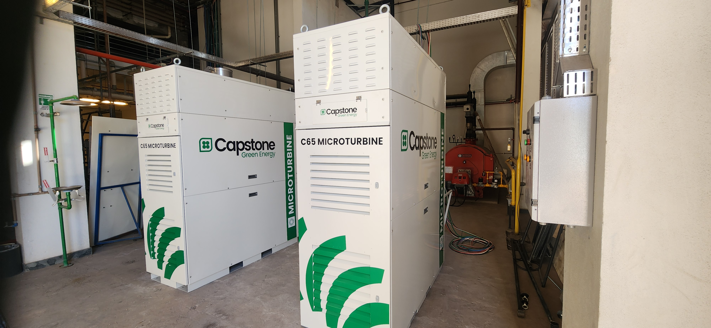

**Instituição:** Universidade Federal de Minas Gerais (UFMG)
**Escopo:** Pesquisa & Desenvolvimento Institucional / Engenharia de Potência e Integração de Sistemas**Institution:** Federal University of Minas Gerais (UFMG)
**Scope:** Institutional Research & Development / Power Engineering and Systems Integration

{width=80%}

## O DesafioThe Challenge

O campus Pampulha da UFMG é uma infraestrutura de proporções urbanas, recebendo cerca de 60 mil usuários diariamente e com um consumo médio mensal de energia elétrica na casa dos 2.900 MWh. A dependência exclusiva da rede da concessionária no Ambiente de Contratação Regulada (ACR) representa não apenas um custo financeiro massivo, mas também uma vulnerabilidade operacional.The UFMG Pampulha campus is an infrastructure of urban proportions, receiving around 60,000 daily users with an average monthly electricity consumption of approximately 2,900 MWh. Exclusive dependence on the utility grid under the Regulated Market (ACR) represents not only a massive financial cost but also an operational vulnerability.

O Projeto **OÁSIS-UFMG** nasceu para transformar o campus de um consumidor passivo em uma entidade ativa e inteligente. O desafio técnico consistiu em conceber, modelar e implementar uma minirrede (Microgrid) de energia elétrica inédita no país, capaz de gerar, armazenar e gerenciar sua própria energia de forma despachável, operando conectada à rede principal ou em modo ilhado (isolado).The **OÁSIS-UFMG** Project was born to transform the campus from a passive consumer into an active and intelligent entity. The technical challenge consisted of designing, modeling, and implementing an unprecedented electric microgrid in the country, capable of generating, storing, and managing its own energy in a dispatchable manner, operating connected to the main grid or in islanded (isolated) mode.

## Desenvolvimento Tecnológico e IntegraçãoTechnological Development and Integration

Como pesquisador e engenheiro integrante da equipe técnica do projeto, atuei no desenvolvimento e na integração de uma arquitetura híbrida de alta complexidade. O ecossistema da minirrede exigiu a harmonização de três pilares fundamentais de energia, além de uma robusta camada de controle e comunicação:As a researcher and engineer member of the project's technical team, I worked on the development and integration of a highly complex hybrid architecture. The microgrid ecosystem required the harmonization of three fundamental energy pillars, in addition to a robust control and communication layer:

{width=95%}

* **Usinas Fotovoltaicas (GDFV):** Dimensionamento e simulação de múltiplas plantas solares instaladas nas coberturas dos Centros de Atividades Didáticas (CADs), totalizando aproximadamente 500 kWp de capacidade instalada para suprir a demanda base das edificações.**Photovoltaic Plants (GDFV):** Sizing and simulation of multiple solar plants installed on the rooftops of the Didactic Activity Centers (CADs), totaling approximately 500 kWp of installed capacity to meet the base demand of the buildings.
* **Armazenamento em Baterias (BESS):** Estudos de impacto, modelagem e especificação de um Sistema de Armazenamento de Energia com baterias de Íon-Lítio (capacidade na ordem de 1 MW / 3 MWh). O sistema foi projetado para atuar no *peak shaving* (redução do consumo no horário de ponta da concessionária), garantir estabilidade à rede e permitir o ilhamento de cargas críticas.**Battery Energy Storage (BESS):** Impact studies, modeling, and specification of an Energy Storage System with Lithium-Ion batteries (capacity in the order of 1 MW / 3 MWh). The system was designed to perform peak shaving (reducing consumption during utility peak hours), ensure grid stability, and enable the islanding of critical loads.
* **Cogeração Qualificada com Microturbinas a Gás:** Especificação de microturbinas de alta rotação (Capstone C65) operando com gás natural. A inovação estrutural aqui foi a cogeração (trigeração): a energia térmica residual dos gases de escape é reaproveitada tanto para o aquecimento direto (ex: piscinas do Centro de Treinamento Esportivo) quanto para refrigeração de ambientes, utilizando *chillers* de absorção. Isso eleva a eficiência global do sistema para a faixa de 80% a 90%.**Qualified Cogeneration with Gas Microturbines:** Specification of high-speed microturbines (Capstone C65) operating with natural gas. The structural innovation here was cogeneration (trigeneration): the residual thermal energy from exhaust gases is reused for both direct heating (e.g., swimming pools at the Sports Training Center) and ambient cooling, using absorption chillers. This raises the overall system efficiency to the 80% to 90% range.

{width=95%}

* **Controle, Automação e Comunicação (IoT):** Para que as fontes distribuídas atuassem como uma entidade única e controlável, a equipe desenvolveu quadros elétricos inteligentes de medição e comutação (IoT). Validações avançadas das estratégias de controle e análises de latência de redes sem fio (LoRa, Zigbee, UDP/IP) foram executadas em bancada utilizando simuladores de tempo real *Hardware-in-the-Loop* (Typhoon HIL 604).**Control, Automation, and Communication (IoT):** So that distributed sources could act as a single, controllable entity, the team developed smart electrical panels for measurement and switching (IoT). Advanced validation of control strategies and latency analysis of wireless networks (LoRa, Zigbee, UDP/IP) were performed on the bench using real-time Hardware-in-the-Loop simulators (Typhoon HIL 604).

## ImpactoImpact

O Projeto OÁSIS estabelece um novo paradigma de maturidade tecnológica para infraestruturas de grande porte no Brasil. A integração da usina solar, do armazenamento em baterias e da geração térmica descentralizada não apenas promove uma redução drástica nas despesas milionárias com energia e na pegada de carbono, mas transforma o campus em um gigantesco laboratório vivo (*living lab*). O resultado é uma infraestrutura resiliente, sustentável e com controle dinâmico de ponta a ponta.The OÁSIS Project establishes a new paradigm of technological maturity for large-scale infrastructure in Brazil. The integration of the solar plant, battery storage, and decentralized thermal generation not only promotes a drastic reduction in million-dollar energy expenses and carbon footprint, but also transforms the campus into a gigantic living lab. The result is a resilient, sustainable infrastructure with end-to-end dynamic control.

{height=60px}

<!-- {height=60px} -->

<!--Include social share buttons-->

