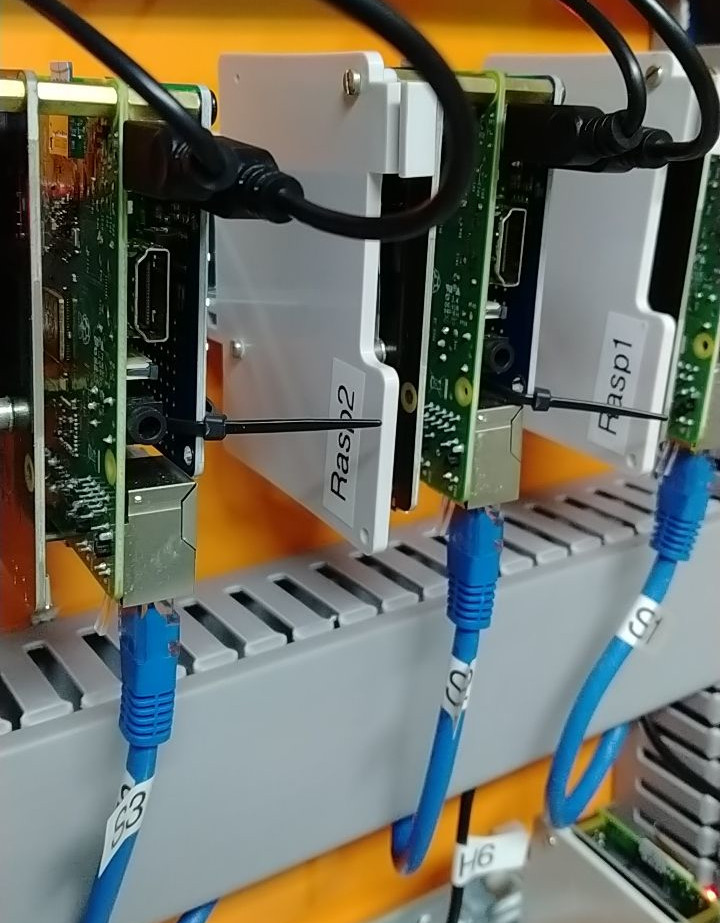

**Contexto:** Pesquisa Aplicada (UFMG) / Orientação de Mestrado
**Escopo:** Liderança Técnica / Arquitetura de Software e Hardware IoT**Context:** Applied Research (UFMG) / Master's Thesis Supervision
**Scope:** Technical Leadership / IoT Software and Hardware Architecture

{width=50%}

## O DesafioThe Challenge

A Usina Experimental Fotovoltaica TESLA (37 kWp) operava com um sistema de supervisão comercial e fechado de terceiros (Meteocontrol). Essa dependência gerava problemas severos de escalabilidade e operação: o sistema era engessado, exigia renovações contratuais caras e não permitia a inclusão de novos hardwares, como bancos de baterias e inversores híbridos.The TESLA Experimental Photovoltaic Plant (37 kWp) operated with a closed, third-party commercial monitoring system (Meteocontrol). This dependency generated severe scalability and operational problems: the system was rigid, required expensive contract renewals, and did not allow the inclusion of new hardware, such as battery banks and hybrid inverters.

Além de ser uma "caixa preta" que impedia o controle do fluxo de potência ativa e reativa (permitindo apenas o monitoramento passivo), a taxa de amostragem de dados (*polling*) era de 5 minutos. Essa alta latência fazia com que o sistema perdesse variações cruciais na geração de energia durante o dia, como passagens de nuvens ou flutuações rápidas. O desafio foi liderar tecnicamente o desenvolvimento de uma solução própria, *open-source*, modular e de altíssima resolução.Beyond being a "black box" that prevented active and reactive power flow control (allowing only passive monitoring), the data sampling rate (polling) was 5 minutes. This high latency caused the system to miss crucial variations in energy generation throughout the day, such as cloud passages or rapid fluctuations. The challenge was to technically lead the development of a proprietary, open-source, modular, and ultra-high-resolution solution.

## Arquitetura Full-Stack e IoT IndustrialFull-Stack Architecture and Industrial IoT

Atuando na orientação e concepção tecnológica da arquitetura, estruturei o sistema para ser tolerante a falhas, utilizando microsserviços e computação de borda (*Edge Computing*). O desenvolvimento cobriu desde a instrumentação física até a nuvem:Leading the architectural design and technological conception, I structured the system to be fault-tolerant, using microservices and Edge Computing. The development covered everything from physical instrumentation to the cloud:

* **Hardware e Edge Computing:** Substituímos servidores caros por clusters de microcomputadores Raspberry Pi 3 B+, dividindo os serviços em servidores de comunicação, aplicação (banco de dados) e backup. Para integrar sensores analógicos legados (como sensores de corrente CC) que não possuíam interface de rede, desenvolvemos hardwares intermediários utilizando microcontroladores Arduino Nano com *shields* Ethernet.**Hardware and Edge Computing:** We replaced expensive servers with clusters of Raspberry Pi 3 B+ microcomputers, splitting services into communication servers, application (database) servers, and backup servers. To integrate legacy analog sensors (such as DC current sensors) that lacked a network interface, we developed intermediary hardware using Arduino Nano microcontrollers with Ethernet shields.
* **Aquisição de Dados e Protocolos:** Implementamos rotinas de comunicação via Modbus TCP/IP e RS-485 para extrair dados brutos diretamente dos inversores (SMA e Fronius) e do medidor de energia (Janitza). Para a estação meteorológica, criamos serviços em Python operando em *background* via FTP. A transmissão interna dos dados foi orquestrada utilizando o protocolo leve e seguro MQTT/MQTTS.**Data Acquisition and Protocols:** We implemented communication routines via Modbus TCP/IP and RS-485 to extract raw data directly from the inverters (SMA and Fronius) and the energy meter (Janitza). For the weather station, we created Python services running in the background via FTP. Internal data transmission was orchestrated using the lightweight and secure MQTT/MQTTS protocol.
* **Backend e Integração Open-Source:** O processamento, a conversão para unidades de engenharia e o controle de fluxo foram programados visualmente utilizando o **Node-RED**.**Backend and Open-Source Integration:** Processing, conversion to engineering units, and flow control were visually programmed using **Node-RED**.
* **Banco de Dados e Dashboards:** O armazenamento e a visualização gráfica final foram construídos na plataforma **Emoncms**, utilizando uma abordagem de banco de dados NoSQL, otimizada para o rápido consumo e registro de séries temporais de energia.**Database and Dashboards:** Storage and final graphical visualization were built on the **Emoncms** platform, using a NoSQL database approach optimized for rapid consumption and recording of energy time series.

## ImpactoImpact

A nova arquitetura rompeu a dependência tecnológica e financeira de licenças de software. O ganho técnico foi imediato: a taxa de amostragem (*polling*) caiu de 5 minutos para impressionantes 10 segundos, permitindo um rastreamento preciso de todos os picos e vales de geração ao longo do dia.The new architecture broke the technological and financial dependency on software licenses. The technical gain was immediate: the sampling rate (polling) dropped from 5 minutes to an impressive 10 seconds, enabling precise tracking of all generation peaks and valleys throughout the day.

Além disso, o novo sistema supervisório tornou-se o coração digital da planta, garantindo total flexibilidade para a futura integração de inversores híbridos e sistemas de armazenamento de energia (baterias de Chumbo-Carbono, Sal Fundido e Íon-Lítio) em uma topologia pronta para o controle de despacho.Furthermore, the new supervisory system became the digital heart of the plant, ensuring full flexibility for the future integration of hybrid inverters and energy storage systems (Lead-Carbon, Molten Salt, and Lithium-Ion batteries) in a topology ready for dispatch control.

{height=60px}

<!--Include social share buttons-->

