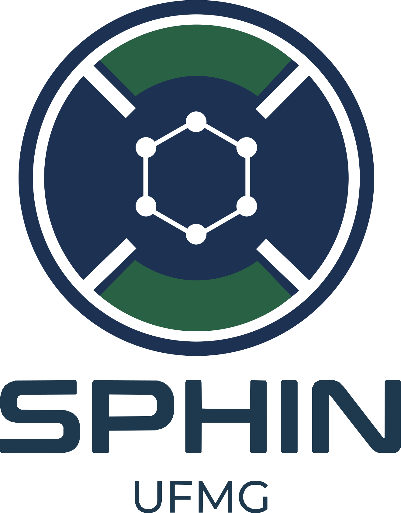

{fig-alt="SPHIN Lab" fig-align="center" width="35%"}

::: {style="text-align: center;"}
> O **SPHIN** existe para expandir o estado da arte na engenharia de acionamentos. Nascido na excelência da Universidade Federal de Minas Gerais (UFMG), nós transformamos pesquisa fundamental sobre forças eletromagnéticas e algoritmos em tempo real em soluções *Deep Tech*, conectando a ciência acadêmica às demandas reais da indústria B2B de alta performance.
:::

---

## Missão e Visão

### Missão
**Projetar, controlar e conectar sistemas rotativos de vanguarda.**  
Atuamos como um núcleo de excelência em Pesquisa, Desenvolvimento e Inovação (P&D+I). Desenvolvemos ecossistemas *full-stack* — do design eletromagnético de máquinas elétricas extremas (ex: rotores acima de 100.000 rpm) e eletrônica de potência até a infraestrutura IoT para telemetria. Simultaneamente, formamos pesquisadores e engenheiros de alto nível técnico, capazes de liderar a transição tecnológica e a inovação industrial.

### Visão
**Ser o epicentro acadêmico-industrial do Brasil em mecatrônica extrema, perfeitamente integrado aos maiores polos globais.**  
Consolidar o SPHIN como um parceiro estratégico intercontinental em hardware industrial e controle vetorial. Nosso objetivo é estabelecer pontes de pesquisa e desenvolvimento de tecnologias de propulsão com ecossistemas de inovação na América do Norte, Ásia e Europa, gerando *spin-offs*, patentes e transferência de tecnologia.

---

## Nossos Valores e Pilares Técnicos

### 1. Rigor Científico e Validação Multifísica
Na academia, o limite não é um palpite. Apoiamos nossa engenharia em análises profundas, método científico e simulações por elementos finitos (FEM). Do estresse centrífugo à temperatura no entreferro, tudo é matematicamente modelado em malhas rigorosas e validado antes da usinagem.

### 2. Transferência de Tecnologia (B2B)
Não fazemos ciência apenas para publicações. O conhecimento gerado no laboratório tem vocação aplicada. Focamos na entrega de valor real, prestando consultoria especializada de alto nível e desenvolvendo soluções tecnológicas que destravam gargalos da engenharia pesada.

### 3. Ecossistemas Abertos e Soberania Digital
A inovação em *Deep Tech* ganha escala através da colaboração. Priorizamos ecossistemas independentes, protocolos transparentes e infraestruturas *open-source* (Linux/Wayland) em toda nossa cadeia. Evitamos caixas-pretas proprietárias, garantindo o controle total sobre a tecnologia desenvolvida — do CAD à nuvem.

### 4. Arquitetura *Full-Stack* em Tempo Real
Acreditamos que o projeto mecânico e o código operam como um só organismo. Formamos talentos com domínio de ponta a ponta: a robustez das ligas de neodímio, a precisão do chaveamento PWM no inversor e a confiabilidade dos *gateways* de comunicação remota.

---

## Stack Tecnológico e Áreas de Domínio

O ecossistema de P&D do SPHIN é sustentado por ferramentas e linguagens modernas, projetadas para estabilidade e alto desempenho:

*   **Modelagem e Eletromagnetismo:** Simulações multifísicas e análise de elementos finitos (*ElmerFEM*, *FEMM*, *Ansys Maxwell*, *COMSOL*).
*   **Controle e Eletrônica de Potência:** Desenvolvimento de eletrônicas, algoritmos em tempo real e controle vetorial (FOC).
*   **Software e Sistemas Embarcados:** Arquiteturas assíncronas e alta performance utilizando **C/C++**, **Rust**, **Golang**, **Julia**, **Python**, **Node.js** e **MATLAB**.
*   **Conectividade Industrial:** Redes de telemetria, painéis SCADA, *edge computing* e automação contínua (*IoT Industrial*).

---

::: {.callout-note}
### Parcerias e Inovação Aberta
O SPHIN está continuamente prospectando novos desafios tecnológicos. Empresas e pesquisadores interessados em colaborações, projetos de P&D ou consultoria avançada em máquinas elétricas podem entrar em contato através do Departamento de Engenharia Elétrica da UFMG.
:::
