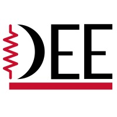

:::{#hero-heading}
**Desenvolvo tecnologia para o setor industrial | Projeto de Máquinas Elétricas, Geração de Energia &amp; Automação | ProfessorI develop technology for the industrial sector | Electrical Machine Design, Power Generation &amp; Automation | Professor**

Belo Horizonte, Minas Gerais, BrasilBelo Horizonte, Minas Gerais, Brazil  

Desenvolvo tecnologia para o setor industrial, com foco em máquinas elétricas, geração de energia e automação. Sou especialista no projeto de geradores e motores customizados, além da instrumentação de processos industriais — criando soluções para operação remota, IIoT e Indústria 4.0.I develop technology for the industrial sector, focusing on electrical machines, power generation, and automation. I specialize in designing custom generators and motors, as well as industrial process instrumentation — creating solutions for remote operation, IIoT, and Industry 4.0.

**Professor****Professor**, Universidade Federal de Minas Gerais (UFMG)

  
  

<!-- ## Notícias e Eventos -->
## NotíciasNews
<!-- Acompanhe as últimas &nbsp;[Notícias](pages/news/index.qmd#category=news)&nbsp;, &nbsp;[Eventos](pages/news/index.qmd#category=event)&nbsp;, e &nbsp;[Mais »](pages/news/index.qmd) -->

::: {#recent-news}

:::

[Ver todas »](pages/news/index.qmd)[See all »](pages/news/index.qmd)

<!-- 
[Todos as Notícias »](pages/news/index.qmd)
 -->

:::

## Blog
<!-- Confira os últimos &nbsp;[Artigos](pages/blog/index.qmd)&nbsp; e &nbsp;[Mais »](pages/blog/index.qmd) -->

::: {#recent-blog}

:::

[Ver Todos »](pages/blog/index.qmd)[See all »](pages/blog/index.qmd)

## PortfólioPortfolio

::: {#recent-portfolio}

:::

[Ver Todos »](pages/portfolio/index.qmd)[See all »](pages/portfolio/index.qmd)

### Clientes e ParceirosClients &amp; Partners



