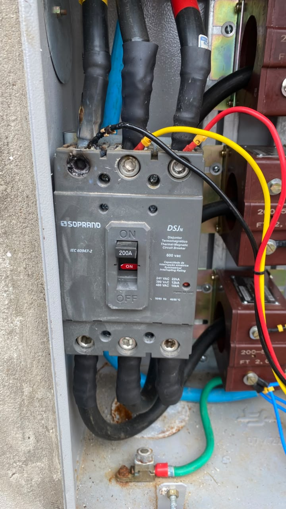

## O sintoma: paradas intermitentesThe symptom: intermittent shutdowns

Uma planta industrial de pequeno porte enfrentava **desligamentos intermitentes e sem padrão definido**. A equipe local classificava o problema como "falta de fase". As máquinas paravam, o time de manutenção buscava a causa, não encontrava, e a produção era retomada — até a próxima queda.A small industrial plant was experiencing **intermittent shutdowns with no defined pattern**. The local team classified the issue as "phase loss." Machines would stop, the maintenance team searched for the cause, found nothing, and production resumed — until the next trip.

Cada parada não programada representava prejuízo direto. E o pior: **sem causa identificada**, não havia plano de ação.Each unplanned shutdown meant direct financial loss. Worse: **without an identified cause**, there was no action plan.

Após diversas tentativas frustradas de diagnóstico interno, a equipe acionou a Cemig. Somente quando o técnico da concessionária foi até o local e abriu o painel do padrão de entrada é que o problema se tornou visível.After several failed internal diagnosis attempts, the team called Cemig. Only when the utility technician arrived on site and opened the service entrance panel did the problem become visible.

## Investigação e causa raizInvestigation and root cause

"Falta de fase" é um sintoma, não um diagnóstico. As causas possíveis incluem falha da concessionária, disjuntor desarmado, transformador com defeito ou mau contato no barramento."Phase loss" is a symptom, not a diagnosis. Possible causes include utility grid faults, tripped circuit breakers, transformer defects, or poor contact in the busbar.

As duas primeiras hipóteses foram eliminadas por exclusão lógica:The first two hypotheses were ruled out by logical exclusion:

1. **Rede da Cemig:** a intermitência errática e a ausência de queixas de vizinhos tornavam essa hipótese improvável.**Cemig grid:** the erratic intermittency and absence of complaints from neighboring consumers made this unlikely.
2. **Disjuntores internos:** todos estavam armados e sem sinais de atuação recente.**Internal circuit breakers:** all were engaged with no signs of recent tripping.
3. **Barramento de entrada:** restava inspecionar o ponto entre o medidor e a carga principal.**Service entrance busbar:** the remaining point to inspect was between the meter and the main load.

A equipe abriu o painel do padrão da Cemig e encontrou o problema:The team opened the utility panel and found the problem:

<figure style="text-align: center;">

<figcaption>

Fig. 1 — Disjuntor derretido no padrão Cemig. O dano concentrado na base do borne indica aquecimento por conexão frouxa, não por sobrecarga generalizada.Fig. 1 — Melted circuit breaker in the Cemig utility panel. Damage concentrated at the terminal base indicates heating from a loose connection, not general overload.

</figcaption>

</figure>

O disjuntor apresentava **fusão localizada** no borne de entrada. A carbonização e deformação do termoplástico estavam restritas ao ponto de conexão do cabo de fase, enquanto a parte superior do componente preservava sua estrutura. Esse padrão de dano **exclui sobrecarga** e aponta diretamente para **alta resistência de contato em um único terminal**.The circuit breaker showed **localized melting** at the input terminal. Carbonization and thermoplastic deformation were confined to the phase conductor connection point, while the upper portion of the component retained its structure. This damage pattern **rules out overload** and points directly to **high contact resistance at a single terminal**.

## A física do problema: conexão frouxa = calorThe physics: loose connection = heat

O mecanismo é a **Lei de Joule**: uma resistência elétrica percorrida por corrente dissipa potência na forma de calor.The mechanism is **Joule's Law**: an electrical resistance carrying current dissipates power as heat.

**P = R × I²**

Quando o parafuso do borne não recebe o torque correto, a área de contato entre o condutor e o terminal se reduz. Essa **interface parcial** comporta-se como uma resistência concentrada.When the terminal screw does not receive proper torque, the contact area between conductor and terminal shrinks. This **partial interface** behaves as a concentrated resistance.

Exemplo prático: uma resistência de contato de apenas **0,1 ohm** em um circuito de 100 A dissipa **1.000 watts** localizados. Equivale a manter um aquecedor ligado dentro do painel.Practical example: a contact resistance of just **0.1 ohm** in a 100 A circuit dissipates **1,000 watts** at that single point. That's equivalent to running a space heater inside your panel.

O processo é progressivo:The process is progressive:

1. **Conexão frouxa** → resistência de contato elevada.**Loose connection** → high contact resistance.
2. **Aquecimento** → dilatação térmica.**Heating** → thermal expansion.
3. **Ciclos de dilatação e contração** → afrouxamento adicional.**Cyclic expansion and contraction** → further loosening.
4. **Oxidação acelerada** pelo calor → aumento da resistência.**Heat-accelerated oxidation** → increased resistance.
5. **Degradação do isolante** → carbonização e fusão do componente.**Insulator degradation** → carbonization and component melting.

O ciclo se autorrealimenta. Sem intervenção, o resultado é o da foto.The cycle is self-reinforcing. Without intervention, the result is what the photo shows.

## Causa raiz: falha de execuçãoRoot cause: execution failure

O problema não estava no componente, no projeto ou na rede. **Estava na instalação.**The problem was not the component, the design, or the grid. **It was the installation.**

O técnico que instalou o disjuntor cometeu duas falhas:The technician who installed the circuit breaker made two mistakes:

- **Torque inadequado no borne.** Cada disjuntor tem uma especificação de torque nominal (tipicamente entre 1,5 e 4,0 N·m para modelos de média potência). Apertar "no feeling" — prática comum no chão de fábrica — não garante a pressão de contato necessária.**Inadequate terminal torque.** Every circuit breaker has a rated torque specification (typically 1.5 to 4.0 N·m for medium-power models). Tightening "by feel" — common practice on the factory floor — does not guarantee the required contact pressure.
- **Ausência do teste de tração.** Após apertar o borne, puxar o cabo para verificar a fixação elimina a falsa sensação de aperto. Cabos com isolação presa parcialmente sob o terminal são uma causa frequente de conexões frouxas que passam despercebidas.**Skipping the pull test.** After tightening the terminal, pulling the cable to verify the connection eliminates the false sense of tightness. Cables with insulation partially trapped under the terminal are a frequent cause of unnoticed loose connections.

Ambos os procedimentos constam em manuais de fabricantes, na NR-10 e na NBR 5410. A falha foi de **disciplina operacional**, não de competência técnica.Both procedures are in manufacturer manuals, NR-10, and NBR 5410 standards. The failure was one of **operational discipline**, not technical competence.

**Esse modo de falha não é exclusivo de painéis de concessionária.** O mesmo problema já foi observado em sistemas de geração fotovoltaica: conexões CC frouxas em string boxes e inversores, onde correntes contínuas elevadas (tipicamente 10 a 15 A por string) aceleram ainda mais a degradação térmica. Em sistemas fotovoltaicos, o risco é duplo — além da parada de geração, há o perigo real de arco elétrico em CC, que não se autoextingue como em CA. O princípio é idêntico, a consequência é a mesma, e a prevenção também.**This failure mode is not exclusive to utility panels.** The same problem has been observed in photovoltaic generation systems: loose DC connections in string boxes and inverters, where high continuous currents (typically 10 to 15 A per string) accelerate thermal degradation even further. In PV systems, the risk is twofold — beyond generation downtime, there is a real danger of DC arcing, which does not self-extinguish as AC does. The principle is identical, the consequence is the same, and the prevention is no different.

## Três ações para sua equipeThree actions for your team

1. **Torquímetro calibrado como ferramenta obrigatória.** O custo do instrumento é insignificante comparado ao prejuízo de uma parada não programada ou de um painel incendiado.**Calibrated torque wrench as a mandatory tool.** The cost of the instrument is negligible compared to the losses from an unplanned shutdown or a panel fire.
2. **Teste de tração no checklist da Ordem de Serviço.** Se o campo existe no papel, ele é cobrado. Se é cobrado, é executado.**Pull test on the work order checklist.** If the field exists on paper, it gets enforced. If it's enforced, it gets done.
3. **Termografia periódica nos painéis.** Uma câmera termográfica detecta pontos quentes meses antes da falha. O disjuntor deste caso acusaria um delta de temperatura no borne semanas antes de se degradar completamente.**Periodic thermographic inspection of panels.** A thermal camera detects hot spots months before failure. The circuit breaker in this case would have shown a temperature delta at the terminal weeks before complete degradation.

## ConclusãoConclusion

O disjuntor da foto não falhou por defeito de fabricação. Falhou por **um procedimento que levaria menos de 60 segundos para ser executado corretamente**. É esse minuto que separa uma planta estável de uma que opera apagando incêndios.The circuit breaker in the photo did not fail due to a manufacturing defect. It failed because of **a procedure that would take less than 60 seconds to execute correctly**. That single minute is what separates a stable plant from one that lives by putting out fires.

**Manutenção de excelência não é complexa. É executar o básico com precisão.****Maintenance excellence is not complex. It's about executing the basics with precision.**

---

*Caso real de consultoria em manutenção industrial. Nomes e localização omitidos por confidencialidade.**Real case study from industrial maintenance consultancy. Names and location withheld for confidentiality.*

<!--Include social share buttons-->


