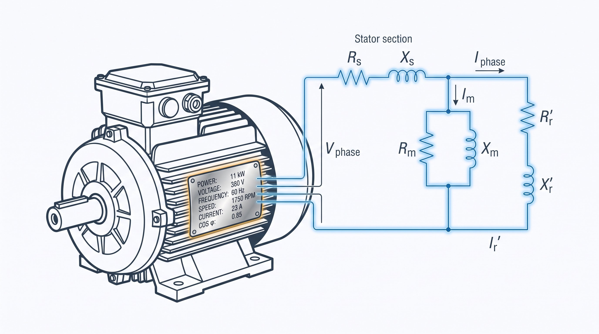

<span class="lang-pt">Recorrentemente encontro problemas em comissionamento de inversores de baixa tensão acionando motores de indução. O procedimento de autoajuste do drive é sempre o melhor caminho para resolver 99% dos casos, mas, de tempos em tempos, deter a teoria e o conhecimento resolve o restante. Há um tempo venho usando uma metodologia própria para estimar os parâmetros do circuito equivalente do motor a partir só dos dados de placa — recentemente resolvi aprimorá-la, corrigir um punhado de simplificações que vinha carregando havia tempo, e disponibilizá-la a quem possa ser útil.</span><span class="lang-en">In my day-to-day commissioning low-voltage drives on induction motors, the drive's auto-tuning routine is almost always the best path — it solves 99% of the cases cleanly. But every so often you hit the remaining 1%, and that's when knowing the theory pays off. I've been using my own methodology to estimate a motor's equivalent-circuit parameters from nameplate data alone for a while now — I recently sat down to refine it, fix a handful of simplifications it had been carrying for too long, and put it out there for anyone who can use it.</span>

<span class="lang-pt">Este post documenta essa metodologia — a que roda hoje por trás da [calculadora de parâmetros de motor de indução](/tools/im-calc-map/). Cada seção abaixo corresponde a uma decisão de projeto tomada ao longo do caminho — junto com o exemplo (em Julia, executado de verdade, não pseudocódigo) que motivou a decisão.</span><span class="lang-en">This post documents that methodology — the one that actually runs behind the [induction motor parameter calculator](/tools/im-calc-map/) today. Each section below corresponds to a design decision made along the way — together with the example (in Julia, actually executed, not pseudocode) that motivated it.</span>

## <span class="lang-pt">O motor de exemplo</span><span class="lang-en">The example motor</span>

<span class="lang-pt">Para acompanhar o texto com números de verdade, uso a placa de um motor real que fotografei em campo: um WEG W22 Premium trifásico de 5,5 kW, 380 V, 60 Hz, 4 polos, categoria N.</span><span class="lang-en">To follow the text with real numbers, I use the nameplate of a real motor I photographed in the field: a three-phase WEG W22 Premium, 5.5 kW, 380 V, 60 Hz, 4 poles, design class N.</span>

```julia
const P_N_kW  = 5.5      # Potência nominal [kW]
const V_N     = 380.0    # Tensão nominal de linha [V]
const f_N     = 60.0     # Frequência nominal [Hz]
const polos   = 4
const n_N     = 1750.0   # Rotação nominal [rpm]
const I_N     = 11.9     # Corrente nominal [A]
const η_N     = 0.91      # Rendimento nominal [pu]
const cosφ_N  = 0.77      # Fator de potência nominal [pu]
const Ip_In   = 7.3       # Razão I_partida / I_nominal (de placa)
const categoria = "N"     # Categoria de conjugado de partida (N ≈ NEMA B)
```

## <span class="lang-pt">O que a placa não diz: perdas mecânicas</span><span class="lang-en">What the nameplate doesn't tell you: mechanical losses</span>

<span class="lang-pt">A placa nunca informa como as perdas totais se dividem — cobre do estator, cobre do rotor, núcleo, perdas suplementares (*stray load*) e atrito+ventilação. Sem essa divisão, não dá para inicializar $R_1$, $R_2$ e $R_M$ com algo melhor que um chute às cegas. A saída é uma tabela normativa: de Almeida, Ferreira & Fong ("Standards for Efficiency of Electric Motors", IEEE Ind. Appl. Magazine, 2011) publicam essa divisão em função da potência nominal, a partir de um levantamento estatístico de motores reais.</span><span class="lang-en">The nameplate never tells you how total losses split — stator copper, rotor copper, core, stray-load, and friction+windage. Without that split, there's no way to initialize $R_1$, $R_2$ and $R_M$ with anything better than a blind guess. The way out is a normative table: de Almeida, Ferreira & Fong ("Standards for Efficiency of Electric Motors," IEEE Ind. Appl. Magazine, 2011) publish that split as a function of rated power, from a statistical survey of real motors.</span>

```julia
# Frações de perda por potência nominal (interpoladas na tabela — ver ref/valores.csv)
f_s, f_r, f_stray, f_c, f_fw = obter_fracoes_perdas(P_N_kW)   # 0.46, 0.20, 0.06, 0.23, 0.05
P_loss_pu = 1.0/η_N - 1.0            # perdas totais, em pu da potência de EIXO — 0.0989 pu
k_r = f_s / f_r                       # 2.30 — razão de perdas Cu estator/rotor

R2 = s_N                              # chute inicial: R2 ≈ escorregamento nominal
R1 = k_r * s_N                        # chute inicial de R1, pela proporção da tabela
R_M = 1.0 / (f_c * P_loss_pu)         # fecha o balanço de perdas do núcleo
```

<span class="lang-pt">O pulo do gato é que o circuito equivalente calcula a potência **eletromagnética** — a desenvolvida no entreferro, descontadas só as perdas Joule do rotor. Atrito, ventilação e perdas suplementares acontecem **depois** disso, a caminho do eixo, e nenhum elemento do circuito os representa. Isso significa que o alvo de convergência não pode ser o valor de placa puro: tem que ser o valor de placa ajustado pela fração mecânica das perdas, sempre um pouco **acima** do que a placa informa.</span><span class="lang-en">The equivalent circuit computes **electromagnetic** power — the power developed in the air gap, net only of the rotor's Joule losses. Friction, windage and stray-load losses happen **after** that, on the way to the shaft, and no circuit element represents them. That means the convergence target can't be the raw nameplate value: it has to be the nameplate value adjusted by the mechanical loss fraction, always a bit **above** what the plate reports.</span>

```julia
f_mech = f_fw + f_stray                            # fração do total de perdas que é mecânica
P_mec_alvo_pu = 1.0 + f_mech * P_loss_pu            # 1.0109 pu — sempre > 1.0
η_alvo = η_N + f_mech * (1.0 - η_N)                 # 91.99% — sempre > η_N
```

## <span class="lang-pt">Fechando o ramo magnetizante</span><span class="lang-en">Closing the magnetizing branch</span>

<span class="lang-pt">Um dos caminhos para determinar $X_M$ e $R_M$ é iterá-los por ganho proporcional junto com todo o resto, disputando o mesmo grau de liberdade que a corrente e o fator de potência — o que deixa a convergência instável e o resultado dependente da ordem dos ajustes. Mas a placa já dá módulo e ângulo da corrente nominal ($I_N$, $\cos\varphi$), o que é informação aproximada para achar a corrente de magnetização através de subtração fasorial, em forma fechada:</span><span class="lang-en">One of the paths to determine $X_M$ and $R_M$ is to iterate them by proportional gain alongside everything else, fighting over the same degree of freedom as current and power factor — which makes convergence unstable and the result dependent on adjustment order. But the nameplate already gives the magnitude and angle of the rated current ($I_N$, $\cos\varphi$), which is approximate information for finding the magnetizing current through phasor subtraction, in closed form:</span>

```julia
# V_m = V1 - I1*(R1+jX1)   (tensão no ramo magnetizante, pela queda no estator)
# I2  = V_m / (R2/s + jX2) (corrente de rotor, pela impedância do ramo série)
# Im  = I1 - I2            (o que sobra é a corrente de magnetização)
Vm = complex(1.0, 0.0) - I1fasor * complex(R1, X1)
I2fasor = Vm / complex(R2/s_N, X2)
Im = I1fasor - I2fasor
Ym = Im / Vm                             # Y_m = 1/R_M + 1/(jX_M)
real(Ym) > 1e-9 && (R_M = 1.0/real(Ym))  # mantém o último valor válido se Y_m ainda não fechar fisicamente
-imag(Ym) > 1e-9 && (X_M = -1.0/imag(Ym))
```

<span class="lang-pt">Com isso, $|I_1|$ e $\cos\varphi$ ficam exatos por construção — não sobra grau de liberdade disputado entre parâmetros que deveriam ser independentes. Nas primeiras iterações, antes de $R_1$ e $R_2$ estabilizarem, $Y_m$ pode sair momentaneamente com parte real negativa — fisicamente impossível, já que $I_1 = I_2 + I_M$. Por isso $R_M$ e $X_M$ só são atualizados quando o resultado é fisicamente válido; caso contrário, o valor da iteração anterior é mantido até o resto do circuito estabilizar.</span><span class="lang-en">With this, $|I_1|$ and $\cos\varphi$ come out exact by construction — no degree of freedom is left contested between parameters that should be independent. In the first few iterations, before $R_1$ and $R_2$ settle, $Y_m$ can momentarily come out with a negative real part — physically impossible, since $I_1 = I_2 + I_M$. That's why $R_M$ and $X_M$ are only updated when the result is physically valid; otherwise, the previous iteration's value is kept until the rest of the circuit settles.</span>

## <span class="lang-pt">A dupla personalidade do motor</span><span class="lang-en">The motor's split personality</span>

<span class="lang-pt">A mesma corrente de partida usada para calibrar $X_1+X_2$ também deveria, em tese, servir para prever o torque de partida — só que o torque calculado desvia sistematicamente menor que o de qualquer motor real. Um exemplo de livro-texto com dados medidos (Fitzgerald, *Electric Machinery*, Exemplo 6.5) mostra a explicação: aquela máquina tem **dois** ensaios de rotor bloqueado, um a 15 Hz e outro a 60 Hz. O primeiro dá os parâmetros "limpos" de regime; o segundo, na frequência de rede, mostra o efeito pelicular em ação nas barras do rotor — a resistência do rotor sobe **2,84 vezes**, e a reatância de dispersão cai para **0,65** do valor de regime (a corrente de partida, de 5 a 8 vezes a nominal, também satura os caminhos de dispersão magnética, empurrando a reatância pra baixo pelo mesmo motivo).</span><span class="lang-en">The same starting current used to calibrate $X_1+X_2$ should, in theory, also predict the starting torque — except the computed torque deviates systematically lower than any real motor's. A textbook example with measured data (Fitzgerald, *Electric Machinery*, Example 6.5) shows the explanation: that machine has **two** locked-rotor tests, one at 15 Hz and one at 60 Hz. The first gives the "clean" running parameters; the second, at line frequency, shows skin effect acting on the rotor bars in practice — rotor resistance rises **2.84×**, and leakage reactance drops to **0.65×** the running value (the starting current, 5 to 8 times rated, also saturates the leakage flux paths, pushing reactance down for the same reason).</span>

<span class="lang-pt">Um único conjunto de parâmetros constantes simplesmente não representa a máquina nas duas condições. A solução foi manter dois conjuntos — regime e partida — ligados por dois fatores, $K_R$ e $K_X$, tabelados pela categoria de conjugado de partida do motor (N, A, H, D — equivalentes a NEMA B, A, C e D):</span><span class="lang-en">A single set of constant parameters simply does not represent the machine under both conditions. The fix was to keep two parameter sets — running and starting — linked by two factors, $K_R$ and $K_X$, tabulated by the motor's starting-torque design class (N, A, H, D — equivalent to NEMA B, A, C and D):</span>

```julia
FATORES_PARTIDA = Dict(
    "N" => (kR=2.0, kX=0.8),   # barra profunda, a mais comum (≈ NEMA B)
    "A" => (kR=1.2, kX=0.85),  # barra rasa de baixa resistência (≈ NEMA A)
    "H" => (kR=3.0, kX=0.75),  # dupla gaiola, conjugado de partida alto (≈ NEMA C)
    "D" => (kR=1.1, kX=0.85),  # barra de alta resistência, escorregamento alto (≈ NEMA D)
)
```

<span class="lang-pt">Para o WEG de 5,5 kW (categoria N), isso dá o circuito de regime abaixo — usado no ponto nominal — e um segundo conjunto de partida, usado só para calcular o rotor bloqueado e a sequência negativa:</span><span class="lang-en">For the 5.5 kW WEG (design class N), this gives the running circuit below — used at the rated point — and a second starting set, used only to compute locked rotor and the negative-sequence circuit:</span>

| <span class="lang-pt">Parâmetro</span><span class="lang-en">Parameter</span> | <span class="lang-pt">Regime</span><span class="lang-en">Running</span> |
|:--|--:|
| R₁ (Ω) | 0.6894 |
| R₂ (Ω) | 0.6113 |
| X₁ (mH) | 2.730 |
| X₂ (mH) | 4.095 |
| Xₘ (mH) | 80.66 |

<span class="lang-pt">Erro contra os dados nominais: potência mecânica 0,01%, corrente 0,00%, fator de potência 0,00%, rendimento 0,20% — todos dentro da tolerância de 2%.</span><span class="lang-en">Error against rated data: mechanical power 0.01%, current 0.00%, power factor 0.00%, efficiency 0.20% — all within the 2% tolerance.</span>

## <span class="lang-pt">Quando o catálogo dá o conjugado de partida</span><span class="lang-en">When the catalogue gives you starting torque</span>

<span class="lang-pt">Tabela por categoria é um bom ponto de partida, mas é só isso — um ponto de partida. Se o usuário tiver o conjugado de partida do catálogo do fabricante ($C_p/C_n$), dá pra fazer melhor: em vez de tabelar $K_R$, ele vira a incógnita resolvida por bisseção, ajustada até o circuito reproduzir o conjugado de partida informado — o mesmo papel que $I_p/I_n$ já cumpre para $X_1+X_2$.</span><span class="lang-en">A table by design class is a good starting point, but that's all it is — a starting point. If the user has the starting torque from the manufacturer's catalogue ($C_p/C_n$), you can do better: instead of tabulating $K_R$, it becomes the unknown solved by bisection, adjusted until the circuit reproduces the reported starting torque — the same role $I_p/I_n$ already plays for $X_1+X_2$.</span>

```julia
# T_p(K_R) tem máximo em R2p=√(R1²+X²) e não é monotônica em todo o domínio — mas na faixa
# física (K_R ≤ 4) estamos no ramo crescente, então a bisseção é segura.
lo, hi = 1.0, 4.0
for _ in 1:40
    meio = 0.5*(lo+hi)
    torque_partida_pu(meio) < alvo_pu ? (lo = meio) : (hi = meio)
end
K_R = 0.5*(lo+hi)
```

<span class="lang-pt">O teste mais forte que tenho até hoje: a máquina do Fitzgerald (dupla gaiola, categoria H, $C_p/C_n = 0,87$ de catálogo) resolve para $K_R = 2,95$ — contra o $K_R = 2,84$ **medido** diretamente nos dois ensaios de rotor bloqueado dela. Duas fontes de dado completamente independentes, a 4% de distância uma da outra.</span><span class="lang-en">The strongest test I have so far: the Fitzgerald machine (double-cage, class H, catalogue $C_p/C_n = 0.87$) solves to $K_R = 2.95$ — against the $K_R = 2.84$ **measured** directly from its two locked-rotor tests. Two completely independent data sources, 4% apart.</span>

## <span class="lang-pt">Sequência negativa não herda os parâmetros de regime</span><span class="lang-en">Negative sequence doesn't inherit the running parameters</span>

<span class="lang-pt">Para desequilíbrio de tensão, o campo de sequência negativa gira em sentido contrário ao rotor — o escorregamento efetivo visto por ele é $(2-s)$, não $s$. Não basta trocar esse divisor e reaproveitar $R_2$, $X_2$ de regime: a razão é a mesma da dupla personalidade do motor — a frequência induzida no rotor por esse campo é $f_2 \approx (2-s)\cdot f_1 \approx 2f_1$, maior até que a do próprio ensaio de rotor bloqueado. O mesmo efeito pelicular que distingue partida de regime se aplica com ainda mais força aqui (confirmado contra Ion Boldea, *Induction Machines Handbook*, seções sobre alimentação desequilibrada e sequências).</span><span class="lang-en">Under voltage unbalance, the negative-sequence field rotates opposite to the rotor — the slip it sees is $(2-s)$, not $s$. Simply swapping that divisor and reusing the running $R_2$, $X_2$ isn't enough: the reason is the same as in the motor's split personality — the frequency induced in the rotor by that field is $f_2 \approx (2-s)\cdot f_1 \approx 2f_1$, higher even than the locked-rotor test's own frequency. The same skin effect that separates starting from running applies with even more force here (confirmed against Ion Boldea, *Induction Machines Handbook*, the sections on unbalanced supply and sequence circuits).</span>

```julia
# R1, X1, R_M, X_M continuam os de REGIME (a frequência do estator é a mesma f1 nas duas
# sequências) — só R2 e X2 do ramo do rotor usam o conjunto de PARTIDA.
seq_negativa = resolver_circuito(
    ParametrosPU(R1=R1, R2=R2*K_R, X1=X1, X2=X2*K_X, Xm=X_M, Rm=R_M),
    bases, 2 - s_N,
)
```

<span class="lang-pt">Para o WEG de 5,5 kW, uma tensão de sequência negativa de mesma magnitude que a nominal produziria 89,3 A — mais de 7 vezes a corrente nominal — com fator de potência de 0,43. Na prática, um desequilíbrio de tensão de apenas 2% já bastaria para produzir uma corrente de sequência negativa considerável, e é por isso que motores de indução são tão sensíveis a desequilíbrio de tensão entre fases.</span><span class="lang-en">For the 5.5 kW WEG, a negative-sequence voltage of the same magnitude as rated would produce 89.3 A — more than 7 times rated current — at a power factor of 0.43. In practice, a mere 2% voltage unbalance is already enough to produce a considerable negative-sequence current, which is why induction motors are so sensitive to phase voltage unbalance.</span>

## <span class="lang-pt">Trazendo o multímetro para o jogo</span><span class="lang-en">Bringing the multimeter into the game</span>

<span class="lang-pt">Tudo até aqui parte só de dados de placa. Mas se o usuário tem a máquina em mãos, dois ensaios simples melhoram a estimativa sem exigir nada além de um multímetro e, opcionalmente, um variador de tensão.</span><span class="lang-en">Everything so far starts only from nameplate data. But if the user has the machine in hand, two simple tests improve the estimate without requiring anything beyond a multimeter and, optionally, a variac.</span>

<span class="lang-pt">**Resistência de fase (DC).** $R_1$ nunca é medido no caminho normativo — vem só da proporção tabelada a partir das perdas mecânicas. Com a resistência de fase medida (terminal a terminal, num motor de 6 terminais, evitando qualquer conversão de ligação Y/Δ), ela substitui esse chute inicial, corrigida da temperatura do ensaio para uma referência "a quente" pela fórmula clássica do cobre:</span><span class="lang-en">**Phase resistance (DC).** $R_1$ is never measured in the normative path — it only comes from the tabulated ratio derived from mechanical losses. With the measured phase resistance (terminal to terminal, on a 6-terminal motor, avoiding any Y/Δ connection conversion), it replaces that initial guess, corrected from the test temperature to a "hot" reference via the classic copper formula:</span>

```julia
# R(T) ∝ (k + T), k=234,5°C para cobre. 75°C como referência padrão sem a classe de isolação.
R1_quente = R1_medido * (234.5 + 75.0) / (234.5 + T_ensaio)
```

<span class="lang-pt">O ajuste de $R_1$ contra a eficiência continua rodando por cima desse valor medido — ele absorve o resíduo do efeito pelicular CA (a medição é DC) e da incerteza dessa referência de temperatura, então não é preciso modelar os dois efeitos à parte.</span><span class="lang-en">The efficiency-matching adjustment of $R_1$ still runs on top of this measured value — it absorbs the residual from AC skin effect (the measurement is DC) and from the uncertainty in that temperature reference, so there's no need to model both effects separately.</span>

<span class="lang-pt">**Rotor bloqueado.** Tensão e corrente de um ensaio de rotor bloqueado (tipicamente em tensão reduzida, para não superaquecer o motor) servem de conferência cruzada: escalando a corrente linearmente até a tensão nominal, comparo a razão de partida implícita com o $I_p/I_n$ de placa. Se divergirem mais de 15%, o app avisa — pode ser erro de leitura, saturação forte na tensão de ensaio, ou um dos dois dados errado.</span><span class="lang-en">**Locked rotor.** Voltage and current from a locked-rotor test (typically at reduced voltage, to avoid overheating the motor) serve as a cross-check: scaling the current linearly up to rated voltage, I compare the implied starting-current ratio against the nameplate's $I_p/I_n$. If they diverge by more than 15%, the app warns — it could be a reading error, strong saturation at the test voltage, or one of the two values being wrong.</span>

## <span class="lang-pt">Referências</span><span class="lang-en">References</span>

1. A. T. de Almeida, F. J. T. E. Ferreira, J. A. C. Fong, "Standards for Efficiency of Electric Motors," *IEEE Industry Applications Magazine*, Jan/Feb 2011.
2. A. E. Fitzgerald, C. Kingsley, S. D. Umans, *Electric Machinery*, 7ª ed. (McGraw-Hill, 2013), Cap. 6, Exemplo 6.5.
3. I. Boldea, *Induction Machines Handbook*, 3ª ed. (CRC Press) — capítulos sobre alimentação com tensão desequilibrada e operação de geradores de indução em desequilíbrio.
4. IEEE Std 112-2017, *Standard Test Procedure for Polyphase Induction Motors and Generators*.
5. NEMA MG 1-2016, *Motors and Generators*.
