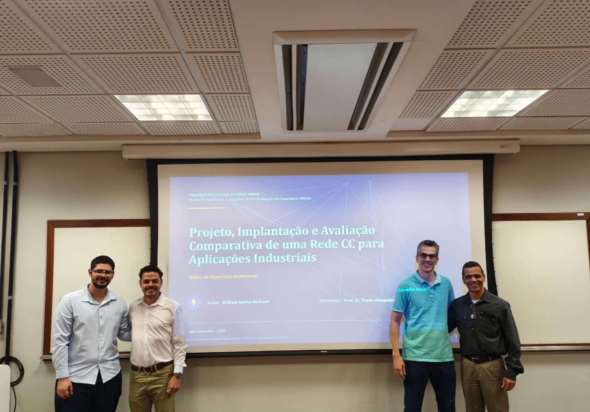

<figure style="text-align: center;">

{width=70%}

<figcaption>

Fig. 1 — William Andrade após a aprovação da dissertação de mestrado.Fig. 1 — William Andrade after the approval of his master's thesis.

</figcaption>

</figure>

**William Santos Andrade** foi aprovado em sua defesa de dissertação de mestrado intitulada **"Projeto, Implantação e Avaliação Comparativa de Uma Rede CC Para Aplicações Industriais"** no Programa de Pós-Graduação em Engenharia Elétrica da UFMG.**William Santos Andrade** was approved in his master's thesis defense entitled **"Design, Implementation and Comparative Evaluation of a DC Network for Industrial Applications"** at the Graduate Program in Electrical Engineering of UFMG.

Agradecemos à banca avaliadora pela participação e contribuições:We thank the examining committee for their participation and contributions:

- **Prof. Sidelmo Magalhães Silva** — DEE**Prof. Sidelmo Magalhães Silva** — DEE
- **Prof. João Marcus S. Callegari** — DELT**Prof. João Marcus S. Callegari** — DELT

**Orientador:** Prof. Thales Alexandre Carvalho Maia**Advisor:** Prof. Thales Alexandre Carvalho Maia

Parabéns ao William pela conquista! 🎉Congratulations to William on this achievement! 🎉

<!--Include social share buttons-->


