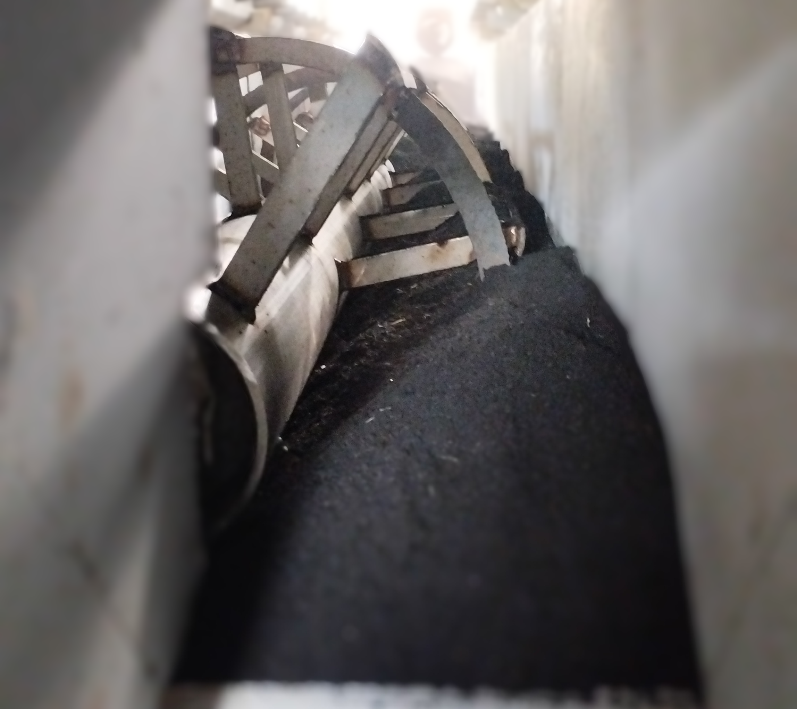
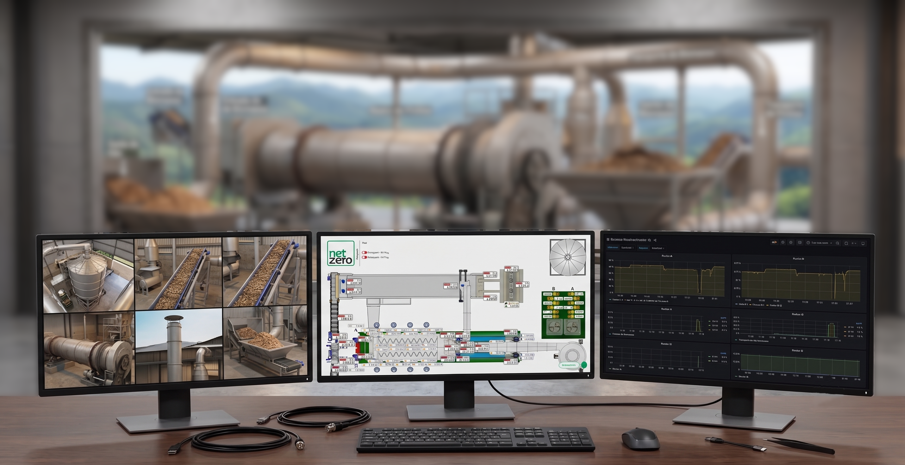

**Empresa:** NetZero
**Escopo:** Liderança Tecnológica / Engenharia Full-Stack e IoT Industrial**Company:** NetZero
**Scope:** Technology Leadership / Full-Stack Engineering and Industrial IoT

{width=60%}

## O DesafioThe Challenge

A produção de Biochar em escala industrial exige um controle rigoroso de processos termoquímicos e movimentação de materiais. O grande desafio tecnológico nesse cenário é garantir que os dados fluam com confiabilidade absoluta desde os sensores no ambiente agressivo do chão de fábrica até os servidores em nuvem, sem latência e sem perda de pacotes, garantindo a rastreabilidade essencial para o mercado de créditos de carbono.Industrial-scale Biochar production demands rigorous control of thermochemical processes and material handling. The major technological challenge in this scenario is ensuring that data flows with absolute reliability — from sensors in the harsh factory-floor environment to cloud servers — without latency or packet loss, guaranteeing the traceability essential for the carbon credit market.

Atuando como Líder Tecnológico na **NetZero**, o meu objetivo foi projetar e implementar, em tempo recorde, toda a espinha dorsal de automação, elétrica e de dados da fábrica, fugindo das limitações e dos altos custos de licenciamento de sistemas de prateleira engessados.Serving as Technology Leader at **NetZero**, my goal was to design and implement, in record time, the entire automation, electrical, and data backbone of the factory, moving beyond the limitations and high licensing costs of rigid off-the-shelf systems.

## Engenharia Híbrida: Do Metal à NuvemHybrid Engineering: From Metal to Cloud

Este projeto é a materialização da engenharia *full-stack* aplicada à indústria pesada. A arquitetura foi concebida para ser resiliente, escalável e de domínio proprietário. Minha atuação cobriu todas as camadas do ecossistema tecnológico da planta:This project is the embodiment of full-stack engineering applied to heavy industry. The architecture was designed to be resilient, scalable, and proprietary. My contributions spanned every layer of the plant's technological ecosystem:

{width=85%}

* **Infraestrutura Elétrica e Potência:** Fui responsável pelo projeto e implementação de toda a rede elétrica de baixa tensão e pela estruturação do Centro de Controle de Motores (CCM), garantindo o acionamento seguro e eficiente do maquinário pesado.**Electrical and Power Infrastructure:** I was responsible for the design and implementation of the entire low-voltage electrical network and the structuring of the Motor Control Center (MCC), ensuring safe and efficient operation of heavy machinery.
* **Hardwares Proprietários e Comunicação Redundante:** Para garantir a robustez na aquisição de dados, desenvolvi módulos de I/O (Entradas e Saídas) customizados. Implementei uma malha de comunicação redundante operando simultaneamente via cabeamento físico robusto (CAN bus) e rede sem fio (Wi-Fi). Caso uma das vias sofra interferência ou rompimento, o sistema mantém a telemetria intacta.**Proprietary Hardware and Redundant Communication:** To ensure robustness in data acquisition, I developed custom I/O (Input/Output) modules. I implemented a redundant communication mesh operating simultaneously via robust physical wiring (CAN bus) and wireless network (Wi-Fi). Should one path suffer interference or breakage, the system keeps telemetry intact.
* **Sistemas Embarcados e Edge Computing:** Desenvolvimento de *firmwares* otimizados para microcontroladores de borda, responsáveis por ler os sensores do processo de pirólise/gaseificação, empacotar os dados e gerenciar os monitores de *heartbeat* dos equipamentos em tempo real.**Embedded Systems and Edge Computing:** Development of optimized firmware for edge microcontrollers, responsible for reading pyrolysis/gasification process sensors, packaging data, and managing real-time equipment heartbeat monitors.
* **Integração de Dados e Nuvem (IoT):** Na camada de software, orquestrei sistemas de mensageria e consumo de dados em tempo real utilizando instâncias virtuais (VPS). Desenvolvi a arquitetura de *backend* para receber essas variáveis, permitindo a criação de *dashboards* no estilo SCADA para a supervisão remota e simultânea de múltiplas plantas operacionais.**Data Integration and Cloud (IoT):** At the software layer, I orchestrated messaging systems and real-time data consumption using virtual private servers (VPS). I developed the backend architecture to ingest these variables, enabling SCADA-style dashboards for remote and simultaneous supervision of multiple operational plants.

## ImpactoImpact

A entrega desta arquitetura completa rompeu a dependência de fornecedores de automação tradicionais. O sistema construído garantiu não apenas a operacionalidade imediata e segura da planta de Biochar, mas estabeleceu uma infraestrutura de dados madura. O resultado é uma fábrica inteligente, onde todas as variáveis de processo — desde a temperatura dos fornos até a vibração dos motores — estão centralizadas e visíveis em tempo real na nuvem, permitindo decisões rápidas e auditorias precisas.The delivery of this complete architecture broke the dependency on traditional automation vendors. The built system not only ensured the immediate and safe operation of the Biochar plant but also established a mature data infrastructure. The result is a smart factory where every process variable — from furnace temperatures to motor vibrations — is centralized and visible in real time in the cloud, enabling rapid decisions and precise audits.

<!-- {height=60px} -->

{height=60px}

<!--Include social share buttons-->

