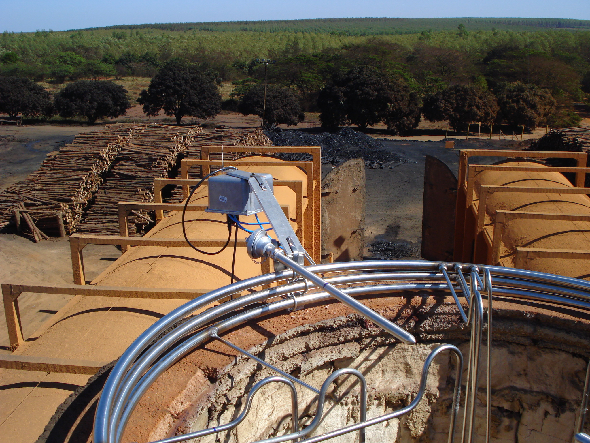
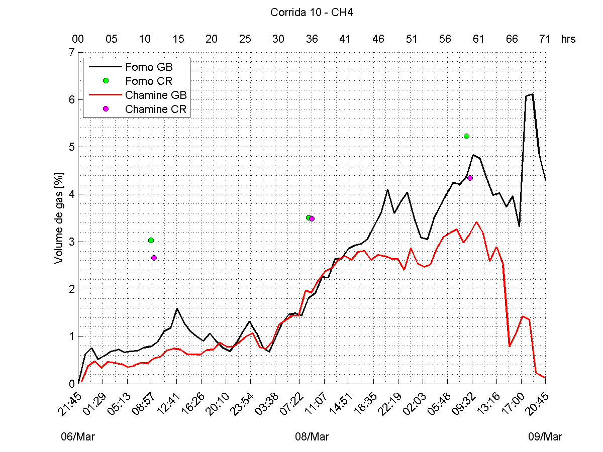

**Parceiro Industrial:** ArcelorMittal Bioflorestas **Escopo:** Engenharia Reversa, Instrumentação Analítica e Ciência de Dados Aplicada**Industrial Partner:** ArcelorMittal Bioflorestas **Scope:** Reverse Engineering, Analytical Instrumentation and Applied Data Science  

{width=70%}

## O DesafioThe Challenge

A produção de carvão vegetal (biomassa) para a indústria siderúrgica envolve processos termoquímicos complexos de carbonização. Para que empresas de grande porte, como a **ArcelorMittal Bioflorestas**, possam certificar suas operações e atuar ativamente no mercado internacional de créditos de carbono, é exigida uma precisão absoluta na medição das emissões de gases de efeito estufa (GEE) durante o processo.

O grande obstáculo prático é que os analisadores de gás comerciais de alta precisão operam frequentemente como "caixas-pretas". Seus hardwares e softwares proprietários entregam dados pré-processados e engessados, o que inviabiliza a customização algorítmica necessária para a realização de cálculos estequiométricos e auditorias rigorosas exigidas pelos órgãos certificadores de carbono.

The production of charcoal (biomass) for the steel industry involves complex thermochemical carbonization processes. For large-scale companies such as **ArcelorMittal Bioflorestas** to certify their operations and actively participate in the international carbon credit market, absolute precision is required in measuring greenhouse gas (GHG) emissions throughout the process.

The major practical obstacle is that high-precision commercial gas analyzers often operate as "black boxes." Their proprietary hardware and software deliver pre-processed, rigid data, which prevents the algorithmic customization needed to perform stoichiometric calculations and rigorous audits required by carbon certification bodies.

 

## Engenharia Reversa e Ciência de DadosReverse Engineering and Data Science

Para contornar as restrições comerciais dos equipamentos de prateleira e garantir total controle sobre os dados das emissões, o projeto exigiu uma abordagem híbrida de instrumentação avançada e modelagem matemática.

A solução desenvolvida passou pelas seguintes etapas críticas de engenharia:

* **Engenharia Reversa de Analisadores:** Atuei diretamente na desmontagem lógica e física dos analisadores de gás comerciais. O objetivo foi mapear e interceptar os sinais analógicos e digitais "crus" (*raw data*) diretamente nas saídas dos sensores óticos e químicos, antes que fossem filtrados pelo software proprietário do fabricante.
* **Sistema de Aquisição e Condicionamento:** Projetei a arquitetura de coleta de dados capaz de operar no ambiente hostil do chão de fábrica (altas temperaturas e particulados). Isso garantiu que as leituras de concentração de gases (como $CO$, $CO_2$, $CH_4$ e $O_2$) fossem extraídas em tempo real e com alta fidelidade.

  A pirólise da biomassa de eucalipto pode ser representada pela decomposição genérica:

  $$C_n H_m O_p \;\xrightarrow{\;\Delta\;}\; a\,C_{(s)} + b\,H_2 + c\,C_x H_y + d\,CO + e\,CO_2 + f\,H_2O$$

  onde os coeficientes $a, b, c, d, e, f$ dependem da composição da madeira e das condições do forno (temperatura, taxa de aquecimento e atmosfera), formando: carbono fixo (carvão), hidrogênio gasoso, hidrocarbonetos leves (alcatrão), monóxido e dióxido de carbono, e água.

* **Balanço Químico e Modelagem:** Na camada de software, utilizei técnicas de Ciência de Dados para modelar a termodinâmica dos fornos. Desenvolvi algoritmos que cruzavam os dados crus dos sensores com as variáveis de entrada de biomassa, realizando o balanço químico estequiométrico e de massa contínuo da combustão.

To circumvent the commercial restrictions of off-the-shelf equipment and ensure full control over emissions data, the project demanded a hybrid approach combining advanced instrumentation and mathematical modeling.

The developed solution went through the following critical engineering stages:

* **Reverse Engineering of Analyzers:** I worked directly on the logical and physical disassembly of commercial gas analyzers. The goal was to map and intercept the raw analog and digital signals directly at the output of optical and chemical sensors, before they were filtered by the manufacturer's proprietary software.
* **Acquisition and Conditioning System:** I designed the data collection architecture capable of operating in the hostile factory-floor environment (high temperatures and particulates). This ensured that gas concentration readings (such as $CO$, $CO_2$, $CH_4$ and $O_2$) were extracted in real time and with high fidelity.

  The pyrolysis of eucalyptus biomass can be represented by the generic decomposition:

  $$C_n H_m O_p \;\xrightarrow{\;\Delta\;}\; a\,C_{(s)} + b\,H_2 + c\,C_x H_y + d\,CO + e\,CO_2 + f\,H_2O$$

  where the coefficients $a, b, c, d, e, f$ depend on the wood composition and furnace conditions (temperature, heating rate and atmosphere), forming: fixed carbon (charcoal), hydrogen gas, light hydrocarbons (tar), carbon monoxide and dioxide, and water.

* **Chemical Balance and Modeling:** At the software layer, I used Data Science techniques to model furnace thermodynamics. I developed algorithms that cross-referenced raw sensor data with biomass input variables, performing continuous stoichiometric and mass balance of combustion.

{width=85%}

## ImpactoImpact

Este desenvolvimento rompeu a limitação dos instrumentos comerciais, transformando equipamentos padrão em ferramentas de auditoria de precisão científica. A modelagem algorítmica do balanço de massa forneceu à ArcelorMittal Bioflorestas a transparência e a rastreabilidade exatas dos gases emitidos e evitados no processo de carbonização.

Como resultado direto, o sistema viabilizou a comprovação auditável das métricas de sustentabilidade da planta, fornecendo o lastro técnico necessário para a conversão das reduções de emissões em ativos financeiros no mercado global de créditos de carbono.

This development broke through the limitations of commercial instruments, transforming standard equipment into scientifically precise auditing tools. The algorithmic mass-balance modeling provided ArcelorMittal Bioflorestas with exact transparency and traceability of gases emitted and avoided during the carbonization process.

As a direct result, the system enabled auditable verification of the plant's sustainability metrics, providing the technical foundation necessary to convert emission reductions into financial assets in the global carbon credit market.

{height=60px}

{height=60px}

<!--Include social share buttons-->

