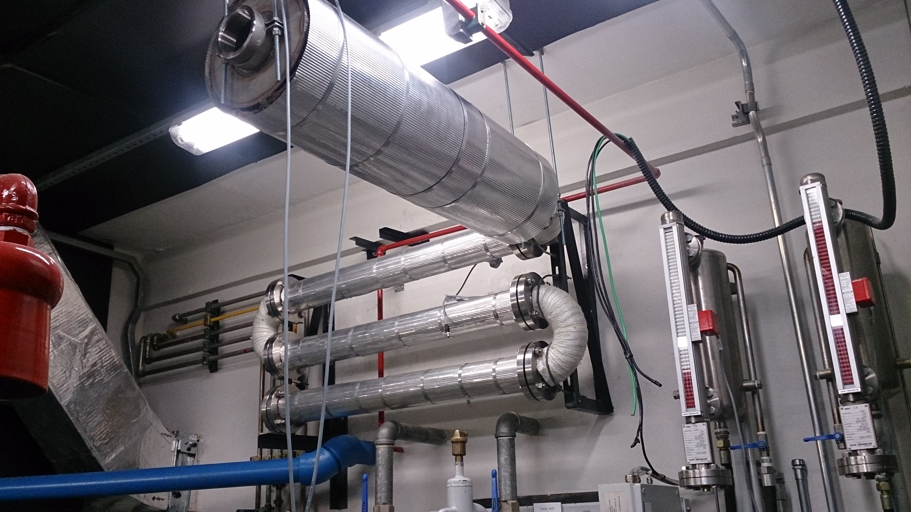
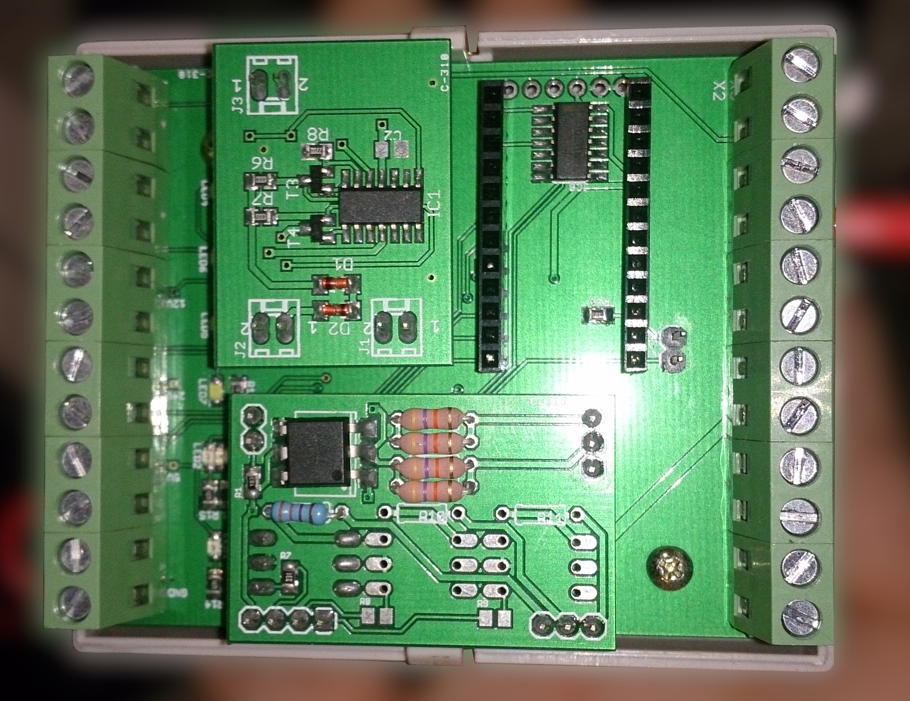
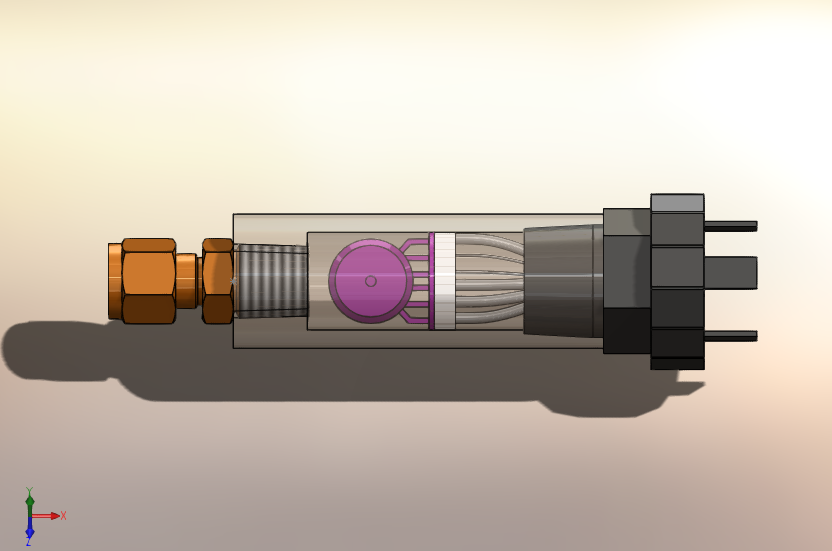

**Parceiros:** FARR / Centro de Tecnologia em Mobilidade (CTM - UFMG) **Escopo:** Engenharia Fluidodinâmica, Eletrônica de Potência e Controle PID Customizado**Partners:** FARR / Mobility Technology Center (CTM - UFMG) **Scope:** Fluid Dynamics Engineering, Power Electronics and Custom PID Control  

## O Desafio da Sobrealimentação de MotoresThe Challenge of Engine Supercharging

Para a realização de pesquisas avançadas e homologações, os laboratórios de engenharia automotiva necessitam de bancadas de ensaio que simulem com exatidão as condições reais de operação dos veículos. No Centro de Tecnologia em Mobilidade (CTM) da UFMG, surgiu a necessidade de testar motores a combustão interna superalimentados.

O desafio consistia em fornecer ar de admissão para esses motores sob condições estritamente controladas de pressão e temperatura, simulando o comportamento de turbocompressores em diferentes regimes de carga. Fui responsável por dimensionar e executar a solução completa, integrando a fluidodinâmica pesada à eletrônica de controle de precisão.

To conduct advanced research and homologation, automotive engineering laboratories require test benches that accurately simulate real vehicle operating conditions. At the Mobility Technology Center (CTM) of UFMG, the need arose to test supercharged internal combustion engines.

The challenge was to supply intake air to these engines under strictly controlled pressure and temperature conditions, simulating the behavior of turbochargers under different load regimes. I was responsible for designing and implementing the complete solution, integrating heavy fluid dynamics with precision control electronics.

## Engenharia Eletromecânica e FluidodinâmicaElectromechanical and Fluid Dynamics Engineering

A arquitetura do sistema exigiu o dimensionamento e a integração de componentes mecânicos e elétricos de alta capacidade:

* **Compressão e Controle de Pressão:** A geração do fluxo de ar foi realizada através da instalação e dimensionamento de compressores do tipo parafuso. Para garantir que a pressão de admissão do motor a combustão fosse exata e dinâmica, integrei uma válvula proporcional linear controlada eletronicamente via malha de corrente padrão industrial de 4 a 20 mA.
* **Sistema de Aquecimento de Alta Potência:** A simulação térmica do ar comprimido demandou um sistema de aquecimento robusto. Projetei um arranjo com resistências aletadas individuais de 8 kW cada, configuradas em um sistema trifásico combinado que entregava uma potência térmica total de aproximadamente 22 kW para o fluxo de ar.

The system architecture required the sizing and integration of high-capacity mechanical and electrical components:

* **Compression and Pressure Control:** Air flow generation was achieved through the installation and sizing of screw-type compressors. To ensure that the combustion engine's intake pressure was accurate and dynamic, I integrated a linear proportional valve controlled electronically via a standard industrial 4 to 20 mA current loop.
* **High-Power Heating System:** The thermal simulation of compressed air demanded a robust heating system. I designed an arrangement with individual finned resistors of 8 kW each, configured in a combined three-phase system that delivered a total thermal power of approximately 22 kW to the air flow.

## Hardware Customizado e Controle de Potência (*Bare-Metal*)Custom Hardware and Power Control (*Bare-Metal*)

Gerenciar 22 kW de aquecimento e manter a pressão do ar milimetricamente estável exige uma eletrônica que não se encontra "de prateleira". Desenvolvi o hardware e o firmware de controle a partir do zero:
Managing 22 kW of heating and keeping air pressure millimetrically stable requires electronics that are not "off-the-shelf". I developed the control hardware and firmware from scratch:

{width=70%}

* **Controle Linear com Tiristores e *Zero-Crossing*:** Para evitar ruídos elétricos severos na rede do laboratório ao acionar 22 kW de carga, projetei um estágio de eletrônica de potência baseado em tiristores. A modulação de energia para as resistências foi feita de forma contínua e linear, utilizando algoritmos de detecção de passagem por zero (*zero-crossing*). Isso permitiu um aquecimento suave e preciso, sem picos de comutação.
* **Malhas de Controle PID:** O "cérebro" da placa processava simultaneamente algoritmos PID (*Proporcional, Integral e Derivativo*) independentes. Um PID atuava na modulação dos tiristores para travar a temperatura do ar na saída, enquanto outro PID comandava a válvula de 4-20 mA para estabilizar a pressão de admissão, compensando dinamicamente o consumo de ar do motor em aceleração.

* **Linear Control with Thyristors and Zero-Crossing:** To avoid severe electrical noise in the lab's power grid when switching 22 kW of load, I designed a power electronics stage based on thyristors. Energy modulation for the resistors was done continuously and linearly, using zero-crossing detection algorithms. This allowed smooth and precise heating without switching spikes.
* **PID Control Loops:** The board's "brain" simultaneously processed independent PID (Proportional, Integral, Derivative) algorithms. One PID modulated the thyristors to lock the output air temperature, while another PID commanded the 4-20 mA valve to stabilize intake pressure, dynamically compensating for the engine's air consumption during acceleration.

{width=70%}

* **Instrumentação e Sensoriamento:** Além do controle, projetei a mecânica e a eletrônica de integração dos sensores de temperatura e pressão frontal, garantindo que o tempo de resposta da leitura fosse rápido o suficiente para alimentar as malhas do PID sem instabilidade.
* **Instrumentation and Sensing:** Beyond control, I designed the mechanics and integration electronics for the front-end temperature and pressure sensors, ensuring the reading response time was fast enough to feed the PID loops without instability.

## ImpactoImpact

A entrega deste sistema dotou o laboratório do CTM de uma infraestrutura de ensaios de padrão internacional. O desenvolvimento *full-stack* — unindo o dimensionamento do compressor, a termodinâmica dos 22 kW e a eletrônica de controle *bare-metal* — resultou em uma bancada capaz de simular dinamicamente e com precisão absoluta qualquer condição de sobrealimentação para testes de motores de combustão.
The delivery of this system equipped the CTM laboratory with an international standard testing infrastructure. The *full-stack* development — combining compressor sizing, the thermodynamics of 22 kW, and *bare-metal* control electronics — resulted in a test bench capable of dynamically simulating with absolute precision any supercharging condition for combustion engine testing.

{height=60px}

{height=60px}

<!--Include social share buttons-->

