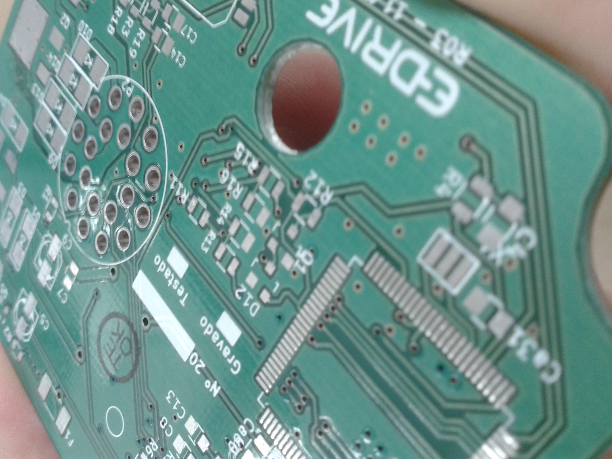
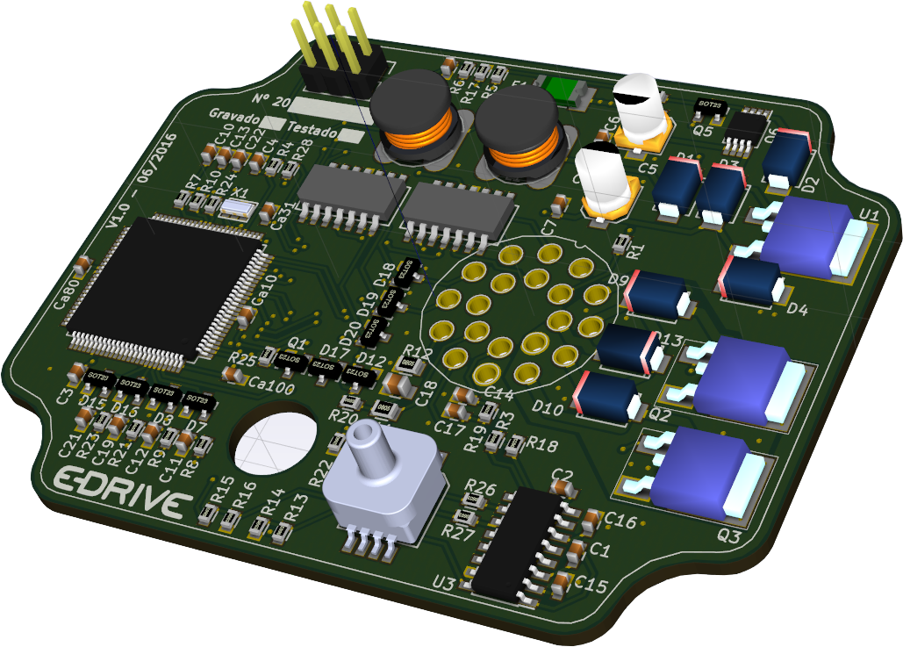
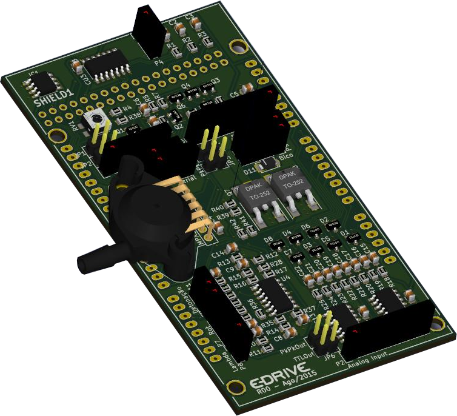

**Parceiros Industriais:** Biagio Turbos / Fahren **Escopo:** Engenharia de Hardware (*Bare-Metal*), Firmware, Calibração Automotiva e Produtização**Industrial Partners:** Biagio Turbos / Fahren **Scope:** Hardware Engineering (*Bare-Metal*), Firmware, Automotive Calibration and Productization

{width=70%}

## O Gargalo TecnológicoThe Technological Bottleneck

A evolução dos motores a combustão exige que qualquer modificação mecânica de performance seja milimetricamente acompanhada por um gerenciamento eletrônico preciso. Uma fabricante consolidada no mercado de turbocompressores (Biagio Turbos) havia desenvolvido um excelente kit mecânico para veículos Fiat, mas esbarrou em um gargalo crítico: a empresa não possuía a competência eletrônica necessária para controlar a injeção e a pressão do sistema.

Sem um "cérebro" eletrônico adequado, a integridade mecânica dos motores originais ficava em risco. Assumi a responsabilidade de suprir essa lacuna tecnológica, desenvolvendo do zero uma Unidade de Controle Eletrônico (ECU/Piggyback) customizada para ler os sensores do veículo, interceptar sinais e atuar com precisão nos parâmetros de combustão.

The evolution of internal combustion engines demands that any mechanical performance modification be precisely accompanied by accurate electronic management. A well-established manufacturer in the turbocharger market (Biagio Turbos) had developed an excellent mechanical kit for Fiat vehicles but hit a critical bottleneck: the company lacked the necessary electronic expertise to control the system's injection and pressure.

Without a suitable electronic "brain," the mechanical integrity of the original engines was at risk. I took on the responsibility of filling this technological gap, developing from scratch a custom Electronic Control Unit (ECU/Piggyback) to read vehicle sensors, intercept signals, and precisely act on combustion parameters.

## Do Conceito à Linha de Produção (TRL 1 ao 9)From Concept to Production Line (TRL 1 to 9)

O grande diferencial deste projeto foi percorrer toda a escala de Níveis de Maturidade Tecnológica (*Technology Readiness Levels* - TRL). O trabalho não se limitou a um protótipo de bancada (TRL 3), mas avançou até a certificação, operação em ambiente real e produção comercial em série (TRL 9).

O desenvolvimento *full-stack* envolveu as seguintes frentes de engenharia:

The major differentiator of this project was covering the entire Technology Readiness Level (TRL) scale. The work was not limited to a bench prototype (TRL 3) but advanced all the way to certification, real-world operation, and commercial series production (TRL 9).

The full-stack development involved the following engineering fronts:

{width=80%}

* **Design de Hardware (*Bare-Metal*):** Projetei a arquitetura eletrônica completa, desde a seleção de microcontroladores até o roteamento avançado da placa de circuito impresso (PCB). O hardware precisava incluir proteções severas contra transientes de tensão e ruído eletromagnético, típicos do cofre do motor de um automóvel.
* **Desenvolvimento de Firmware e Sensoriamento:** A programação *bare-metal* garantiu máxima velocidade de processamento e confiabilidade. Integramos sensores de pressão absoluta (MAP) na própria placa para leituras instantâneas do coletor de admissão, além de processar os sinais de rotação e sonda lambda do veículo em tempo real.

* **Hardware Design (*Bare-Metal*):** I designed the complete electronic architecture, from microcontroller selection to advanced PCB routing. The hardware needed to include severe protection against voltage transients and electromagnetic noise, typical of a vehicle's engine bay.
* **Firmware and Sensing Development:** Bare-metal programming ensured maximum processing speed and reliability. We integrated absolute pressure (MAP) sensors directly on the board for instantaneous intake manifold readings, while processing the vehicle's rpm and lambda sensor signals in real time.

{width=80%}

* **Calibração e Segurança de Motor:** Com a eletrônica funcional, fui a campo mapear e calibrar o funcionamento dinâmico dos motores. Ajustei mapas de ponto de injeção suplementar e limitei eletronicamente o pico de pressão do turbo. Essa calibração fina foi o que garantiu o ganho de potência desejado sem comprometer a durabilidade dos motores.
* **Calibration and Engine Safety:** With the electronics functional, I went to the field to map and calibrate the dynamic operation of the engines. I adjusted supplemental injection timing maps and electronically limited the turbo's peak pressure. This fine calibration was what ensured the desired power gain without compromising engine durability.

## O Impacto e o Produto ComercialImpact and Commercial Product

O que começou como a resolução de um problema técnico isolado tornou-se um produto comercial de sucesso. O módulo batizado de **eDRIVE** foi exaustivamente testado em campo, validado e lançado no mercado.

A entrega dessa solução transformou o kit turbo da empresa em um produto inteligente e seguro (*plug-and-play*), culminando na comercialização de centenas de unidades. O projeto atesta a capacidade de traduzir a engenharia eletrônica profunda em viabilidade de negócios, entregando um hardware 100% projetado para a fabricação em escala.

What began as solving an isolated technical problem became a successful commercial product. The module named **eDRIVE** was exhaustively tested in the field, validated, and launched on the market.

Delivering this solution transformed the company's turbo kit into a smart and safe (*plug-and-play*) product, culminating in the sale of hundreds of units. The project attests to the ability to translate deep electronic engineering into business viability, delivering hardware 100% designed for scaled manufacturing.

{height=60px}

{height=60px}

<!--Include social share buttons-->


