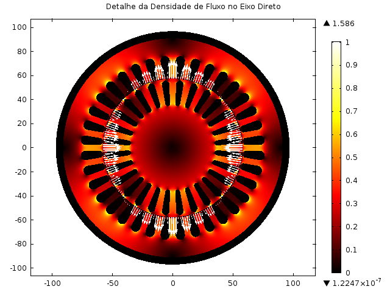
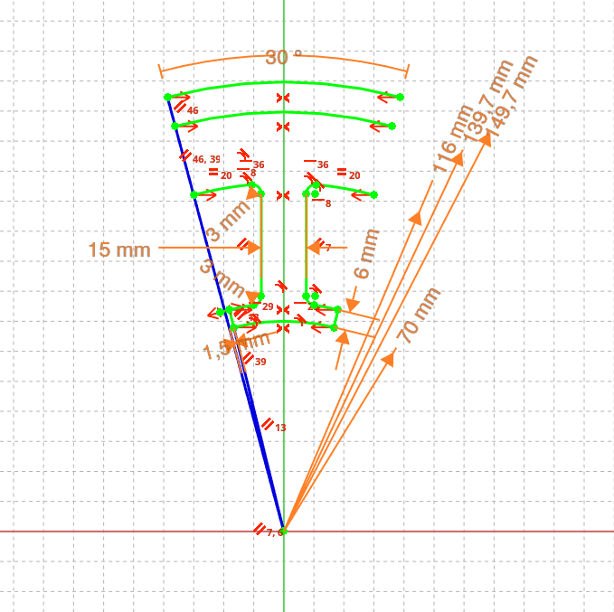
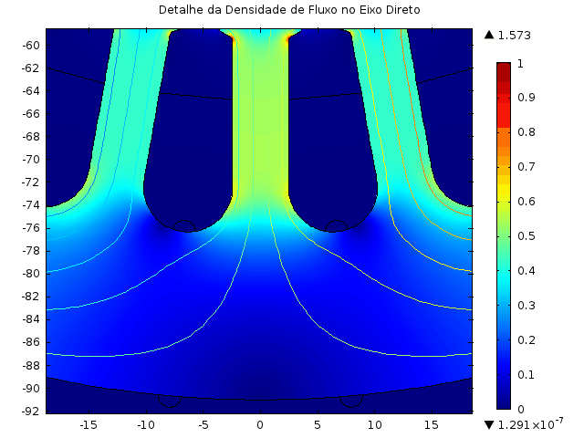
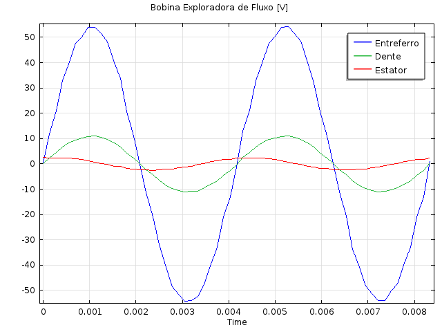

**Escopo:** Análise Eletromagnética Computacional, Otimização Paramétrica e Design Numérico **Atuação:** Especialista em Simulação e Design Eletromagnético**Scope:** Computational Electromagnetic Analysis, Parametric Optimization and Numerical Design **Role:** Specialist in Simulation and Electromagnetic Design

## A Engenharia por Trás do EletromagnetismoThe Engineering Behind Electromagnetism

O desenvolvimento de máquinas elétricas de alta eficiência exige a transição dos cálculos analíticos tradicionais para a modelagem numérica avançada. Em motores de indução trifásicos — como o modelo de 5 CV otimizado neste projeto —, o grande desafio de engenharia é direcionar a energia magnética de forma cirúrgica para o entreferro, transformando o máximo de campo magnético em torque mecânico útil.

O domínio do **Método de Elementos Finitos (FEM)** permite dissecar o circuito magnético "no nível do elétron". Através da simulação multifísica, torna-se possível mapear o comportamento vetorial do campo, identificar gargalos de saturação no aço silício e validar exaustivamente a topologia da máquina antes da usinagem de qualquer protótipo físico.

The development of high-efficiency electrical machines requires transitioning from traditional analytical calculations to advanced numerical modeling. In three-phase induction motors — such as the 5 HP model optimized in this project — the great engineering challenge is to surgically direct magnetic energy to the air gap, transforming the maximum amount of magnetic field into useful mechanical torque.

Mastery of the **Finite Element Method (FEM)** allows dissecting the magnetic circuit "at the electron level." Through multiphysics simulation, it becomes possible to map the vector behavior of the field, identify saturation bottlenecks in silicon steel, and exhaustively validate the machine topology before machining any physical prototype.

## Otimização Geométrica e Controle Vetorial do FluxoGeometric Optimization and Vector Flux Control

Neste projeto, a modelagem FEM foi o núcleo de uma otimização paramétrica agressiva focada no estator e no rotor. A estratégia abordou duas frentes críticas para a eficiência do motor:
In this project, FEM modeling was the core of an aggressive parametric optimization focused on the stator and rotor. The strategy addressed two critical fronts for motor efficiency:

{width=70%}

* **Maximização do Fluxo Enlaçado:** O torque de um motor é diretamente proporcional ao fluxo magnético que efetivamente cruza o entreferro e "abraça" as barras do rotor. Através da parametrização geométrica (ajustando a largura dos dentes e a profundidade da coroa do estator), a relutância do circuito principal foi minimizada. Isso garante a máxima densidade de fluxo útil sem saturar prematuramente o material ferromagnético.
* **Mitigação da Dispersão de Fluxo (*Leakage*):** O fluxo de dispersão é a energia que "curto-circuita" pelas ranhuras sem cruzar o entreferro, degradando o fator de potência e a eficiência geral da máquina. A simulação iterativa permitiu redesenhar a abertura das ranhuras (*slot openings*) e o perfil das cunhas.

* **Maximization of Linked Flux:** Motor torque is directly proportional to the magnetic flux that effectively crosses the air gap and "embraces" the rotor bars. Through geometric parameterization (adjusting tooth width and stator yoke depth), the reluctance of the main circuit was minimized. This ensures maximum useful flux density without prematurely saturating the ferromagnetic material.
* **Mitigation of Flux Leakage:** Leakage flux is the energy that "short-circuits" through the slots without crossing the air gap, degrading the power factor and overall machine efficiency. Iterative simulation allowed redesigning the slot openings and wedge profiles.

## Validação Dinâmica e Resposta ElétricaDynamic Validation and Electrical Response

Uma simulação FEM de alto nível não se limita a gerar mapas de calor estáticos; ela deve prever o comportamento elétrico dinâmico da máquina.
A high-level FEM simulation does not merely generate static heat maps; it must predict the machine's dynamic electrical behavior.

Para validar a integridade do design eletromagnético, o modelo foi submetido a análises transientes rigorosas. A extração de dados através de bobinas exploradoras virtuais permitiu traçar as curvas reais de tensão induzida (Força Eletromotriz) em diferentes seções do circuito magnético. Esse cruzamento entre o domínio espacial (geometria) e o domínio temporal (sinais elétricos) garante que distorções harmônicas e oscilações de torque (*torque ripple*) sejam neutralizadas na prancheta de projeto.
To validate the integrity of the electromagnetic design, the model was subjected to rigorous transient analyses. Data extraction through virtual search coils allowed tracing the actual induced voltage curves (Electromotive Force) in different sections of the magnetic circuit. This cross-referencing between the spatial domain (geometry) and the temporal domain (electrical signals) ensures that harmonic distortions and torque ripple are neutralized at the design stage.

## ImpactoImpact

O emprego de simulações FEM converte o design de máquinas elétricas de um processo de "tentativa e erro" para uma ciência determinística. A capacidade de prever a saturação do aço, controlar vetorialmente os caminhos de relutância, eliminar dispersões de fluxo e validar as correntes trifásicas de alimentação resulta em motores estritamente otimizados: mais compactos, com maior torque específico e prontos para superar os padrões globais de eficiência energética.
The use of FEM simulations converts the design of electrical machines from a "trial and error" process into a deterministic science. The ability to predict steel saturation, vectorially control reluctance paths, eliminate flux leakage, and validate the three-phase supply currents results in strictly optimized motors: more compact, with higher specific torque, and ready to surpass global energy efficiency standards.

{height=60px}

{height=60px}

<!--Include social share buttons-->


