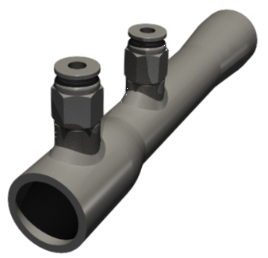
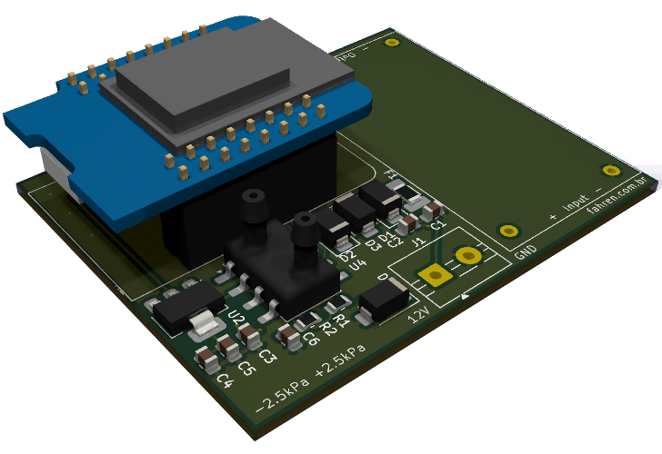

**Escopo:** Engenharia Fluidodinâmica, Usinagem Mecânica, Instrumentação e Eletrônica Embarcada **Aplicações:** Processos industriais, bancadas de teste, automação de fluidos e P&D.**Scope:** Fluid Dynamics Engineering, Mechanical Machining, Instrumentation and Embedded Electronics **Applications:** Industrial processes, test benches, fluid automation and R&D.

## O Desafio da Medição de Fluxo na IndústriaThe Challenge of Flow Measurement in Industry

Um dos maiores desafios na instrumentação industrial é medir a vazão de um fluido (líquido ou gás) sem gerar restrições no sistema. A introdução de sensores intrusivos na tubulação frequentemente causa turbulência e uma indesejada **perda de carga** (queda de pressão), o que força bombas e compressores a trabalharem com sobrecarga, reduzindo a eficiência energética de toda a planta.

A solução clássica e mais eficiente para medir vazão minimizando a perda de carga ao extremo é a utilização de um **Tubo Venturi**. Ao estrangular suavemente o fluxo e depois expandi-lo gradativamente, o Venturi permite o cálculo exato da vazão através da leitura da pressão diferencial, com recuperação quase total da pressão original do sistema.

O grande problema? Tubos Venturi comerciais são caros, têm prazos de entrega longos e, muitas vezes, não se adaptam às dimensões customizadas ou aos fluidos específicos de um projeto de P&D ou de uma planta industrial fora do padrão.

One of the greatest challenges in industrial instrumentation is measuring the flow of a fluid (liquid or gas) without creating restrictions in the system. The introduction of intrusive sensors in the pipeline often causes turbulence and an undesirable **pressure drop**, which forces pumps and compressors to work under overload, reducing the energy efficiency of the entire plant.

The classic and most efficient solution for measuring flow while minimizing pressure drop to the extreme is the use of a **Venturi Tube**. By smoothly constricting the flow and then gradually expanding it, the Venturi allows precise flow calculation through differential pressure reading, with almost total recovery of the original system pressure.

The big problem? Commercial Venturi tubes are expensive, have long delivery times, and often do not adapt to custom dimensions or specific fluids of an R&D project or non-standard industrial plant.

## A Solução: Engenharia de Ponta a PontaThe Solution: End-to-End Engineering

Para resolver esse gargalo, atuo no **desenvolvimento integral de sistemas de medição de fluxo customizados**. Minha abordagem elimina a dependência de fornecedores de prateleira caros, pois assumo a responsabilidade desde a física do escoamento até o dado digital na tela do operador.

A entrega contempla o ciclo completo:

* **Cálculo Fluidodinâmico e Design Mecânico:** Dimensionamento estrito do Tubo Venturi (ângulos de convergência e divergência, diâmetro da garganta e tomadas de pressão) adaptado exatamente à faixa de vazão, viscosidade e densidade do seu fluido.
* **Fabricação Otimizada:** Projeto mecânico voltado para a viabilidade de usinagem (CAD/CAM), garantindo que a peça possa ser fabricada localmente com precisão, reduzindo drasticamente os custos e o tempo de importação de peças comerciais.
* **Eletrônica e Telemetria:** A mecânica não funciona sozinha. Desenvolvo a eletrônica de hardware (*bare-metal*) para ler os sensores de pressão diferencial de alta sensibilidade, convertendo os sinais analógicos em dados digitais precisos.
* **Integração e Calibração:** O sistema é entregue pronto para uso (*plug-and-play*), com o microcontrolador já programado com as curvas de calibração, compensação de temperatura e saídas compatíveis com o seu sistema de controle (seja via saídas analógicas 4-20mA, 0-10V, ou protocolos digitais industriais).

To solve this bottleneck, I work on the **integral development of custom flow measurement systems**. My approach eliminates reliance on expensive off-the-shelf suppliers, as I take responsibility from the flow physics to the digital data on the operator's screen.

The delivery covers the complete cycle:

* **Fluid Dynamics Calculation and Mechanical Design:** Strict sizing of the Venturi Tube (convergence and divergence angles, throat diameter and pressure taps) adapted exactly to the flow range, viscosity and density of your fluid.
* **Optimized Manufacturing:** Mechanical design focused on machining feasibility (CAD/CAM), ensuring the part can be manufactured locally with precision, drastically reducing costs and import time of commercial parts.
* **Electronics and Telemetry:** The mechanics don't work alone. I develop the hardware electronics (*bare-metal*) to read the high-sensitivity differential pressure sensors, converting analog signals into precise digital data.
* **Integration and Calibration:** The system is delivered ready for use (*plug-and-play*), with the microcontroller already programmed with calibration curves, temperature compensation and outputs compatible with your control system (whether via 4-20mA, 0-10V analog outputs, or digital industrial protocols).

{width=80%}

## Por que desenvolver um sistema customizado?Why develop a custom system?

Muitas empresas travam o desenvolvimento de bancadas de teste ou processos industriais por não encontrarem medidores de vazão comerciais que caibam no orçamento ou na tubulação existente.

Ao dominar tanto a **mecânica dos fluidos** quanto a **eletrônica de aquisição**, sou capaz de entregar uma solução completa de metrologia. Você não recebe apenas um projeto 3D ou uma placa eletrônica; você recebe o instrumento completo, calibrado e pronto para comunicar com o seu CLP ou sistema de supervisão.

Many companies stall the development of test benches or industrial processes because they cannot find commercial flow meters that fit the budget or the existing pipeline.

By mastering both **fluid mechanics** and **acquisition electronics**, I can deliver a complete metrology solution. You don't just receive a 3D project or an electronic board; you receive the complete instrument, calibrated and ready to communicate with your PLC or supervision system.

