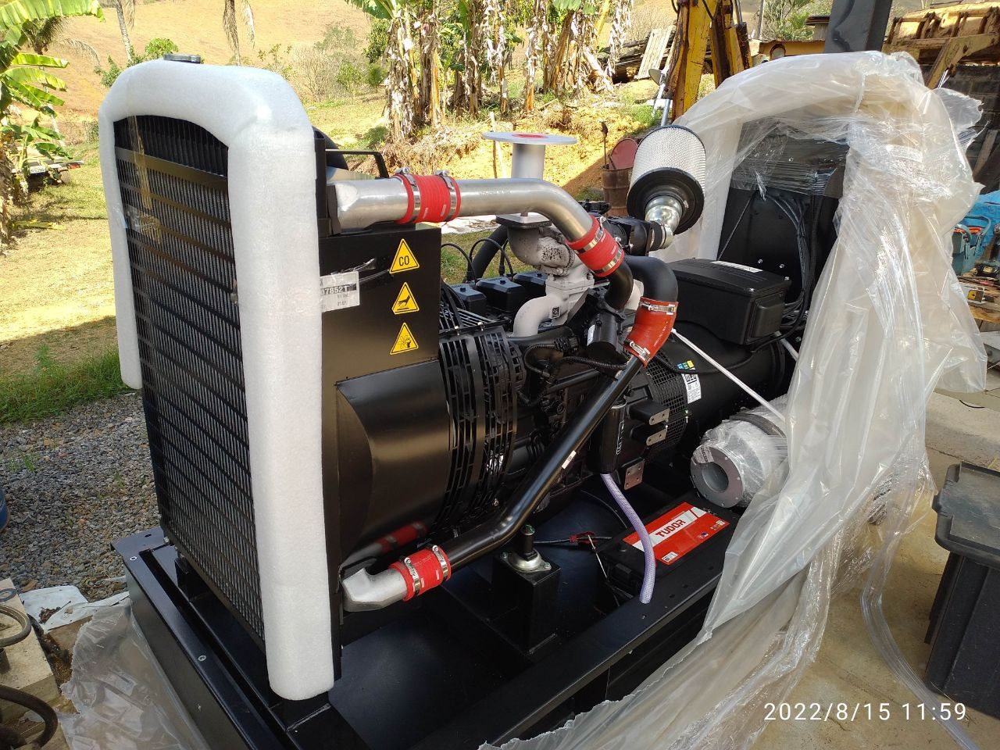
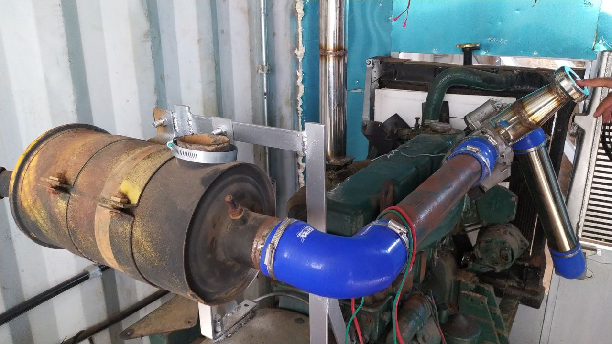
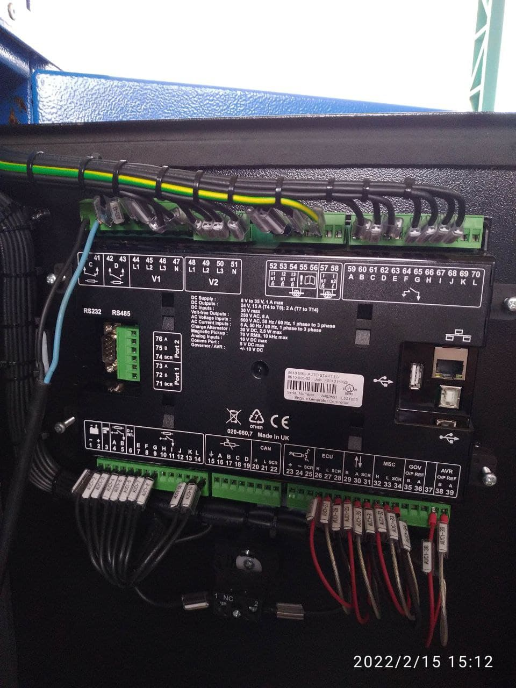

**Escopo:** Engenharia de Sistemas de Geração, Comissionamento Elétrico e Adaptação Mecânica  

{width=85%}

## O Desafio

A viabilização de usinas termoelétricas descentralizadas operando com combustíveis alternativos e de baixo poder calorífico exige um rigor técnico extremo. Diferente da utilização de geradores a diesel ou gás natural comerciais comprados "de prateleira", esses sistemas demandam uma arquitetura de geração 100% customizada.

O desafio deste projeto foi desenvolver integralmente o sistema de geração elétrica, garantindo que o motogerador entregasse energia com estabilidade, eficiência e segurança, independentemente das flutuações inerentes à queima do combustível utilizado.

## Engenharia de Geração e Comissionamento

Como responsável técnico pela engenharia do sistema gerador, atuei em todas as frentes para garantir a conversão eficiente da energia em eletricidade estável na rede. As principais etapas de desenvolvimento e execução incluíram:

* **Especificação do Motogerador:** Realizei o dimensionamento técnico completo da máquina. Isso envolveu a seleção de um bloco de motor com deslocamento volumétrico e taxa de compressão exatos para suportar a queima de gases de menor densidade energética sem perda crítica de rendimento.
* **Adaptação Mecânica e Fluidodinâmica:** Para viabilizar o uso do combustível, projetei e executei adaptações severas no sistema de admissão de ar e nos coletores. Implementei misturadores e dutos específicos para garantir a estequiometria correta da mistura e prevenir falhas de combustão (*misfires*).
* **Comissionamento Elétrico e Lógica de Controle:** A estabilidade da geração depende de um controle eletroeletrônico impecável. Fui o responsável por toda a montagem, fiação e comissionamento do painel controlador do gerador. Configurei as lógicas de partida, malhas de controle de tensão e frequência (AVR/GOV), parametrização de sincronismo de rede e todos os limites de proteção da máquina.

{width=85%}

## Impacto

O resultado do projeto foi a entrega de uma unidade termoelétrica compacta, robusta e totalmente proprietária. O desenvolvimento comprovou a capacidade de dominar a engenharia de ponta a ponta: desde o fluxo mecânico dos fluidos na admissão até o escovamento de bits no comissionamento do painel, garantindo uma geração de energia elétrica contínua, segura e de alto desempenho para aplicações operacionais críticas.

{height=60px}

<!-- {height=60px} -->

<!--Include social share buttons-->

