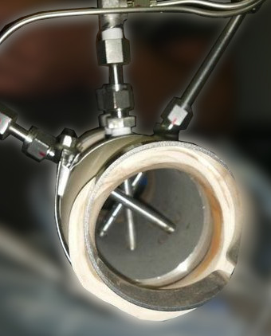
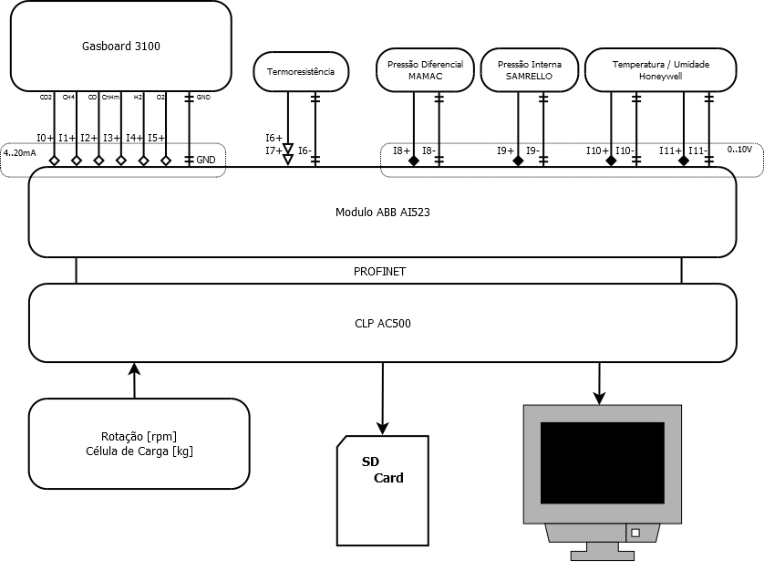
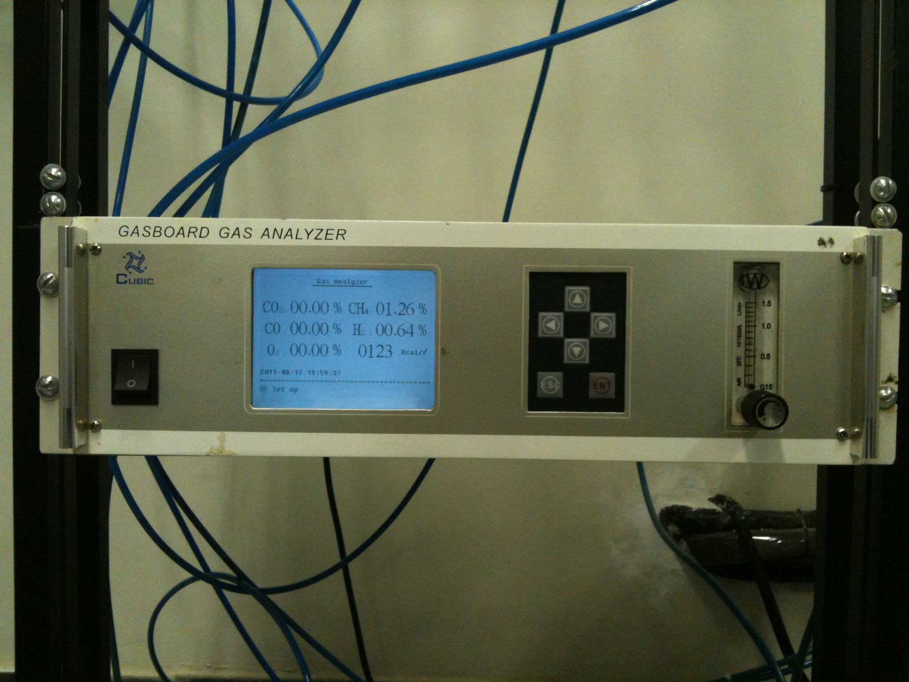
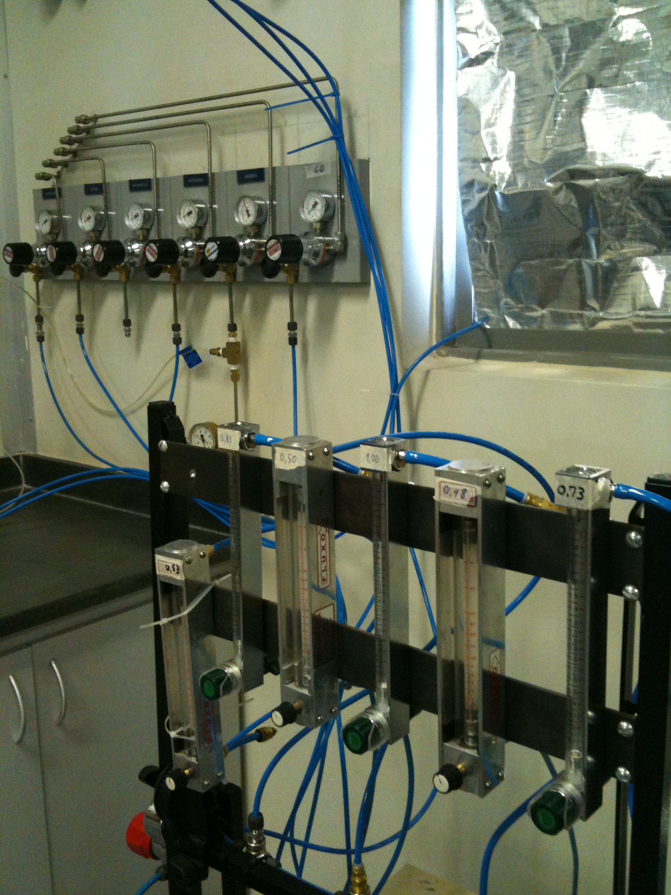
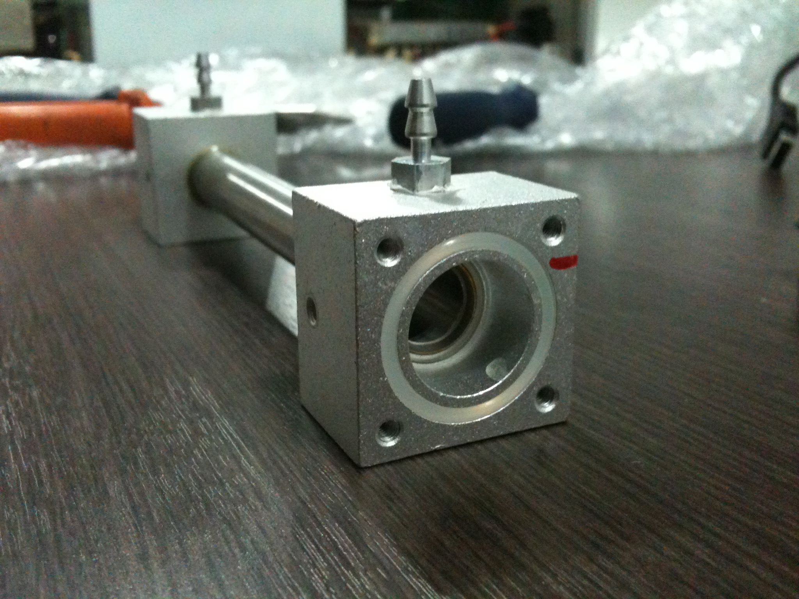

**Parceiros Industriais:** Rima  
**Escopo:** Desenvolvimento de Produto, Engenharia Reversa, Metrologia e Integração de Automação (CLP)  

{width=70%}

## O Desafio

O monitoramento de emissões e a caracterização de gases em fornos industriais são processos fundamentais tanto para a otimização da combustão quanto para o cumprimento de rigorosas normas ambientais. 

A partir da expertise validada em análises termoquímicas para créditos de carbono, o desafio evoluiu da consultoria analítica para a engenharia de produto: foi necessário desenvolver um armário de instrumentação robusto, autônomo e de fácil instalação, capaz de operar no ambiente agressivo das plantas siderúrgicas e metalúrgicas, entregando dados confiáveis e contínuos diretamente para o sistema de controle da fábrica.

## Arquitetura do Produto e Integração de Sistemas

A entrega consistiu em um produto completo, englobando a coleta física da amostra, o condicionamento mecânico e a integração lógica da telemetria. O desenvolvimento foi estruturado nas seguintes frentes:

* **Coleta e Condicionamento Físico:** Para que os sensores de precisão pudessem operar sem degradação, o gás extraído dos fornos (via sondas e tubos de Pitot customizados) precisava ser tratado. O painel projetado incluiu sistemas mecânicos e pneumáticos para a remoção de particulados, controle de fluxo e resfriamento da amostra antes de atingir os módulos de análise.
* **Instrumentação Multivariável:** O núcleo analítico do sistema foi estruturado ao redor de analisadores multiparamétricos (como o Gasboard 3100) para a caracterização contínua de concentrações de CO2, CH4, CO, H2 e O2. Em paralelo, foram integrados transmissores de pressão diferencial (MAMAC), pressão interna (SAMRELLO), além de medidores de temperatura e umidade da amostra (Honeywell).
* **Integração em Tempo Real (CLP):** A inovação do projeto esteve na conectividade e transparência dos dados. Realizei a interligação completa de todos os instrumentos analíticos com o Controlador Lógico Programável (CLP) da própria planta. Utilizando módulos de aquisição dedicados (ABB AI523) e o protocolo de comunicação industrial PROFINET, a arquitetura garantiu que as medições chegassem ao CLP AC500 com máxima fidelidade.

{width=90%}

---

## Engenharia Reversa e Metrologia Customizada

Durante a execução do projeto, o núcleo analítico exigiu intervenções de baixo nível para garantir a confiabilidade dos dados no ambiente industrial. Ao invés de operar o analisador como uma "caixa-preta", foi necessário realizar a manutenção e a engenharia reversa do equipamento para ajustes finos em sua eletrônica e pneumática.

{width=75%}

Para assegurar a precisão das leituras de emissões e atestar a qualidade da solução entregue, projetei e construí uma bancada de calibração de fluxo customizada do zero. 

{width=75%}

Utilizando rotâmetros de precisão, tubulações pneumáticas estruturadas e componentes usinados sob medida para a câmara de fluxo, o sistema permitiu a calibração fina e a aferição cruzada das vazões dos gases de amostra e de referência, garantindo a certificação metrológica da solução antes de sua ida para o chão de fábrica.

{width=90%}

---

## Impacto

O desenvolvimento superou o conceito de medição isolada ao entregar uma solução *plug-and-play* com precisão atestada em laboratório e perfeitamente integrada à arquitetura de automação existente na planta. 

Ao fornecer caracterizações precisas e medições de umidade em tempo real diretamente para as telas de supervisão da operação, o equipamento eliminou pontos cegos do processo termoquímico. Isso permitiu aos operadores da Rima otimizarem a eficiência dos fornos industriais em tempo real, baseando suas tomadas de decisão em dados instantâneos e rastreáveis.

{height=60px}

{height=60px}

<!--Include social share buttons-->

