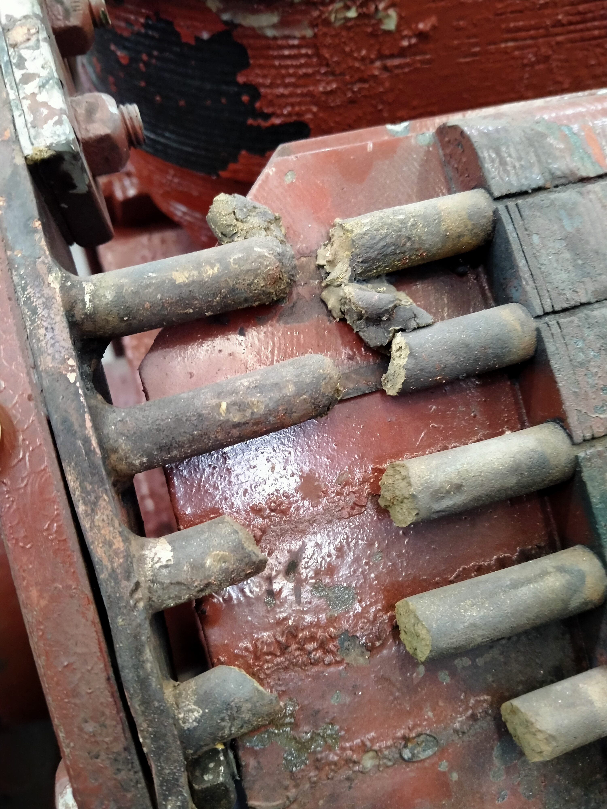
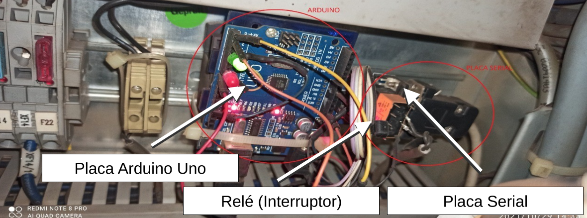

A elaboração de laudos técnico-científicos exige um profundo rigor analítico para subsidiar decisões jurídicas e resoluções de litígios. A atuação como perito e assistente técnico envolve a investigação de causa-raiz, análise do estado da arte e a emissão de pareceres isentos e fundamentados para resguardar empresas em disputas de propriedade intelectual, responsabilidade operacional e falhas em equipamentos.

Abaixo, apresento dois casos reais onde a engenharia investigativa serviu como prova jurídica definitiva.

The preparation of technical-scientific reports demands deep analytical rigor to support legal decisions and dispute resolutions. Acting as an expert witness and technical assistant involves root cause investigation, state-of-the-art analysis, and issuing impartial, well-founded opinions to protect companies in intellectual property disputes, operational liability, and equipment failures.

Below, I present two real cases where investigative engineering served as definitive legal evidence.

---

## Caso 1: Análise de Falha e Responsabilidade Técnica em Máquinas RotativasCase 1: Failure Analysis and Technical Responsibility in Rotating Machinery

**Escopo:** Engenharia Forense e Análise de Causa-Raiz
**Scope:** Forensic Engineering and Root Cause Analysis

{width=60%}
### O ContextoThe Context

Investigação das causas da quebra catastrófica das barras do rotor de um motor síncrono de grande porte (1.500 kW, 3.450 V, 10 polos), ocorrida logo após um serviço de manutenção corretiva.
Investigation of the causes of the catastrophic breakage of the rotor bars of a large synchronous motor (1,500 kW, 3,450 V, 10 poles), which occurred shortly after a corrective maintenance service.

### A InvestigaçãoThe Investigation

A análise técnica aprofundada determinou que a falha não possuía relação com os reparos pontuais realizados no anel de curto-circuito, mas sim com um severo processo de fadiga por estresse termo-mecânico. O laudo demonstrou que o equipamento, com mais de 40 anos de operação, sofria com ineficiências de refrigeração no lado acoplado, o que gerou um gradiente térmico elevado e um envelhecimento acelerado do material metálico.
The in-depth technical analysis determined that the failure was not related to the specific repairs performed on the short-circuit ring, but rather to a severe thermo-mechanical stress fatigue process. The report demonstrated that the equipment, with over 40 years of operation, suffered from cooling inefficiencies on the coupled side, which generated a high thermal gradient and accelerated aging of the metallic material.

### Impacto JurídicoLegal Impact

O parecer técnico comprovou que a falha inicial desencadeou uma reação em cadeia devido à transferência excessiva de corrente para as barras adjacentes durante os ciclos de partida. Essa comprovação técnica isentou a empresa de manutenção de qualquer responsabilidade ou passivo sobre a quebra, fornecendo respaldo legal incontestável.
The technical opinion proved that the initial failure triggered a chain reaction due to excessive current transfer to adjacent bars during startup cycles. This technical evidence exonerated the maintenance company from any responsibility or liability for the breakage, providing incontestable legal support.

---

## Caso 2: Avaliação de Propriedade Intelectual e Anterioridade TecnológicaCase 2: Intellectual Property Assessment and Prior Art Analysis

**Escopo:** Perícia de Software/Hardware e Disputa de Propriedade Intelectual
**Scope:** Software/Hardware Expert Analysis and Intellectual Property Dispute

### O ContextoThe Context

Emissão de parecer técnico-científico para validar ou refutar judicialmente a alegação de invenção de um sistema de integração de automação industrial (envolvendo placas seriais e linhas de braços robóticos).
Issuance of a technical-scientific opinion to judicially validate or refute the claimed invention of an industrial automation integration system (involving serial boards and robotic arm lines).

### A InvestigaçãoThe Investigation

A condução de uma rigorosa análise de anterioridade comprovou que o hardware pleiteado como invenção era composto integralmente por placas de desenvolvimento comercialmente disponíveis no varejo, baseadas em arquiteturas de domínio público. O laudo também identificou a modificação e o uso indevido de bibliotecas de código aberto, caracterizando infração direta aos termos de uso da licença de software livre LGPL (*GNU Lesser General Public License*).
A rigorous prior art analysis proved that the hardware claimed as an invention was composed entirely of commercially available development boards based on public domain architectures. The report also identified the modification and unauthorized use of open-source libraries, characterizing a direct infringement of the LGPL (*GNU Lesser General Public License*) free software license terms.

### Impacto JurídicoLegal Impact

O parecer descaracterizou a alegação de patenteabilidade e ineditismo, provando tratar-se apenas de uma melhoria de um processo já existente montado com tecnologia de prateleira. O documento serviu como prova material decisiva para a resolução do litígio de propriedade intelectual da companhia.
The opinion discredited the claim of patentability and novelty, proving it to be merely an improvement of an existing process assembled with off-the-shelf technology. The document served as decisive material evidence for resolving the company's intellectual property dispute.

---

## Atuação em Engenharia Forense e PeríciasForensic Engineering and Expert Analysis Services

Os casos acima ilustram apenas uma fração da minha capacidade de atuação em engenharia forense. Com vasta experiência na condução de investigações técnicas rigorosas, emito laudos que traduzem a capacidade da engenharia elétrica, mecânica e de software para o meio jurídico, fornecendo a segurança técnica necessária para a tomada de decisão.

**Posso auxiliar sua empresa ou escritório de advocacia com:**

*   **Investigação de Causa-Raiz:** Falhas em equipamentos de potência (transformadores, geradores, motores industriais, inversores).
*   **Propriedade Intelectual:** Avaliação de patentes, quebra de PI e anterioridade tecnológica em hardwares e softwares.
*   **Sistemas de Energia:** Análise técnica de microrredes, qualidade de energia e sinistros elétricos.
*   **Suporte Jurídico:** Atuação como Assistente Técnico em litígios complexos.

The cases above illustrate just a fraction of my capacity in forensic engineering. With extensive experience in conducting rigorous technical investigations, I issue reports that translate the capabilities of electrical, mechanical, and software engineering into the legal sphere, providing the technical certainty needed for decision-making.

**I can assist your company or law firm with:**

*   **Root Cause Investigation:** Failures in power equipment (transformers, generators, industrial motors, inverters).
*   **Intellectual Property:** Patent evaluation, IP infringement, and prior art analysis in hardware and software.
*   **Energy Systems:** Technical analysis of microgrids, power quality, and electrical incidents.
*   **Legal Support:** Acting as a Technical Assistant in complex litigation.

{height=60px}

<!-- {height=60px} -->

<!--Include social share buttons-->

