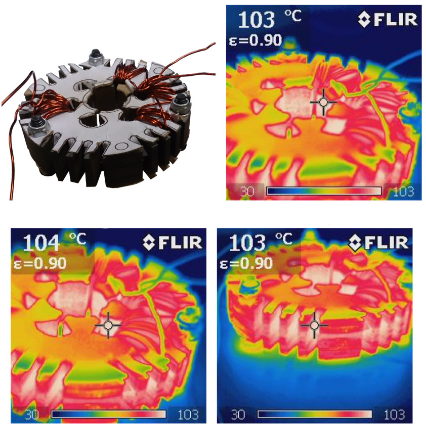
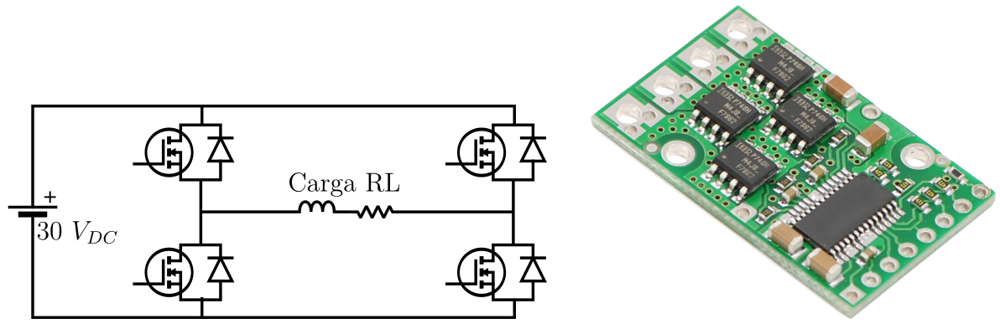
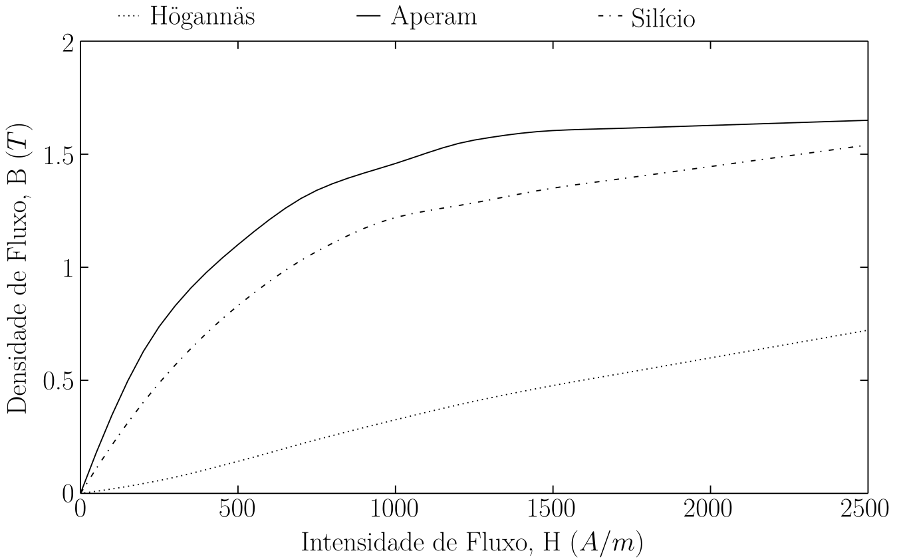

**Escopo:** Eletrônica de Potência, Metrologia Magnética, Desenvolvimento de Hardware (*Bare-Metal*) e Ensaios de Materiais **Aplicações:** Máquinas Elétricas de Alta Rotação (Microturbinas), Conversores de Frequência e Veículos Elétricos.**Scope:** Power Electronics, Magnetic Metrology, Hardware Development (*Bare-Metal*) and Materials Testing **Applications:** High-Speed Electrical Machines (Microturbines), Frequency Converters and Electric Vehicles.  

{width=70%}

## O Limite dos Ensaios TradicionaisThe Limits of Traditional Testing

O desenvolvimento de máquinas elétricas de alta densidade de potência e elevadas rotações (como microturbinas) exige materiais ferromagnéticos que suportem frequências severas com baixas perdas. Durante o projeto de um gerador de alta rotação, foi necessário avaliar o desempenho de diferentes tecnologias de materiais: Aço Silício convencional, compostos de Metalurgia do Pó (SMC - Somaloy) e o aço de alta performance Aperam (0,35 mm).

O problema central reside nos métodos padrão da indústria para validação de aço. O tradicional ensaio pelo Quadro de Epstein utiliza amostras retangulares (tiras) submetidas a fluxos puramente senoidais, considerando apenas uma orientação cristalográfica. Essa abordagem ignora as distorções harmônicas reais dos inversores e, mais criticamente, não contabiliza as perdas introduzidas pelo processo de fabricação e corte da peça final, como a eletroerosão a fio (EDM).

Para obter dados reais e aplicáveis, projetei uma metodologia de validação customizada, ensaiando o material na sua geometria final de estator.

The development of high-power-density, high-speed electrical machines (such as microturbines) demands ferromagnetic materials that can withstand severe frequencies with low losses. During the design of a high-speed generator, it was necessary to evaluate the performance of different material technologies: conventional Silicon Steel, Powder Metallurgy composites (SMC - Somaloy), and the high-performance Aperam steel (0.35 mm).

The core problem lies in the industry's standard methods for steel validation. The traditional Epstein Frame test uses rectangular samples (strips) subjected to purely sinusoidal fluxes, considering only one crystallographic orientation. This approach ignores the real harmonic distortions from inverters and, more critically, fails to account for the losses introduced by the manufacturing and cutting process of the final part, such as wire EDM (Electrical Discharge Machining).

To obtain real and applicable data, I designed a custom validation methodology, testing the material in its final stator geometry.

## Desenvolvimento do Inversor e Bancada de TestesInverter Development and Test Bench

Para excitar os corpos de prova em condições operacionais extremas, a eletrônica de bancada convencional não era suficiente. Desenvolvi, do zero, um conversor de frequência monofásico dedicado ao ensaio dos materiais.
To excite the test specimens under extreme operational conditions, conventional bench electronics were insufficient. I developed, from scratch, a single-phase frequency converter dedicated to material testing.

{width=90%}

A arquitetura do sistema de ensaio englobou:
* **Hardware de Potência:** Utilização de um módulo de Ponte H capaz de operar em até 30 V e suportar correntes de até 15 A contínuos (21 A de pico) sem a necessidade de dissipadores externos.
* **Controle *Bare-Metal*:** A modulação do inversor foi controlada por um microcontrolador de arquitetura RISC de 8-bits (Atmega328p). O firmware desenvolvido permitiu o ajuste dinâmico do índice de modulação, alcançando uma frequência de chaveamento de até 19,5 kHz e permitindo excitar os materiais com frequências fundamentais de até 2 kHz.

The test system architecture encompassed:
* **Power Hardware:** Use of an H-Bridge module capable of operating up to 30 V and withstanding currents of up to 15 A continuous (21 A peak) without the need for external heat sinks.
* **Bare-Metal Control:** The inverter modulation was controlled by an 8-bit RISC architecture microcontroller (Atmega328p). The developed firmware enabled dynamic adjustment of the modulation index, achieving a switching frequency of up to 19.5 kHz and allowing material excitation with fundamental frequencies of up to 2 kHz.

## Resultados e Extração de Curvas (B-H)Results and B-H Curve Extraction

Através da medição síncrona de tensão e corrente com equipamentos de alta precisão (osciloscópio Tektronix e pontas de prova de corrente), os dados brutos foram processados para reconstruir as reais características eletromagnéticas de cada aço na geometria do estator.
Through synchronous voltage and current measurement with high-precision equipment (Tektronix oscilloscope and current probes), the raw data were processed to reconstruct the real electromagnetic characteristics of each steel in the stator geometry.

O sistema permitiu traçar as curvas de magnetização (B-H) e segregar as parcelas exatas de perdas totais e perdas por histerese magnética operando em altas frequências (ex: 1.200 Hz). Os resultados comprovaram quantitativamente a superioridade da liga Aperam frente ao aço silício convencional para o regime de alta rotação.

Para validar o impacto físico dessas perdas, realizei medições termográficas em estado estacionário. Sob excitação de 1.200 Hz, o núcleo Aperam estabilizou em 104°C, enquanto o núcleo de aço silício padrão rapidamente superou a marca crítica de 120°C (mesmo sob resfriamento forçado), evidenciando a sua inaptidão térmica para o projeto.

The system enabled tracing the magnetization curves (B-H) and segregating the exact portions of total losses and magnetic hysteresis losses operating at high frequencies (e.g., 1,200 Hz). The results quantitatively proved the superiority of the Aperam alloy over conventional silicon steel for the high-speed regime.

To validate the physical impact of these losses, I performed steady-state thermographic measurements. Under 1,200 Hz excitation, the Aperam core stabilized at 104°C, while the standard silicon steel core rapidly exceeded the critical 120°C mark (even under forced cooling), highlighting its thermal unsuitability for the project.

## ImpactoImpact

Este projeto atesta a capacidade de ultrapassar a engenharia teórica baseada em datasheets de fornecedores. O desenvolvimento de hardware próprio (inversor/modulador) para a criação de uma bancada de metrologia magnética garante que as decisões críticas de seleção de materiais em um P&D sejam embasadas em dados reais, validados experimentalmente sob as exatas condições harmônicas e geométricas do produto final.
This project demonstrates the ability to go beyond theoretical engineering based on supplier datasheets. The development of custom hardware (inverter/modulator) to create a magnetic metrology bench ensures that critical material selection decisions in R&D are grounded in real data, experimentally validated under the exact harmonic and geometric conditions of the final product.

{height=60px}

{height=60px}

<!--Include social share buttons-->

