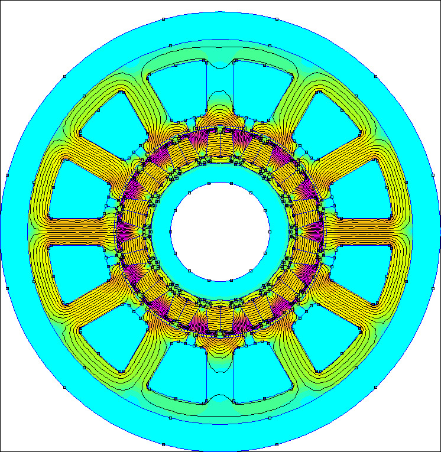
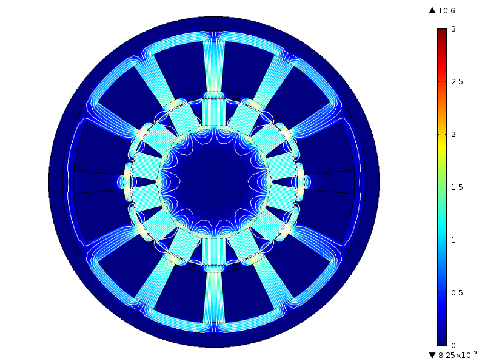
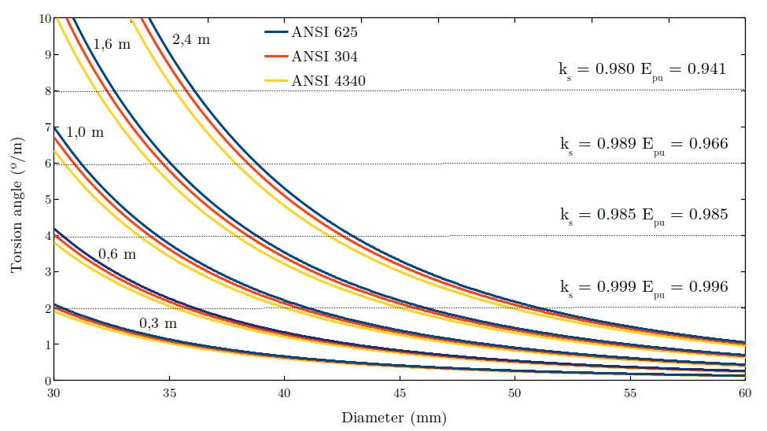
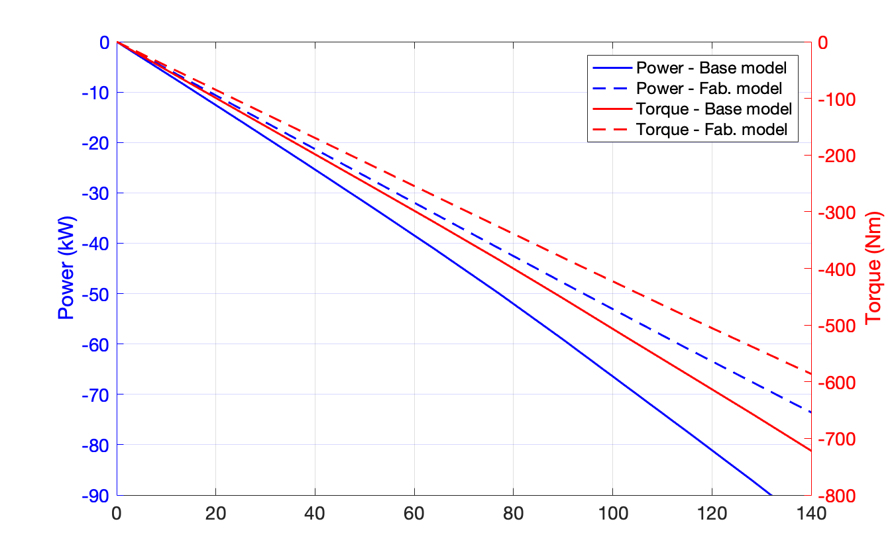
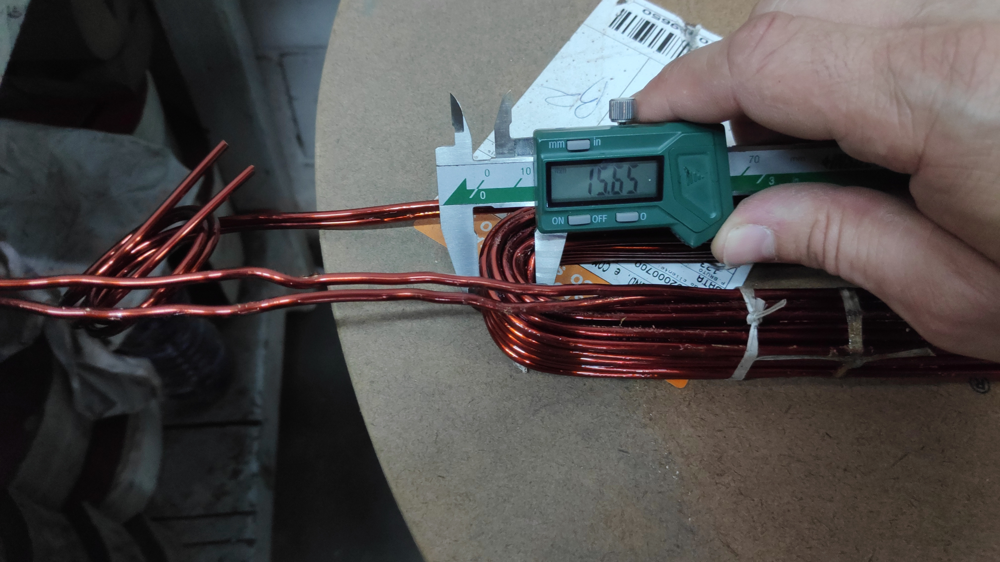

**Escopo:** Pesquisa & Desenvolvimento (P&D), Design Eletromecânico Full-Stack e Simulação Multifísica  
**Atuação:** Arquiteto de Hardware e Liderança Técnica  

{width=65%}

## A Engenharia "Full-Stack" de Máquinas Especiais

Aplicações industriais de fronteira frequentemente esbarram nas limitações físicas de motores e geradores comerciais. Quando restrições de volume, temperatura, pressão ou peso inviabilizam o uso de equipamentos de prateleira, a solução exige o desenvolvimento de **Máquinas Elétricas Especiais**. 

Projetar essas máquinas exige mais do que conhecimento isolado em uma disciplina. A minha atuação cobre o **ciclo completo de engenharia (full-stack)**: do cálculo eletromagnético puro à termodinâmica, passando pela rotodinâmica, mecânica dos fluidos, tolerâncias de usinagem e seleção de materiais. O objetivo é centralizar a concepção para entregar equipamentos com altíssima densidade de potência, capazes de operar com máxima confiabilidade nos ambientes mais hostis imagináveis.

---

## Case de Sucesso: Geração Embarcada em Águas Profundas

A prova máxima dessa capacidade multifísica foi o desenvolvimento de um gerador síncrono de alta potência (75 kW a 90 kW) para uma multinacional líder no setor de Óleo e Gás. A máquina foi projetada do zero para operar submersa no fundo do poço de extração, alimentando uma cabeça de perfuração.

As restrições de engenharia desafiavam os limites dos materiais:
* **Envelope Dimensional:** Diâmetro externo máximo de 152,4 mm (6 polegadas) e comprimento de apenas 2,1 metros (7 pés).
* **Ambiente Hostil:** Operação totalmente submersa em óleo dielétrico, suportando pressões de esmagamento de até 8.000 psi (55 MPa).
* **Ciclo Térmico:** Variações críticas de temperatura de -40°C a 125°C.

### Execução Multidisciplinar

Para viabilizar esta máquina dentro de um envelope tão restrito, executei o design integral, resolvendo gargalos em todas as frentes da física:

{width=90%}

* **Eletromagnetismo e Materiais:** Optei por uma arquitetura de ímãs permanentes embutidos (IPM) de fluxo tangencial, utilizando ímãs de Samário-Cobalto (SmCo) que suportam altíssimas temperaturas e tensões de compressão de até 1.000 MPa. Para viabilizar a prototipagem com a indústria nacional, dimensionei o estator utilizando aço elétrico de alta performance (Aperam NO30-16-HP), garantindo o equilíbrio entre saturação magnética e perdas no núcleo.
* **Dinâmica dos Fluidos e Termodinâmica:** A topologia IPM foi escolhida estrategicamente para manter a superfície do rotor lisa, minimizando as severas perdas mecânicas por atrito hidrodinâmico (*windage losses*) geradas pela rotação da máquina (até 1.500 rpm) imersa em óleo de alta viscosidade. 
* **Rotodinâmica e Integridade Estrutural:** Projetei o eixo em aço inoxidável P550 (não magnético) para evitar dispersão do fluxo. Como o sistema é longo e esbelto, modelei e calculei a rigidez torcional, a deflexão lateral máxima e a fadiga de alto ciclo (critérios ASME). Isso garantiu o dimensionamento correto dos mancais e provou que as vibrações não causariam contato físico entre estator e rotor.

{width=85%}

{width=85%}

### Da Simulação à Manufatura

Uma máquina especial só tem valor se puder ser fabricada. Além das simulações computacionais em elementos finitos, estruturei o projeto para a vida real: dimensionei as ranhuras para bobinas pré-conformadas com fio retangular, calculando o melhor fator de preenchimento de cobre (*fill factor*), e especifiquei tolerâncias mecânicas, mancais e acoplamentos ranhurados que suportassem a expansão térmica dos materiais.

## Impacto e Inovação Patenteada

O design entregue atendeu plenamente a todas as restrições mecânicas, elétricas e térmicas do ambiente de perfuração em águas profundas (*deepwater*), viabilizando a potência exigida através de processos de manufatura nacionalizados. 

A centralização do desenvolvimento — unindo a mitigação das perdas termofluidodinâmicas no óleo ao domínio estrutural e eletromagnético sob altíssima pressão — resultou em uma solução inquestionavelmente inédita. Devido ao alto grau de inovação do arranjo *full-stack*, **a tecnologia desenvolvida para esta máquina resultou em um depósito de patente**, gerando um ativo intelectual de alto valor agregado para a multinacional parceira.

{height=60px}

{height=16px}

<!--Include social share buttons-->

