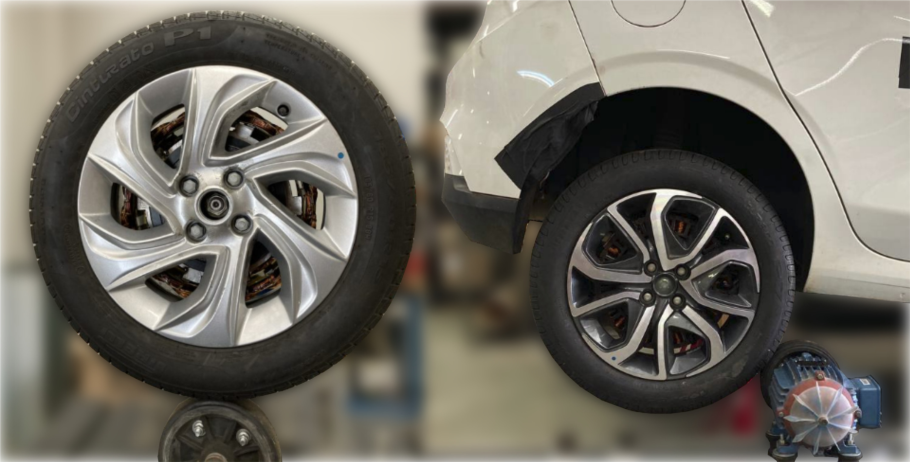
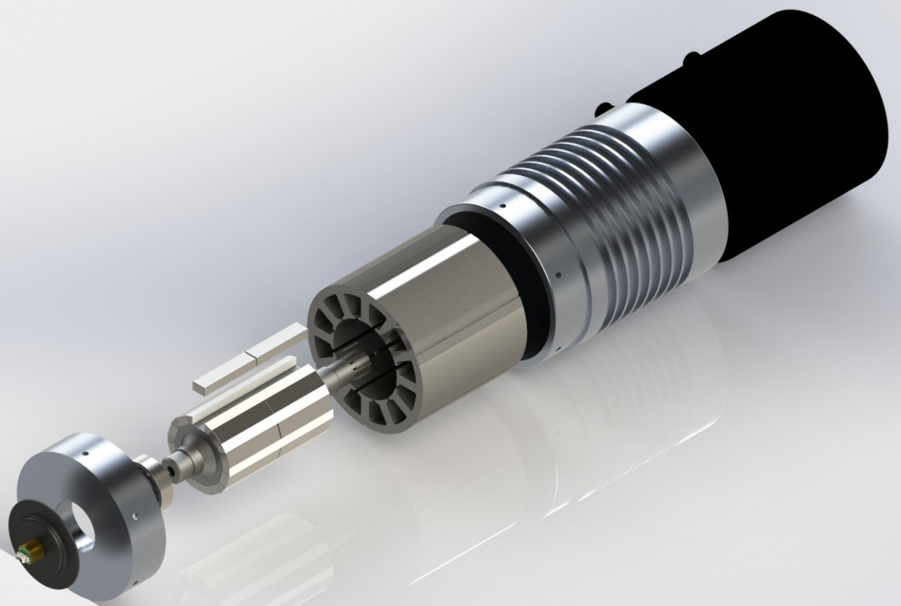
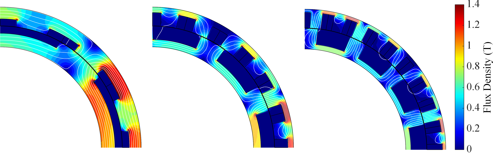
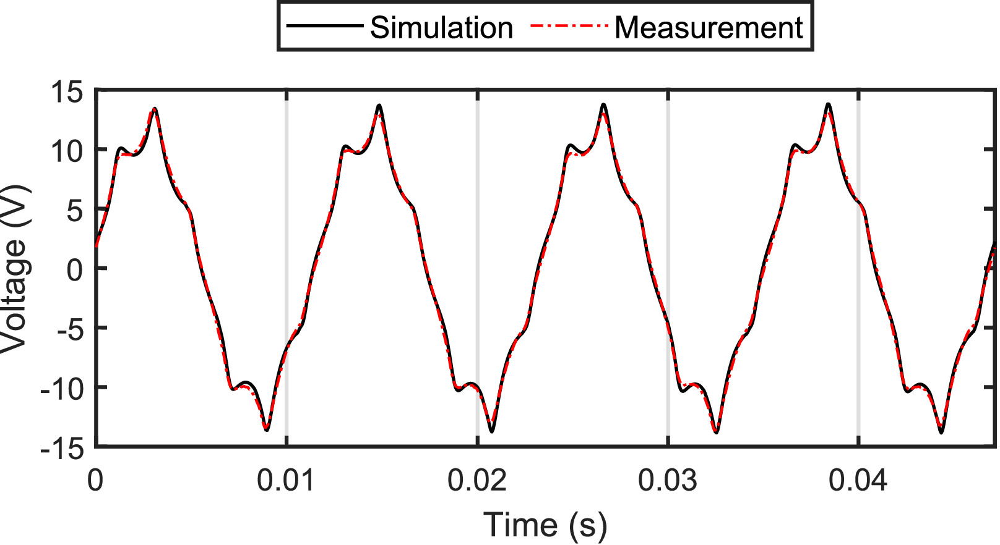

**Parceiros:** Fórmula Tesla UFMG / Stellantis (Fiat)
**Escopo:** Eletrificação Veicular, Design Eletromagnético, Integração Mecânica e Prototipagem

**Partners:** Formula Tesla UFMG / Stellantis (Fiat)
**Scope:** Vehicle Electrification, Electromagnetic Design, Mechanical Integration and Prototyping

## A Arquitetura *In-Wheel* na Eletrificação VeicularThe *In-Wheel* Architecture in Vehicle Electrification

A transição global para a mobilidade elétrica exige inovações que ultrapassem a simples substituição do motor a combustão por um motor elétrico central. Uma das abordagens de engenharia automotiva com maior potencial é a adoção de **Motores In-Wheel (IWM)** — máquinas elétricas instaladas diretamente no interior das rodas.

Essa arquitetura descentralizada elimina a necessidade de eixos de transmissão e diferenciais mecânicos, reduzindo o peso global do *powertrain* e liberando espaço crítico no chassi para a alocação de baterias. Além disso, permite o controle independente de torque em cada roda, viabilizando melhorias expressivas em sistemas de controle de estabilidade, tração integral (AWD) e eficiência na frenagem regenerativa.

Abaixo, apresento minha atuação no dimensionamento e projeto de motores *In-Wheel* para dois cenários distintos da eletrificação veicular: a alta performance nas pistas e a eficiência comercial para veículos de passeio.

The global transition to electric mobility demands innovations that go beyond simply replacing the combustion engine with a central electric motor. One of the most promising automotive engineering approaches is the adoption of **In-Wheel Motors (IWM)** — electrical machines installed directly inside the wheels.

This decentralized architecture eliminates the need for drive shafts and mechanical differentials, reducing overall powertrain weight and freeing critical chassis space for battery allocation. Furthermore, it enables independent torque control at each wheel, enabling significant improvements in stability control systems, all-wheel drive (AWD), and regenerative braking efficiency.

Below, I present my work in the design and sizing of *In-Wheel* motors for two distinct vehicle electrification scenarios: high performance on the track and commercial efficiency for passenger vehicles.

---

## Cenário 1: Alta Densidade de Potência (Fórmula SAE Electric)Scenario 1: High Power Density (Formula SAE Electric)

No contexto do automobilismo estudantil, o controle dinâmico e individual do torque em cada roda oferece uma vantagem competitiva decisiva. Atuei no projeto eletromagnético e dimensionamento de um sistema de tração independente (AWD) para o protótipo da equipe Fórmula Tesla UFMG.

O projeto eletromecânico foi levado ao limite para atender aos rigorosos requisitos de pista e às restrições dimensionais do veículo:

In the context of student motorsport, dynamic and individual torque control at each wheel offers a decisive competitive advantage. I worked on the electromagnetic design and sizing of an independent all-wheel drive (AWD) system for the Formula Tesla UFMG team prototype.

The electromechanical design was pushed to the limit to meet the stringent track requirements and vehicle dimensional constraints:

{width=90%}

* **Meta de Performance:** O sistema precisava fornecer potência e torque suficientes para acelerar um veículo de 280 kg por 75 metros em menos de 4 segundos.
* **Restrição Dimensional:** O motor completo, juntamente com o sistema de redução mecânica, precisava ser embarcado no espaço restrito de uma roda com aro de 10 polegadas.
* **Topologia Eletromagnética:** Para atingir os requisitos de densidade de potência e confiabilidade, projetei uma Máquina Síncrona de Ímãs Permanentes com Ranhuras Fracionárias e Enrolamento Não Sobreposto (FSPMSM).
* **Acoplamento e Rotação:** O design adotou uma arquitetura de fluxo radial com redução mecânica por engrenagens planetárias, permitindo que a máquina elétrica operasse em alta velocidade nominal de 12.000 rpm.
* **Desempenho Final:** As simulações validaram que cada motor poderia fornecer 17,7 kW de potência contínua, alimentado por um barramento de alta tensão estipulado pelo limite da competição de 600 Vdc.

* **Performance Target:** The system needed to provide enough power and torque to accelerate a 280 kg vehicle over 75 meters in less than 4 seconds.
* **Dimensional Constraint:** The complete motor, together with the mechanical reduction system, had to fit within the restricted space of a 10-inch wheel rim.
* **Electromagnetic Topology:** To meet the power density and reliability requirements, I designed a Fractional-Slot Concentrated-Winding Permanent Magnet Synchronous Machine (FSPMSM).
* **Coupling and Rotation:** The design adopted a radial flux architecture with planetary gear reduction, allowing the electrical machine to operate at a high nominal speed of 12,000 rpm.
* **Final Performance:** Simulations validated that each motor could deliver 17.7 kW of continuous power, powered by a high-voltage bus stipulated by the competition limit of 600 Vdc.

---

## Cenário 2: Eletrificação Comercial e *Energy Harvesting* (Stellantis / Fiat)Scenario 2: Commercial Electrification and *Energy Harvesting* (Stellantis / Fiat)

Enquanto as pistas exigem densidade extrema de potência, o mercado automotivo de massa busca soluções de baixo custo e alta robustez. A eletrificação de veículos de passeio leves (nível micro-híbrido) é uma estratégia para reduzir o consumo de combustível e as emissões de gases poluentes.

Neste projeto, atuei no desenvolvimento e na avaliação experimental de uma máquina elétrica *In-Wheel* focada em *energy harvesting* (frenagem regenerativa), preservando integralmente o *powertrain* a combustão original do veículo.

While the track demands extreme power density, the mass automotive market seeks low-cost, high-robustness solutions. Electrifying light passenger vehicles (micro-hybrid level) is a strategy to reduce fuel consumption and pollutant gas emissions.

In this project, I worked on the development and experimental evaluation of an *In-Wheel* electrical machine focused on *energy harvesting* (regenerative braking), while fully preserving the vehicle's original combustion powertrain.

* **Topologia sem Terras Raras:** Para evitar a volatilidade de preço e o alto custo dos ímãs de neodímio, optou-se por uma Máquina de Fluxo Comutado (FSM) com excitação por enrolamentos de campo. Essa escolha ofereceu um fluxo magnético controlável, estrutura de rotor robusta e capacidade de operar nas altas temperaturas inerentes à proximidade com os freios do veículo.
* **Dimensionamento Eletromagnético:** A máquina foi projetada e simulada extensivamente via FEM (Método de Elementos Finitos), chegando-se a uma configuração ideal de 24 ranhuras no estator e 10 polos no rotor (24s-10p). O entreferro mecânico foi fixado em 0,5 mm para balancear a conversão de energia e a segurança mecânica contra vibrações.

* **Rare-Earth-Free Topology:** To avoid price volatility and the high cost of neodymium magnets, a Flux-Switching Machine (FSM) with field winding excitation was chosen. This choice offered controllable magnetic flux, robust rotor structure, and the ability to operate at the high temperatures inherent to proximity with the vehicle's brakes.
* **Electromagnetic Sizing:** The machine was designed and extensively simulated via FEM (Finite Element Method), arriving at an ideal configuration of 24 stator slots and 10 rotor poles (24s-10p). The mechanical air gap was set at 0.5 mm to balance energy conversion and mechanical safety against vibrations.

<!--  -->

* **Integração Mecânica Não-Invasiva:** O design foi projetado para montagem no eixo traseiro do veículo, aproveitando o volume interno da roda. Em um trabalho de usinagem e adaptação mecânica rigorosa, o próprio tambor do freio traseiro foi utilizado como o eixo/suporte do núcleo do rotor da máquina elétrica, expandido via aquecimento indutivo para montagem por interferência.
* **Regeneração de Energia:** A máquina foi dimensionada visando recuperar energia cinética durante as desacelerações, fornecendo potência elétrica extra para o barramento de 12 V do veículo e aliviando o alternador. O dimensionamento levou em conta a potência média de frenagem urbana, mirando uma recuperação viável na faixa de centenas de Watts por roda.

* **Non-Invasive Mechanical Integration:** The design was conceived for mounting on the vehicle's rear axle, taking advantage of the internal wheel volume. Through rigorous machining and mechanical adaptation work, the rear brake drum itself was used as the shaft/support for the electrical machine's rotor core, expanded via inductive heating for interference fit assembly.
* **Energy Regeneration:** The machine was sized to recover kinetic energy during decelerations, supplying extra electrical power to the vehicle's 12 V bus and relieving the alternator. The sizing took into account the average urban braking power, targeting a viable recovery in the range of hundreds of Watts per wheel.

## ImpactoImpact

O desenvolvimento destes projetos atesta a capacidade de transitar por todo o ciclo da engenharia automotiva eletrificada. Desde o uso de simulações em Elementos Finitos (FEM) para otimização do núcleo magnético e mitigação de saturação, até a usinagem, montagem mecânica e validação experimental em dinamômetro. Seja maximizando a relação kW/kg para o *motorsport* ou projetando topologias de baixo custo para o mercado de massa, o domínio da arquitetura *In-Wheel* demonstra uma execução completa do conceito à bancada.
The development of these projects attests to the ability to navigate the entire electrified automotive engineering cycle. From the use of Finite Element Method (FEM) simulations for magnetic core optimization and saturation mitigation, to machining, mechanical assembly, and experimental validation on a dynamometer. Whether maximizing the kW/kg ratio for *motorsport* or designing low-cost topologies for the mass market, mastery of the *In-Wheel* architecture demonstrates complete execution from concept to bench.

{height=60px}

{height=60px}

<!--Include social share buttons-->


