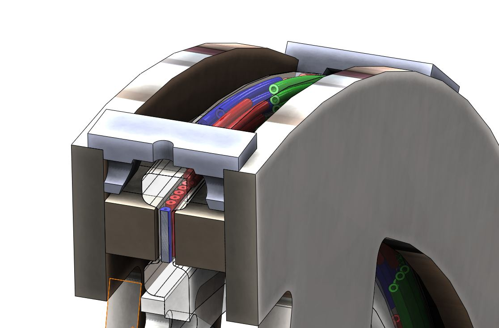
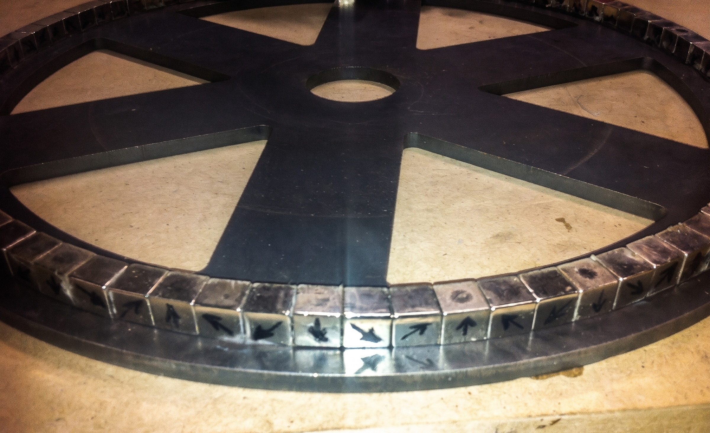
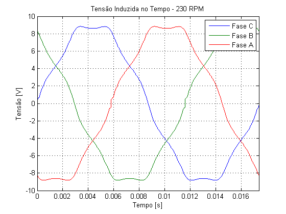
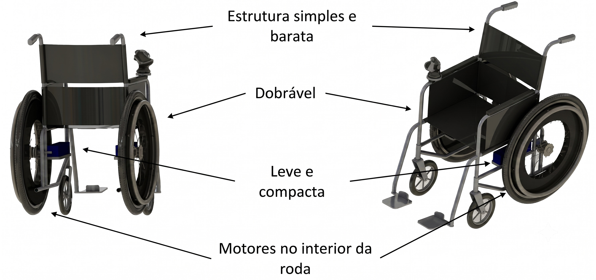

O desenvolvimento de motores elétricos compactos e de alta densidade de potência é o coração da nova engenharia de mobilidade. A substituição de sistemas pesados e ineficientes por tecnologias de tração direta (*In-Wheel*) transforma não apenas a performance energética, mas a usabilidade e a ergonomia de veículos leves.

Abaixo, detalho minha experiência no desenvolvimento de motores síncronos de fluxo axial aplicados a dois cenários desafiadores: a alta performance de veículos de competição e a inclusão social através da motorização de cadeiras de rodas.

---

## Cenário 1: Veículo de Alta Eficiência Energética (Competição Estudantil)

**Escopo:** Engenharia Eletromagnética e Fabricação de Protótipo  
**Aplicação:** Protótipo de Milhagem (Competição de Eficiência Energética)  

### O Contexto
O objetivo era substituir os tradicionais e ineficientes sistemas de transmissão mecânica por um motor elétrico acoplado diretamente à roda de um veículo de competição voltado para a máxima eficiência energética.

### O Desenvolvimento
Projetei e construí um Motor Síncrono a Ímãs Permanentes de Fluxo Axial (AFPM). A arquitetura escolhida foi a *Coreless* (sem núcleo ferromagnético), uma decisão crucial para eliminar as perdas no ferro (correntes de Foucault e histerese) e zerar o torque de *cogging*. 

Para suprir o aumento do entreferro efetivo causado pela ausência do núcleo, utilizei ímãs de altíssima densidade energética de Neodímio-Ferro-Boro dispostos em um arranjo de Halbach duplo (rotores em ambos os lados do estator). O estator foi desenvolvido em resina epóxi, abrigando bobinas concêntricas moldadas manualmente com fio Litz para reduzir o efeito pelicular (*skin effect*).

### O Impacto
O motor resultou em uma máquina extremamente leve, compacta e com eficiência superior a 90%, garantindo a propulsão direta da roda de 16 polegadas do veículo sem a necessidade de caixas de redução, provando o potencial da topologia de fluxo axial para veículos ultraleves.

---

## Cenário 2: Eletrificação de Cadeira de Rodas (Projeto Híbrido)

**Escopo:** Design de Produto, Engenharia Eletromecânica e Liderança de Projeto  
**Aplicação:** Cadeira de Rodas Convencional Assistida  

### O Contexto
Cadeiras de rodas motorizadas tradicionais são pesadas (50 a 85 kg), difíceis de transportar (não são dobráveis) e utilizam baterias de chumbo-ácido obsoletas. Se a bateria descarregar, o usuário perde totalmente a mobilidade, pois a arquitetura dos motores radiais e redutores mecânicos impede a tração manual.

### A Inovação
Liderei um projeto financiado pela CODEMGE para transferir a tecnologia do motor de alta eficiência desenvolvido na universidade para a inclusão social. A proposta foi eletrificar uma cadeira de rodas convencional, mantendo-a dobrável e leve (abaixo de 15 kg o conjunto).

A adaptação exigiu desafios mecânicos para escalar a roda de 16" do projeto original para o aro 24" padrão das cadeiras. Como o motor *coreless* de fluxo axial (projetado anteriormente) elimina o arrasto magnético quando desenergizado, a cadeira tornou-se **híbrida**. O usuário pode tracionar a roda manualmente pelos aros tradicionais ou acionar o motor elétrico (alimentado por modernas baterias de Lítio) para vencer rampas ou percorrer longas distâncias.

### O Impacto
O projeto demonstrou que a engenharia de alta performance pode ter impacto direto na qualidade de vida das pessoas. Ao eliminar transmissões pesadas e substituir o chumbo por lítio, comprovamos a viabilidade de um produto inclusivo, portátil e à prova de falhas (já que o usuário nunca fica imobilizado por falta de bateria).

{height=60px}

{height=60px}

<!--Include social share buttons-->

