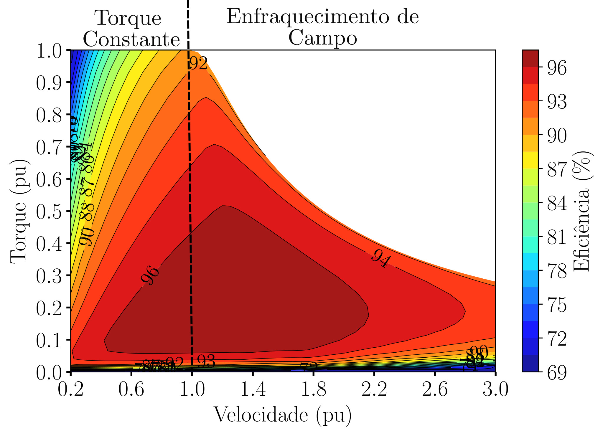
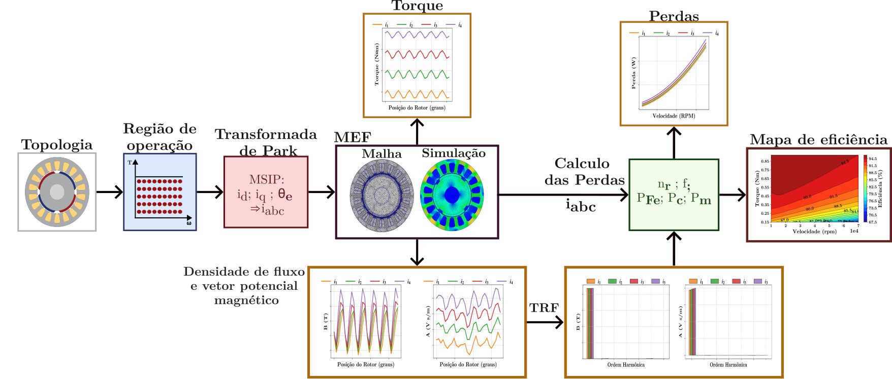
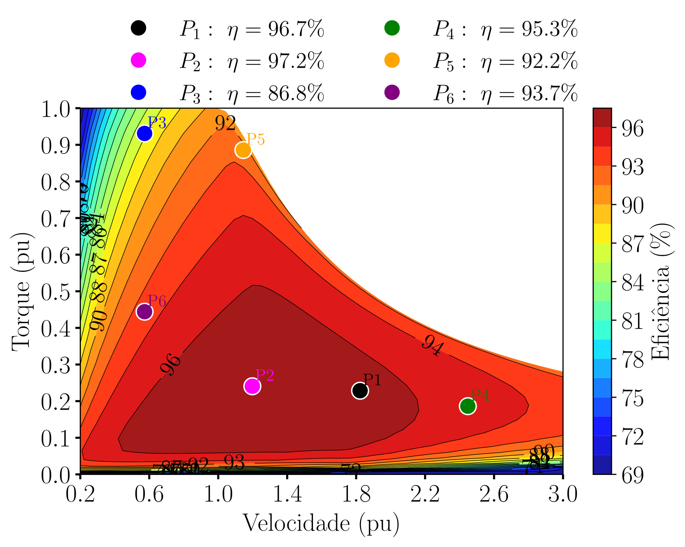

**Escopo:** Pesquisa & Desenvolvimento (P&D), Modelagem e Simulação de Máquinas Elétricas **Atuação:** Engenharia Eletromagnética e Desenvolvimento de Software Open-Source**Scope:** Research & Development (R&D), Modeling and Simulation of Electrical Machines **Role:** Electromagnetic Engineering and Open-Source Software Development  

{width=90%}

## O Desafio das Caixas Pretas ComerciaisThe Challenge of Commercial Black Boxes

A eletrificação de veículos exige sistemas de propulsão e tração altamente eficientes para utilizar menos energia durante o ciclo de condução, aumentando assim a autonomia do veículo. Contudo, a eficiência de uma máquina elétrica não é um valor único; ela varia dinamicamente conforme o torque e a velocidade de operação.

Os mapas de eficiência são ferramentas essenciais na fase de projeto, pois representam visualmente o comportamento da máquina em toda a sua faixa operacional, permitindo identificar as regiões de maior desempenho e os pontos críticos de perdas elevadas. O grande desafio para o desenvolvimento de máquinas elétricas de alta performance é que o mercado depende massivamente de soluções comerciais fechadas para gerar esses mapas. Para eliminar essa limitação e garantir total controle sobre o modelo matemático, desenvolvi uma ferramenta computacional de código aberto (*open-source*) capaz de automatizar e auditar todo o processo de cálculo.

Vehicle electrification demands highly efficient propulsion and traction systems to use less energy during the driving cycle, thus increasing vehicle range. However, the efficiency of an electrical machine is not a single value; it varies dynamically according to torque and operating speed.

Efficiency maps are essential tools in the design phase, as they visually represent the machine's behavior across its entire operating range, enabling the identification of peak performance regions and critical high-loss points. The major challenge for developing high-performance electrical machines is that the market relies heavily on closed commercial solutions to generate these maps. To eliminate this limitation and ensure full control over the mathematical model, I developed an open-source computational tool capable of automating and auditing the entire calculation process.

## Arquitetura Híbrida de SimulaçãoHybrid Simulation Architecture

A solução computacional construída baseia-se em uma arquitetura de simulação híbrida: ela integra a robustez das análises magnetostáticas pelo Método de Elementos Finitos (MEF) a modelos analíticos precisos de perdas eletromagnéticas, unificados em uma rotina de pós-processamento automatizada. O desenvolvimento foi estruturado nas seguintes frentes:

* **Modelagem Eletromagnética e Topologia:** Especificação e implementação do modelo de elementos finitos abrangendo três topologias de Máquinas Síncronas de Ímãs Permanentes (MSIP), contemplando rotores de ímãs superficiais e internos. A modelagem incluiu a definição da geometria, as propriedades dos materiais, as condições de contorno e a aplicação da técnica de *sliding band* para a simulação precisa da rotação do rotor.
* **Algoritmo de Cálculo e Varredura:** Construção de uma rotina computacional que varre múltiplos pontos de operação de torque e velocidade. O algoritmo aplica a Transformada de Park para definir as correntes de entrada e extrai, de cada simulação, os parâmetros eletromagnéticos fundamentais, como fluxo, vetor potencial magnético e torque.

The computational solution built is based on a hybrid simulation architecture: it integrates the robustness of magnetostatic analyses via the Finite Element Method (FEM) with precise analytical models of electromagnetic losses, unified in an automated post-processing routine. The development was structured along the following fronts:

* **Electromagnetic Modeling and Topology:** Specification and implementation of the finite element model covering three topologies of Permanent Magnet Synchronous Machines (PMSM), including surface and interior permanent magnet rotors. The modeling encompassed geometry definition, material properties, boundary conditions, and the application of the *sliding band* technique for precise rotor rotation simulation.
* **Calculation and Sweep Algorithm:** Construction of a computational routine that sweeps multiple torque and speed operating points. The algorithm applies the Park Transform to define input currents and extracts, from each simulation, the fundamental electromagnetic parameters such as flux, magnetic vector potential, and torque.

## Pós-Processamento e Segregação de PerdasPost-Processing and Loss Segregation

A precisão do mapa de eficiência gerado pela ferramenta repousa no detalhamento analítico executado na fase de pós-processamento:

* **Análise Harmônica Espacial:** Implementação da Transformada Rápida de Fourier (TRF) no domínio espacial para decompor os sinais brutos de fluxo e potencial vetor em suas harmônicas.
* **Cálculo de Perdas:** Com o sinal decomposto, a ferramenta calcula as perdas no núcleo ferromagnético (histerese e correntes parasitas, utilizando o modelo de Steinmetz), as perdas por correntes parasitas induzidas nos ímãs permanentes e as perdas no cobre (abrangendo efeito Joule e efeito de proximidade).

The accuracy of the efficiency map generated by the tool rests on the analytical detailing performed in the post-processing phase:

* **Spatial Harmonic Analysis:** Implementation of the Fast Fourier Transform (FFT) in the spatial domain to decompose the raw flux and vector potential signals into their harmonics.
* **Loss Calculation:** With the decomposed signal, the tool calculates ferromagnetic core losses (hysteresis and eddy currents, using the Steinmetz model), eddy current losses induced in the permanent magnets, and copper losses (covering Joule effect and proximity effect).

## Resultados e ImpactoResults and Impact

{width=90%}

A partir da compilação das perdas totais de cada ponto de operação, a lógica de pós-processamento constrói mapas de eficiência bidimensionais detalhados.

A entrega dessa ferramenta de código aberto devolve a independência aos pesquisadores e engenheiros. Ao viabilizar a visualização das regiões de maior desempenho e expor a contribuição matemática individual de cada tipo de perda (ferro, ímã e cobre) ao longo da faixa de operação, a plataforma fornece subsídios precisos para o dimensionamento ótimo e para a tomada de decisão no projeto focado em eficiência energética.

From the compilation of total losses at each operating point, the post-processing logic builds detailed two-dimensional efficiency maps.

The delivery of this open-source tool restores independence to researchers and engineers. By enabling visualization of peak performance regions and exposing the individual mathematical contribution of each loss type (iron, magnet, and copper) across the operating range, the platform provides precise inputs for optimal sizing and decision-making in energy-efficiency-focused design.

{height=60px}

<!-- {height=60px} -->

<!--Include social share buttons-->

