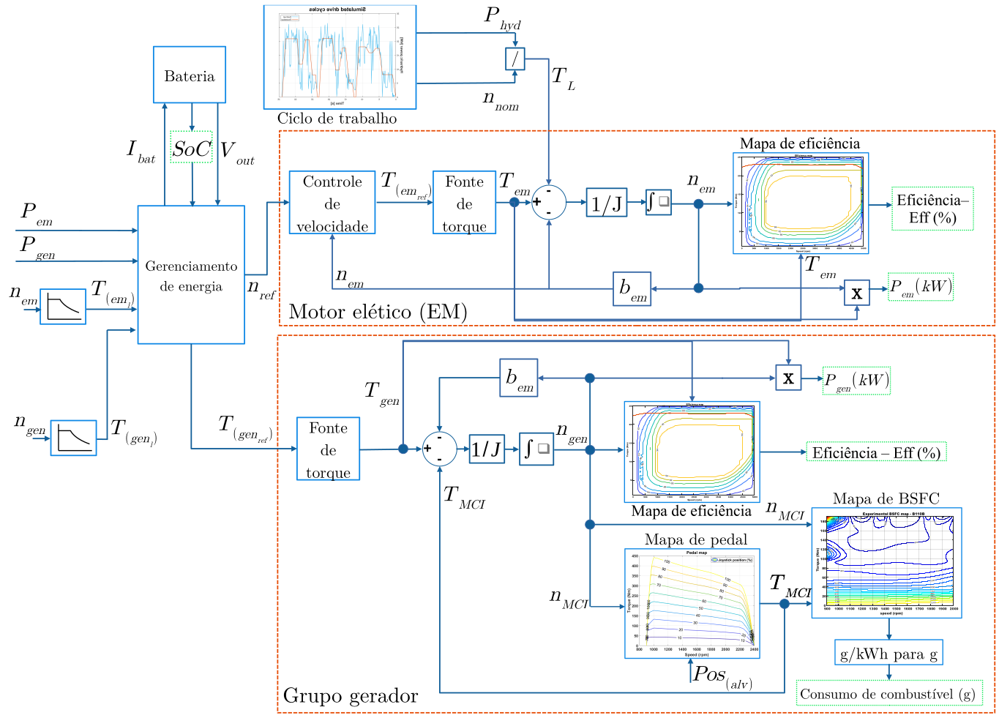

**Parceiro Industrial:** CNH Industrial (CNHi)
**Escopo:** Pesquisa & Desenvolvimento (P&D) / Eletrificação Full-Stack**Industrial Partner:** CNH Industrial (CNHi)
**Scope:** Research & Development (R&D) / Full-Stack Electrification

{width=60%}

## O DesafioThe Challenge

A eletrificação de maquinário pesado *off-road* apresenta desafios muito distintos dos veículos de passeio. Em equipamentos como retroescavadeiras, a tração é apenas uma fração do problema; a maior complexidade reside no acionamento dos pesados implementos hidráulicos, que exigem picos de potência severos e respostas dinâmicas rigorosas.The electrification of heavy off-road machinery presents challenges very different from passenger vehicles. In equipment such as backhoe loaders, traction is only a fraction of the problem; the greater complexity lies in driving the heavy hydraulic implements, which demand severe power peaks and rigorous dynamic responses.

Tendo uma retroescavadeira fornecida pela **CNH Industrial** como plataforma de desenvolvimento em laboratório, o objetivo deste projeto foi conceber, do zero, uma arquitetura de hibridização capaz de otimizar o consumo energético e provar a viabilidade da eletrificação em maquinário de construção e agrícola.With a backhoe loader provided by **CNH Industrial** as a development platform in the laboratory, the goal of this project was to design, from scratch, a hybridization architecture capable of optimizing energy consumption and proving the feasibility of electrification in construction and agricultural machinery.

## Desenvolvimento Tecnológico e Atuação Full-StackTechnological Development and Full-Stack Contributions

Para que a hibridização fosse bem-sucedida, não bastava apenas acoplar um motor elétrico. O projeto exigiu uma abordagem *full-stack* de engenharia, conectando a física dos fluidos hidráulicos até a lógica de controle nos microcontroladores.For the hybridization to be successful, simply coupling an electric motor was not enough. The project required a full-stack engineering approach, connecting the physics of hydraulic fluids to the control logic in microcontrollers.

Fui o responsável técnico integral por desenhar a topologia do sistema e executar as seguintes frentes de desenvolvimento:I was the sole technical lead responsible for designing the system topology and executing the following development fronts:

* **Modelagem Energética e Topologia:** Realizei todo o levantamento de balanço de potência e cálculo de energias do ciclo de trabalho da máquina. Com base nesses dados, defini a topologia de hibridização ideal (série/paralelo) e o modo de operação dinâmico do sistema.**Energy Modeling and Topology:** I carried out the complete power balance survey and energy calculations for the machine's duty cycle. Based on this data, I defined the optimal hybridization topology (series/parallel) and the dynamic operating mode of the system.
* **Integração com o Sistema Hidráulico:** Estudo profundo do sistema de óleo e das demandas de vazão e pressão das bombas hidráulicas para garantir que o acionamento elétrico suprisse os picos de carga sem perdas de performance nos implementos (braço, caçamba).**Hydraulic System Integration:** In-depth study of the oil system and the flow and pressure demands of the hydraulic pumps to ensure that the electric drive would meet load peaks without performance losses in the implements (arm, bucket).
* **Especificação do Powertrain:** Dimensionamento completo e especificação do hardware de potência. Isso incluiu a seleção exata do motor elétrico de tração/acionamento, o dimensionamento do banco de baterias (capacidade, taxa de descarga e tensão) e a definição dos inversores de frequência.**Powertrain Specification:** Complete sizing and specification of power hardware. This included the exact selection of the traction/drive electric motor, battery bank sizing (capacity, discharge rate, and voltage), and the definition of frequency inverters.
* **Sistemas Embarcados e Controle:** Desenvolvimento da inteligência da máquina. Criei a lógica de controle que decide, em tempo real, como dividir a carga entre o motor a combustão e o motor elétrico, embarcando esse software em hardwares de controle industrial para gerenciar a interface com os inversores e a bateria.**Embedded Systems and Control:** Development of the machine's intelligence. I created the control logic that decides, in real time, how to split the load between the combustion engine and the electric motor, deploying this software on industrial control hardware to manage the interface with the inverters and battery.

## ImpactoImpact

Este projeto validou a capacidade de transformar um equipamento legado, movido a diesel e de alta complexidade mecânica, em uma plataforma híbrida controlada por software. O resultado é uma arquitetura pronta para reduzir emissões de carbono e custos operacionais, provando que o domínio integrado de mecânica, elétrica e código é o único caminho viável para o futuro do maquinário pesado.This project validated the ability to transform legacy diesel-powered equipment of high mechanical complexity into a software-controlled hybrid platform. The result is an architecture ready to reduce carbon emissions and operational costs, proving that integrated mastery of mechanics, electrical engineering, and code is the only viable path for the future of heavy machinery.

{height=60px}

{height=60px}

<!--Include social share buttons-->

