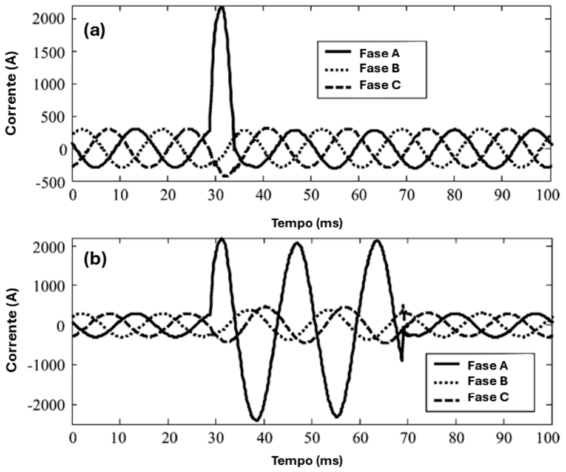
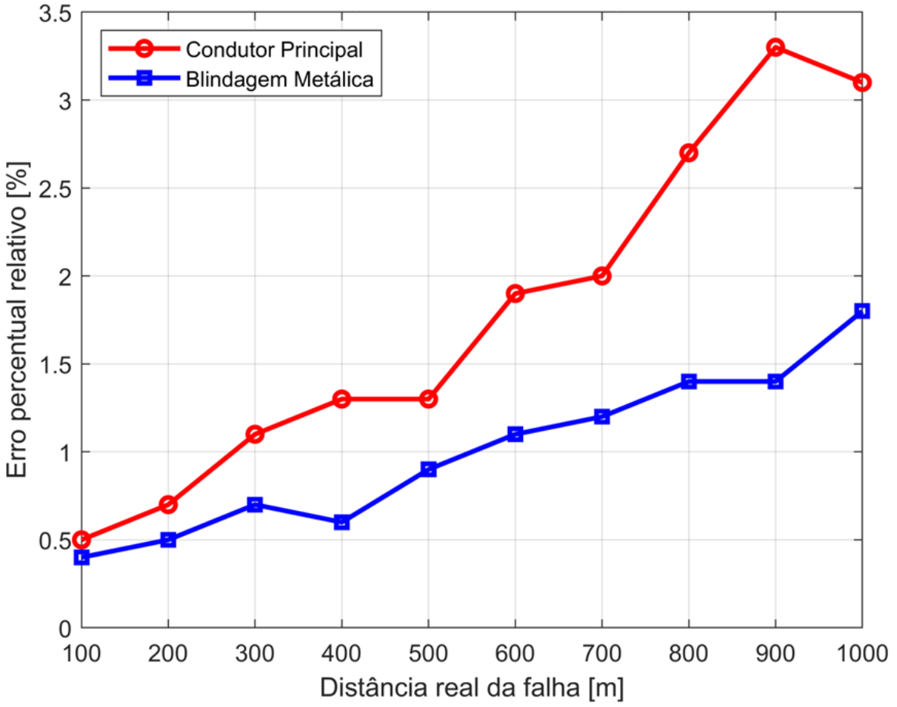

**Escopo:** Eletromagnetismo Aplicado, Processamento de Sinais, Instrumentação e P&D.**Scope:** Applied Electromagnetism, Signal Processing, Instrumentation and R&D.  

{width=80%}

## O Desafio Oculto das Redes SubterrâneasThe Hidden Challenge of Underground Grids

Nas redes elétricas de média tensão, o envelhecimento da isolação dos cabos subterrâneos ocorre de forma gradual e não uniforme. Fatores como umidade e estresse elétrico geram fenômenos de arborescência (*water trees* e *electrical trees*), que degradam o polímero isolante.

Antes de um cabo romper definitivamente, ele apresenta **falhas incipientes**: pequenos arcos elétricos que duram apenas frações de um ciclo (subcíclicos) e se autoextinguem no cruzamento por zero da onda de tensão. Por serem transitórios e de baixíssima energia, esses eventos passam totalmente despercebidos pelos sistemas de proteção convencionais do sistema elétrico de potência. O desafio da engenharia é detectar esses micro-rompimentos online e, mais importante, calcular a localização exata (em metros) de onde a degradação está ocorrendo, antes que ela evolua para uma falha catastrófica.

In medium-voltage power grids, the aging of underground cable insulation occurs gradually and non-uniformly. Factors such as moisture and electrical stress generate treeing phenomena (*water trees* and *electrical trees*), which degrade the insulating polymer.

Before a cable definitively ruptures, it exhibits **incipient faults**: small electric arcs that last only fractions of a cycle (sub-cycle) and self-extinguish at the zero-crossing of the voltage wave. Because they are transient and of extremely low energy, these events go completely unnoticed by conventional power system protection schemes. The engineering challenge is to detect these micro-ruptures online and, more importantly, to calculate the exact location (in meters) of where the degradation is occurring, before it evolves into a catastrophic failure.

## A Física do Problema: O Fator MaxwellThe Physics of the Problem: The Maxwell Factor

Cabos de média tensão possuem uma blindagem metálica aterrada em sua estrutura. Quando o cabo está energizado, existe um forte acoplamento capacitivo entre o condutor central e a blindagem.

Baseando-nos na lei de Ampère-Maxwell, sabemos que a variação temporal do fluxo elétrico através do dielétrico degradado induz uma corrente de deslocamento. No exato instante do micro-arco da falha incipiente, ocorre um escape de corrente de fuga que flui diretamente para a malha de terra.

A inovação central deste projeto foi mudar o foco da instrumentação. Os métodos tradicionais de localização de falhas utilizam as medições de tensão e corrente no condutor principal. O problema é que o condutor principal sofre com a forte interferência das variações de carga da rede, o que insere erros massivos no cálculo de distância. Nossa abordagem aplicou o **método de localização por impedância de dois terminais diretamente na blindagem metálica**.

Medium-voltage cables have a grounded metallic shield in their structure. When the cable is energized, there is strong capacitive coupling between the central conductor and the shield.

Based on Ampère-Maxwell's law, we know that the temporal variation of the electric flux through the degraded dielectric induces a displacement current. At the exact moment of the incipient fault micro-arc, a leakage current escapes and flows directly to the ground grid.

The central innovation of this project was shifting the instrumentation focus. Traditional fault location methods use voltage and current measurements on the main conductor. The problem is that the main conductor suffers from strong interference from grid load variations, which introduces massive errors in the distance calculation. Our approach applied the **two-terminal impedance-based fault location method directly on the metallic shield**.

## Modelagem e Algoritmo de LocalizaçãoModeling and Fault Location Algorithm

{width=90%}

Ao monitorar a tensão e a corrente exclusivamente na blindagem metálica nos terminais do cabo, o algoritmo desenvolvido isola o evento da falha das dinâmicas de carga da rede. O processamento foi estruturado nas seguintes etapas:

* **Aquisição Diferenciada:** O sistema detecta derivadas diferentes de zero nas grandezas da blindagem, confirmando a ocorrência do arco incipiente no domínio do tempo.
* **Desacoplamento Matemático:** A aplicação do método de impedância na blindagem elimina completamente a necessidade de medir as correntes de fase do condutor principal.
* **Cálculo de Posição:** Resolvendo uma equação polinomial de segundo grau com as grandezas transientes da blindagem, o algoritmo calcula as raízes que indicam o percentual exato do comprimento do cabo onde a fuga ocorreu.

By monitoring voltage and current exclusively on the metallic shield at the cable terminals, the developed algorithm isolates the fault event from grid load dynamics. The processing was structured in the following stages:

* **Differentiated Acquisition:** The system detects non-zero derivatives in the shield quantities, confirming the occurrence of the incipient arc in the time domain.
* **Mathematical Decoupling:** Applying the impedance method on the shield completely eliminates the need to measure the phase currents of the main conductor.
* **Position Calculation:** By solving a second-degree polynomial equation with the transient shield quantities, the algorithm calculates the roots that indicate the exact percentage of the cable length where the leakage occurred.

## Impacto

Impact

O desenvolvimento e a validação computacional/experimental desta metodologia representam uma quebra de paradigma na manutenção preditiva de linhas subterrâneas de média tensão.

Ao extrair a informação preditiva diretamente da blindagem, o algoritmo se mostrou imune às flutuações de carga do condutor central. Como resultado prático, a nova abordagem **melhorou a precisão da localização da falha em 55,86%** quando comparada à aplicação do método tradicional no condutor principal. Esta tecnologia permite que concessionárias e indústrias localizem e substituam trechos fadigados cirurgicamente de forma *online*, evitando apagões e elevando drasticamente a confiabilidade do fornecimento de energia.

The development and computational/experimental validation of this methodology represent a paradigm shift in the predictive maintenance of medium-voltage underground lines.

By extracting predictive information directly from the shield, the algorithm proved immune to central conductor load fluctuations. As a practical result, the new approach **improved fault location accuracy by 55.86%** when compared to the traditional method applied to the main conductor. This technology allows utilities and industries to precisely locate and replace fatigued cable sections online, preventing blackouts and dramatically increasing power supply reliability.

{height=60px}

<!-- {height=60px} -->

<!--Include social share buttons-->

