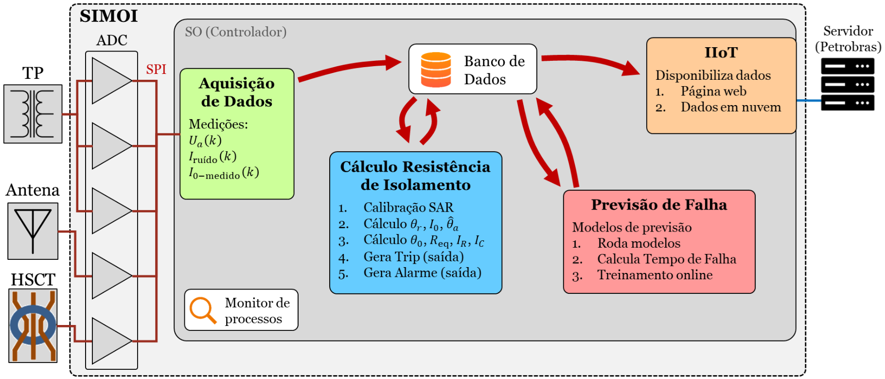
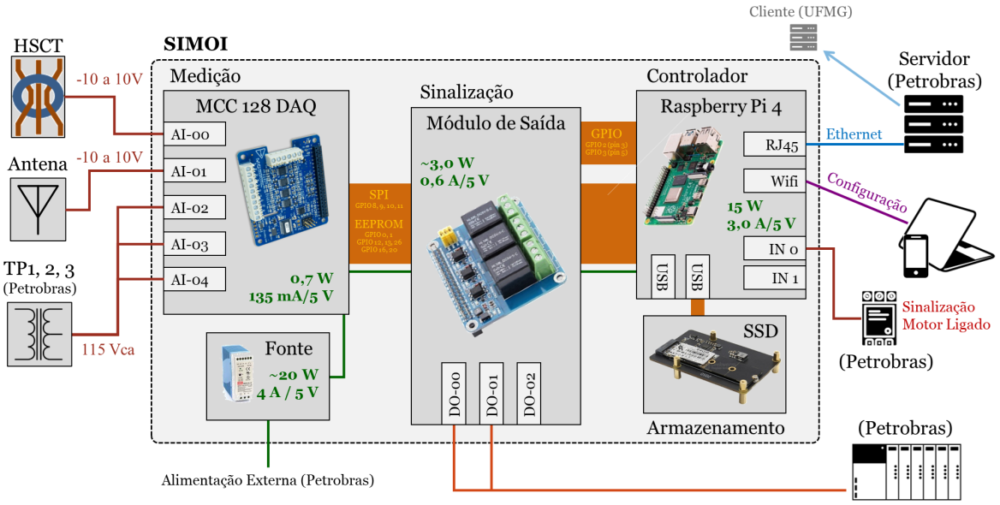
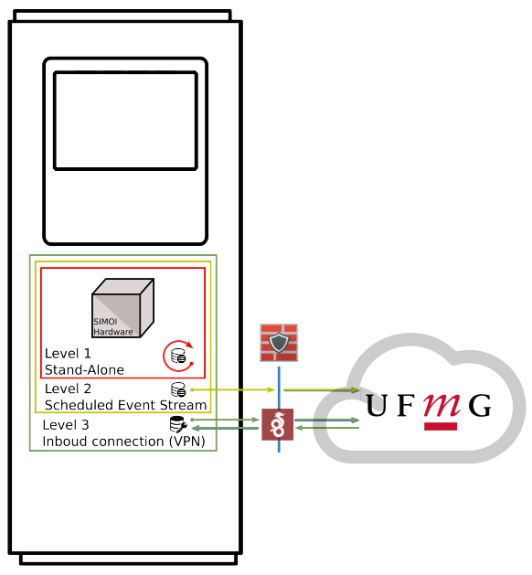

**Parceiros:** UFMG / Petrobras **Escopo:** Arquitetura de Sistemas (Edge/Cloud), Computação Embarcada, Algoritmos Preditivos e IIoT.**Partners:** UFMG / Petrobras **Scope:** Systems Architecture (Edge/Cloud), Embedded Computing, Predictive Algorithms and IIoT.  

## O Desafio da Manutenção Preditiva OffshoreThe Challenge of Offshore Predictive Maintenance

A quebra inesperada de um motor de média tensão em uma plataforma de extração de petróleo gera prejuízos incalculáveis e riscos operacionais severos. Para mitigar esse problema, o Laboratório TESLA da Universidade Federal de Minas Gerais (UFMG), sob a brilhante coordenação do Prof. Dr. Sidelmo Magalhães Silva, firmou uma parceria de Pesquisa e Desenvolvimento com a Petrobras.

O objetivo do projeto **SIMOI** (Sistema de Monitoramento On-line de Isolamento) é arrojado: medir correntes de sequência zero (fugas na ordem de microamperes) em motores de indução em plena operação para calcular a resistência de isolamento e prever a falha muito antes que ela aconteça.

Neste projeto de fronteira, atuei diretamente na **concepção da inteligência do sistema**, definindo como os sinais brutos dos sensores seriam transformados em dados processados, armazenados e enviados para a tomada de decisão.

The unexpected failure of a medium-voltage motor on an oil extraction platform generates incalculable losses and severe operational risks. To mitigate this problem, the TESLA Laboratory at the Federal University of Minas Gerais (UFMG), under the brilliant coordination of Prof. Dr. Sidelmo Magalhães Silva, established a Research and Development partnership with Petrobras.

The goal of the **SIMOI** project (Online Insulation Monitoring System) is bold: to measure zero-sequence currents (leakage on the order of microamperes) in induction motors in full operation to calculate insulation resistance and predict failure long before it occurs.

In this cutting-edge project, I worked directly on the **conception of the system's intelligence**, defining how raw sensor signals would be transformed into processed, stored, and transmitted data for decision-making.

## Computação Embarcada (*Edge Computing*)Embedded Computing (*Edge Computing*)

Para que o diagnóstico preditivo ocorresse em tempo real no chão de fábrica (dentro dos painéis de média tensão da plataforma), projetei a arquitetura do hardware embarcado:

For predictive diagnostics to occur in real time on the factory floor (inside the platform's medium-voltage panels), I designed the embedded hardware architecture:

* **Processamento Central:** A arquitetura foi baseada em Computadores de Placa Única (SBC - *Single Board Computers*), utilizando o ecossistema Raspberry Pi 4 operando com sistema Linux customizado. Isso garantiu o poder de processamento necessário para algoritmos complexos operando diretamente na "borda" (*Edge Computing*).
* **Estruturação Algorítmica:** Concebi os módulos de software responsáveis pela orquestração do sistema. Isso abrangeu desde a aquisição de dados dos conversores A/D via SPI, passando pelo banco de dados otimizado para séries temporais (TimescaleDB/PostgreSQL), até os blocos de cálculo de resistência de isolamento e treinamento online dos modelos de previsão de falhas.

* **Central Processing:** The architecture was based on Single Board Computers (SBC), using the Raspberry Pi 4 ecosystem running a custom Linux system. This ensured the necessary processing power for complex algorithms operating directly at the "edge" (*Edge Computing*).
* **Algorithmic Structuring:** I conceived the software modules responsible for system orchestration. This spanned from data acquisition from A/D converters via SPI, through the time-series-optimized database (TimescaleDB/PostgreSQL), to the insulation resistance calculation blocks and online training of failure prediction models.

## Estratégia de Nuvem e Conectividade (IIoT)Cloud Strategy and Connectivity (IIoT)

Um sistema preditivo só entrega valor se a informação chegar com segurança aos engenheiros de manutenção. Fui responsável por desenhar a estratégia de conectividade da infraestrutura de IoT Industrial (IIoT) do projeto.

A predictive system only delivers value if the information reaches maintenance engineers safely. I was responsible for designing the connectivity strategy for the project's Industrial IoT (IIoT) infrastructure.

A topologia de rede foi concebida em três níveis de operação para atender aos rigorosos requisitos de segurança da informação em ambientes *offshore*:

1. **Nível 1 (*Stand-Alone*):** O equipamento opera de forma autônoma e independente na plataforma, realizando os cálculos de predição e atuando localmente via contatos de alarme/trip no painel, sem depender de internet.

2. **Nível 2 (*Scheduled Event Stream*):** O sistema transmite periodicamente *streams* de dados consolidados e eventos de alarme para servidores externos (UFMG/Petrobras), alimentando painéis web (*dashboards*) para supervisão.

3. **Nível 3 (*Inbound Connection - VPN*):** Criação de um túnel seguro (criptografado) de acesso reverso, permitindo à equipe de desenvolvimento atualizar os modelos preditivos e realizar manutenções remotas no software embarcado sem a necessidade de deslocamento físico até a plataforma.

The network topology was designed in three operational levels to meet the stringent information security requirements of *offshore* environments:

1. **Level 1 (*Stand-Alone*):** The equipment operates autonomously and independently on the platform, performing prediction calculations and acting locally via alarm/trip contacts on the panel, without depending on internet.

2. **Level 2 (*Scheduled Event Stream*):** The system periodically transmits streams of consolidated data and alarm events to external servers (UFMG/Petrobras), feeding web dashboards for supervision.

3. **Level 3 (*Inbound Connection - VPN*):** Creation of a secure encrypted tunnel for reverse access, allowing the development team to update predictive models and perform remote maintenance on the embedded software without the need for physical travel to the platform.

## ImpactoImpact

O desenvolvimento da arquitetura cibernética e algorítmica do SIMOI elevou a pesquisa teórica a um produto aplicável em infraestrutura crítica. A convergência entre o hardware de aquisição preciso idealizado pela equipe da UFMG e o cérebro embarcado que estruturei garante que a Petrobras possa escalar a manutenção preditiva em suas plataformas de forma robusta, segura e orientada a dados.

The development of SIMOI's cybernetic and algorithmic architecture elevated theoretical research into a product applicable to critical infrastructure. The convergence between the precise acquisition hardware designed by the UFMG team and the embedded intelligence I structured ensures that Petrobras can scale predictive maintenance across its platforms in a robust, secure, and data-driven manner.

{height=60px}

{height=60px}

<!--Include social share buttons-->

