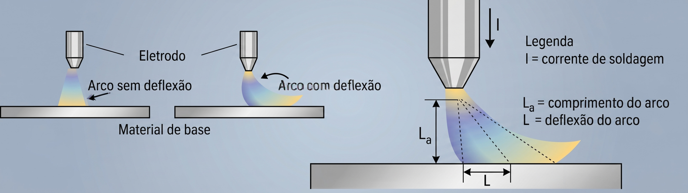

**Projeto:** Apoio à Pesquisa de Doutorado (UFMG)
**Escopo:** Pesquisa & Desenvolvimento (P&D) / Eletrônica de Potência e Simulação Eletromagnética**Project:** Doctoral Research Support (UFMG)
**Scope:** Research & Development (R&D) / Power Electronics and Electromagnetic Simulation

## O DesafioThe Challenge

A realização do passe de raiz em soldagens de tubulações é uma etapa crítica, frequentemente dificultada por irregularidades no alinhamento das faces do chanfro e variações dimensionais. Uma solução tecnológica para distribuir o calor e controlar a poça de fusão é a utilização de tecimento por meios magnéticos, que consiste em defletir o arco elétrico utilizando um campo magnético externo.The root pass in pipe welding is a critical step, often hindered by irregularities in bevel face alignment and dimensional variations. A technological solution for distributing heat and controlling the weld pool is the use of magnetic weaving, which consists of deflecting the electric arc using an external magnetic field.

No escopo desta pesquisa, o objetivo era desenvolver um sistema capaz de promover a oscilação magnética controlada do arco seguindo padrões geométricos complexos, conhecidos como Figuras de Lissajous, aplicados ao processo GMAW. Para tirar esse conceito da teoria e aplicá-lo na bancada de soldagem, era necessário o desenvolvimento de uma eletrônica dedicada.Within the scope of this research, the objective was to develop a system capable of promoting controlled magnetic oscillation of the arc following complex geometric patterns, known as Lissajous Figures, applied to the GMAW process. To take this concept from theory to the welding bench, the development of dedicated electronics was required.

## Atuação no Desenvolvimento TecnológicoRole in Technological Development

Fui o responsável por viabilizar a eletrônica de potência e a validação eletromagnética do projeto, atuando em duas frentes fundamentais:I was responsible for enabling the power electronics and electromagnetic validation of the project, working on two fundamental fronts:

* **Simulação Eletromagnética (FEMM):** Antes da fabricação dos indutores, realizei o modelamento e a simulação computacional das forças magnéticas utilizando o Método dos Elementos Finitos (FEMM). Esse estudo permitiu analisar a interação do campo magnético atuando diretamente sobre o arco elétrico, garantindo que o fluxo fosse direcionado com a densidade necessária para promover a deflexão.**Electromagnetic Simulation (FEMM):** Before manufacturing the inductors, I carried out the modeling and computational simulation of magnetic forces using the Finite Element Method (FEMM). This study enabled the analysis of the magnetic field interaction acting directly on the electric arc, ensuring that the flux was directed with the necessary density to promote deflection.
* **Projeto de Eletrônica de Potência:** Desenvolvi os estágios de potência e o hardware do gerador/controlador de tensão. Projetei e construí amplificadores do tipo AB e do tipo D para alimentar os dois pares de eletroímãs (eixos ortogonais X e Y). A eletrônica garantiu que o sistema pudesse combinar e controlar, com alta fidelidade, as variáveis de frequência, amplitude e fase das equações senoidais para a formação exata das Figuras de Lissajous.**Power Electronics Design:** I developed the power stages and the hardware for the voltage generator/controller. I designed and built class AB and class D amplifiers to drive the two pairs of electromagnets (orthogonal X and Y axes). The electronics ensured that the system could combine and control, with high fidelity, the frequency, amplitude, and phase variables of the sinusoidal equations for the exact formation of Lissajous Figures.

{width=70%}

## ImpactoImpact

O hardware desenvolvido forneceu a estabilidade de sinal e a potência necessárias para o funcionamento do equipamento. Com o sistema operando, foi possível defletir o arco elétrico de forma controlada (movimento difícil de ser conseguido manual ou mecanicamente), modificando a distribuição térmica na poça de fusão e produzindo cordões capazes de superar afastamentos desiguais durante a soldagem do passe de raiz.The developed hardware provided the signal stability and power required for the equipment's operation. With the system running, it became possible to deflect the electric arc in a controlled manner (a movement difficult to achieve manually or mechanically), modifying the thermal distribution in the weld pool and producing beads capable of overcoming uneven gaps during root pass welding.

{height=60px}

<!-- {height=60px} -->

<!--Include social share buttons-->

