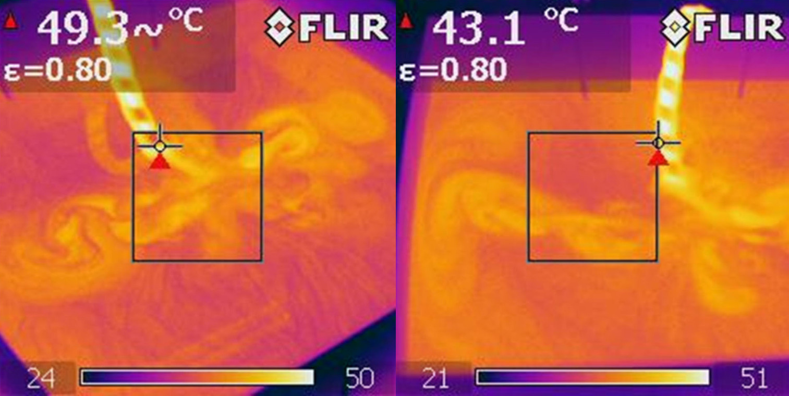
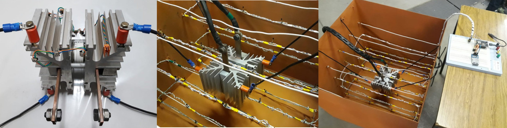
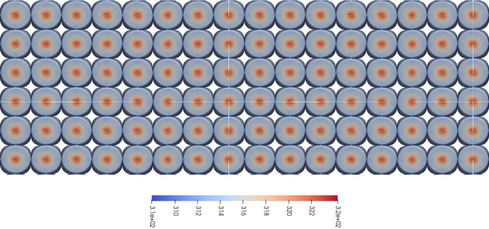

**Escopo:** Dinâmica dos Fluidos Computacional (CFD), Transferência de Calor, Validação Experimental e Design Eletrotérmico
**Aplicações:** Eletrônica de Potência de Alta Tensão, Sistemas de Armazenamento de Energia (BESS) e Veículos Elétricos (EVs).

**Scope:** Computational Fluid Dynamics (CFD), Heat Transfer, Experimental Validation and Electrothermal Design
**Applications:** High Voltage Power Electronics, Battery Energy Storage Systems (BESS) and Electric Vehicles (EVs).

## O Gargalo Térmico na Alta PotênciaThe Thermal Bottleneck in High Power

O aumento exponencial da densidade de potência em conversores estáticos e baterias de íons de lítio esbarrou em um limite físico: a capacidade de dissipar calor. Sistemas de refrigeração tradicionais a ar (natural ou forçado) ou *cold plates* já não são suficientes para garantir a vida útil e a segurança de componentes críticos submetidos a altas cargas.

O **Resfriamento por Imersão (*Immersion Cooling*)** desponta como a solução definitiva. Ao submergir a eletrônica ou as baterias diretamente em fluidos dielétricos ou óleos, a capacidade de extração de calor é multiplicada, os gradientes de temperatura são minimizados e a confiabilidade do sistema aumenta significativamente — elimina-se a dependência de ventiladores e filtros sujeitos a falhas mecânicas.

Atuo no desenvolvimento integral de sistemas de gerenciamento térmico, desde a modelagem matemática e simulação em CFD (Dinâmica dos Fluidos Computacional) até a construção do aparato experimental para validação física.

The exponential increase in power density in static converters and lithium-ion batteries has hit a physical limit: the ability to dissipate heat. Traditional air cooling systems (natural or forced) or cold plates are no longer sufficient to guarantee the lifespan and safety of critical components subjected to high loads.

**Immersion Cooling** emerges as the definitive solution. By submerging electronics or batteries directly in dielectric fluids or oils, heat extraction capacity is multiplied, temperature gradients are minimized, and system reliability increases significantly — eliminating dependence on fans and filters subject to mechanical failure.

I work on the integral development of thermal management systems, from mathematical modeling and CFD (Computational Fluid Dynamics) simulation to building the experimental apparatus for physical validation.

## Eletrônica de Potência: Convecção Natural em ÓleoPower Electronics: Natural Convection in Oil

Para aplicações industriais pesadas, como compensadores estáticos e acionamentos na indústria metalúrgica, desenvolvo estudos de imersão de semicondutores (como tiristores *press-pack*) em óleo mineral.

* **Simulação Termofluidodinâmica (CFD):** Utilizo ferramentas de simulação computacional para modelar o comportamento dos vórtices e do escoamento gerado por diferenças de densidade (efeito Boussinesq) no fluido ao redor de dissipadores complexos.
* **Otimização de Volume:** Através da simulação e do mapeamento por matrizes de sensores de temperatura (telemetria IoT), identifico os padrões de circulação do fluido. Isso permite otimizar o design do tanque, comprovando que o posicionamento dos componentes na parte inferior do reservatório maximiza a convecção e reduz a necessidade de grandes volumes de óleo.
* **Validação em Bancada:** Os testes experimentais demonstraram que a imersão em óleo eleva a capacidade de dissipação de potência em até 2,5 vezes quando comparada à convecção natural a ar, resultando em temperaturas de operação significativamente menores e maior confiabilidade do hardware.

For heavy industrial applications, such as static compensators and drives in the metallurgical industry, I develop studies on immersion of semiconductors (such as press-pack thyristors) in mineral oil.

* **Thermofluidodynamic Simulation (CFD):** I use computational simulation tools to model the behavior of vortices and flow generated by density differences (Boussinesq effect) in the fluid around complex heat sinks.
* **Volume Optimization:** Through simulation and mapping by temperature sensor arrays (IoT telemetry), I identify fluid circulation patterns. This allows optimizing the tank design, proving that positioning components at the bottom of the reservoir maximizes convection and reduces the need for large oil volumes.
* **Bench Validation:** Experimental tests showed that oil immersion increases power dissipation capacity by up to 2.5 times when compared to natural air convection, resulting in significantly lower operating temperatures and greater hardware reliability.

## Baterias Veiculares (BTMS): Imersão com Escoamento AxialVehicle Batteries (BTMS): Immersion with Axial Flow

Em veículos elétricos, a temperatura é o principal fator que determina a degradação, a autonomia e a segurança (evitando o *thermal runaway*) das baterias de íons de lítio. Para o Sistema de Gerenciamento Térmico de Baterias (BTMS), a imersão apresenta vantagens incomparáveis.
In electric vehicles, temperature is the main factor determining degradation, range, and safety (preventing thermal runaway) of lithium-ion batteries. For the Battery Thermal Management System (BTMS), immersion offers unparalleled advantages.

* **Eliminação de Gradientes Térmicos:** Utilizo o OpenFOAM para modelar o resfriamento direto de células cilíndricas submersas em fluidos dielétricos comerciais (como o Novec 774).
* **Escoamento Axial vs. Radial:** Meus estudos em CFD comprovam que forçar o escoamento do fluido na direção **axial** das células praticamente zera a diferença de temperatura entre as baterias do *pack*. Diferentemente de *cold plates* ou fluxos radiais — que deixam as últimas células mais quentes —, o fluxo axial garante um envelhecimento uniforme de todo o sistema.
* **Alta Densidade de Empacotamento:** O design com escoamento axial permite que as células cilíndricas fiquem fisicamente em contato umas com as outras, utilizando os pequenos "canais" naturais formados entre elas para a passagem do fluido. Isso maximiza a densidade de energia do *pack*, requisito crucial para a indústria automotiva.

* **Elimination of Thermal Gradients:** I use OpenFOAM to model the direct cooling of cylindrical cells submerged in commercial dielectric fluids (such as Novec 774).
* **Axial vs. Radial Flow:** My CFD studies prove that forcing fluid flow in the **axial** direction of the cells practically eliminates the temperature difference between batteries in the pack. Unlike cold plates or radial flows — which leave the last cells hotter — axial flow ensures uniform aging of the entire system.
* **High Packing Density:** The axial flow design allows cylindrical cells to be in physical contact with each other, using the small natural "channels" formed between them for fluid passage. This maximizes the pack's energy density, a crucial requirement for the automotive industry.

## Engenharia Orientada a DadosData-Driven Engineering

Os projetos térmicos vão além de aproximações empíricas básicas. O desenvolvimento envolve análise de convergência de malha (método GCI), medição de propriedades térmicas anisotrópicas, cálculo rigoroso de perda de carga para dimensionamento de bombas e validação experimental das temperaturas de junção em laboratório. O resultado é um dimensionamento térmico exato, seguro e pronto para a indústria.
Thermal projects go beyond basic empirical approximations. Development involves mesh convergence analysis (GCI method), measurement of anisotropic thermal properties, rigorous head loss calculation for pump sizing, and experimental validation of junction temperatures in the laboratory. The result is an accurate, safe, industry-ready thermal design.

{height=60px}

<!-- {height=60px} -->

<!--Include social share buttons-->


